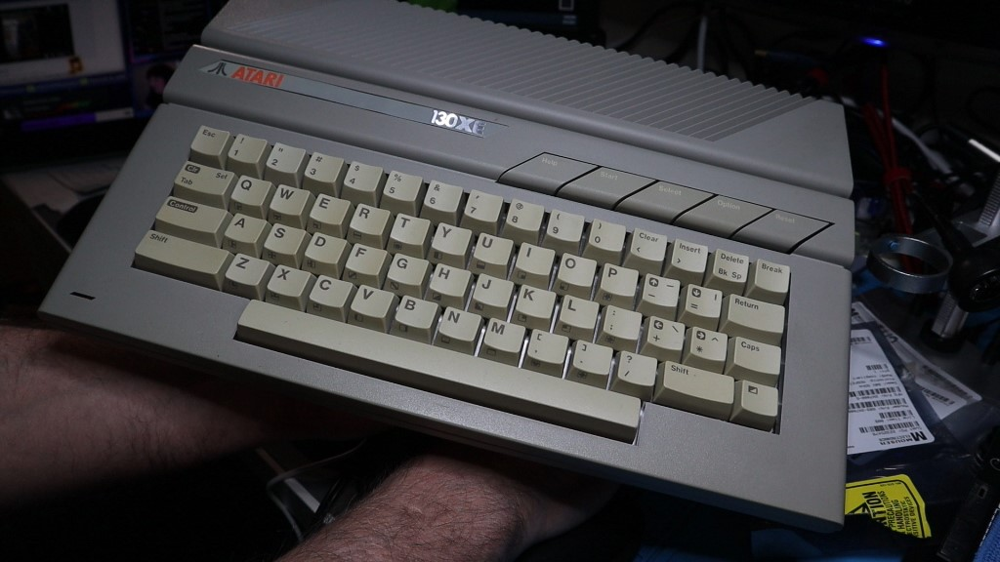
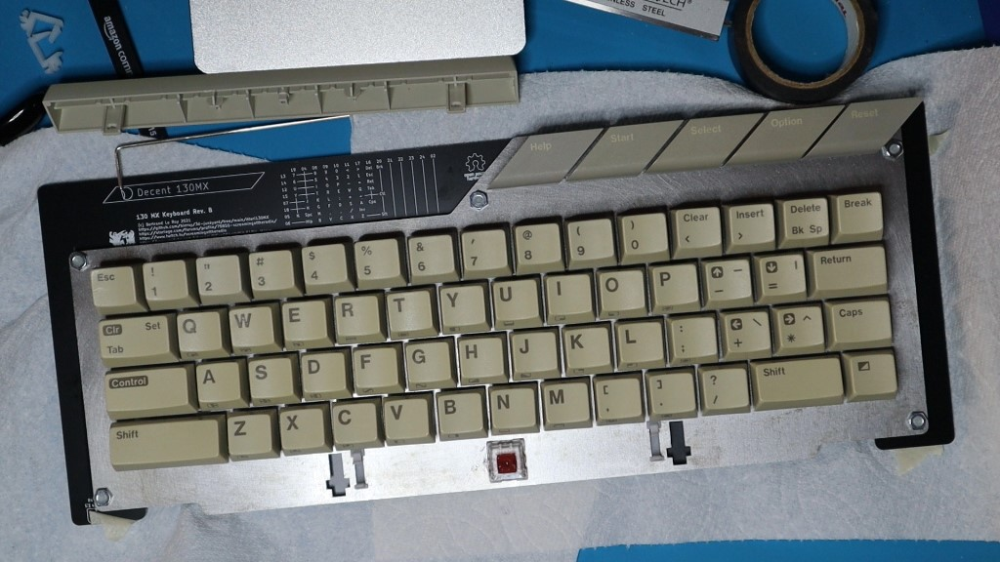
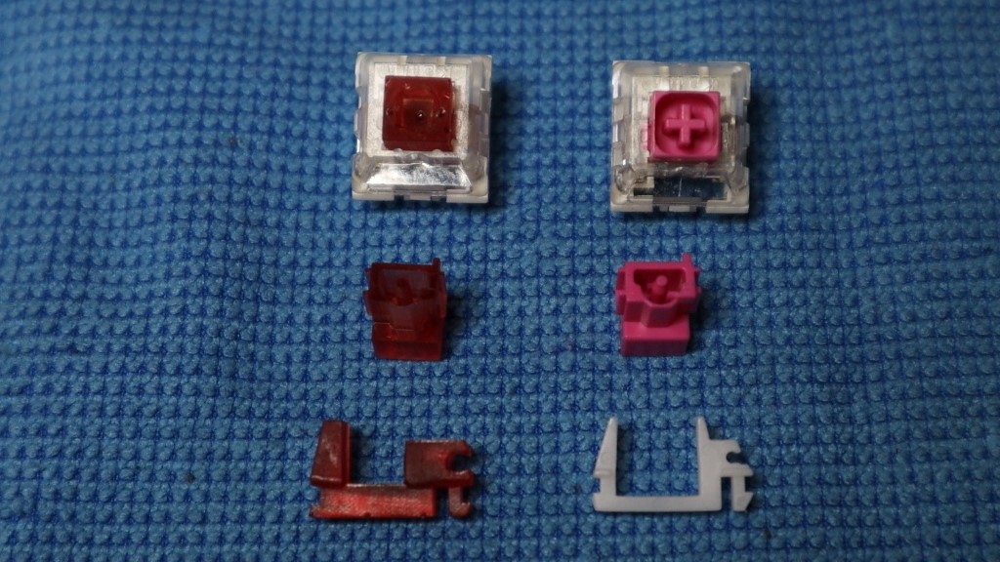
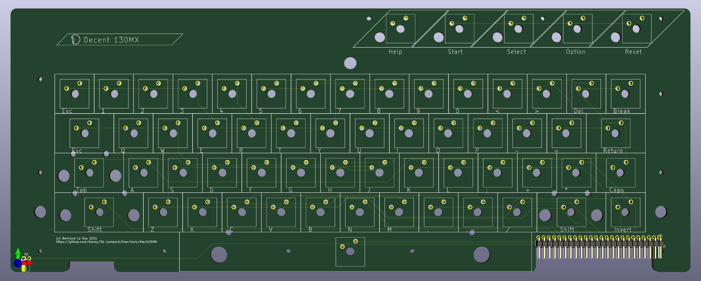
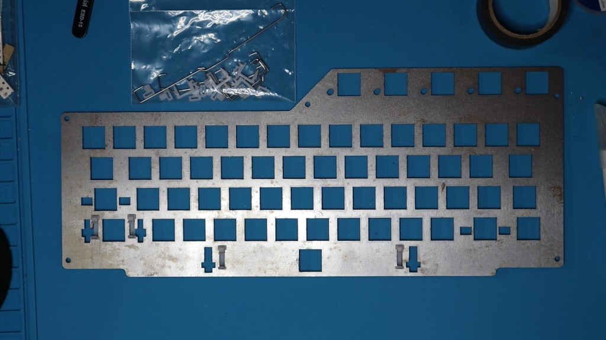
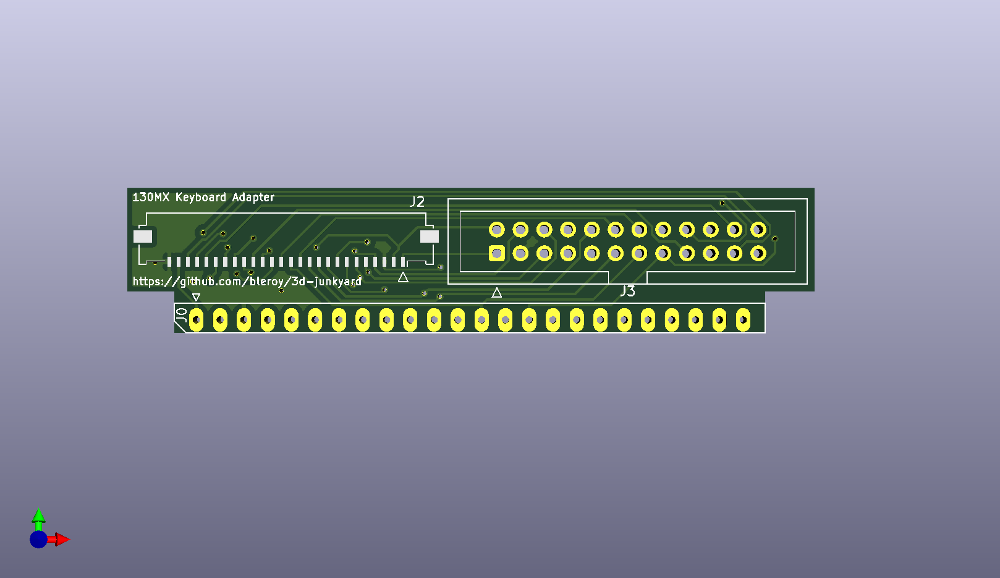

# Atari 130MX mechanical keyboard replacement for Atari XE computers

There's been a number of previous projects to put a modern keyboard on Atari 8-bit computers. I don't think anyone's done it while preserving the original keycaps though (would love to be proven wrong). This is exactly what I did, by 3D-printing modified stems for Kailh Box Pink switches that take the Atari XE key footprint instead of the Cherry MX cross. Cheap resin printers can print at an amazing 50 micron resolution, which is enough to print very small parts with very fine details. Switch stems are such parts, and must be printed very precisely to reproduce the touch and feel from the original. It took a lot of tinkering to get there, and trying a lot of different resins, but the keyboard feels absolutely great. What's more, you can't tell the difference from an aesthetic point of view... Check this out:

The project is built on [a new original PCB design](Atari130MX.pro), [a custom laser-cut steel plate](Atari130MX-plate.svg), [Kailh Box Pink switches](https://www.kailhswitch.com/mechanical-keyboard-switches/smt-key-switches/box-blue-white-switches-for-mechanical.html) and Costar stabilizers.

The stabilizer metal parts are also preserved, but the one for the space bar has a diameter that's considerably larger than off-the-shelf Costar stabilizers can handle, so I also 3D printed new ones:

Here's [a video showing the end result (Rev. B)](https://youtu.be/r8T07Rskkgs):

## Bill of materials

This project is meant to be reproduced. You'll need a few things that are more or less easy to source, so I've made sure to give multiple roads to success and alternatives for most parts.

It's also an approach that could easily be adapted to other vintage computer keyboards, Atari or not. Everything is provided [under an open source license](../LICENSE) so you're encouraged to reproduce and fork the design.

### Atari XE computer

The project is designed around the conservation of the vintage look of Atari XE computers and the integration of the keyboard in its original case. As such, ideally, you should have a donor XE keyboard, and a host XE computer to receive the end product.

It is also possible however to build and use this keyboard and use it with an emulator on a PC or Mac. In this way, you can get closer to the original experience even if you don't have access to the original hardware.

* Optimal: Atari XE computer
* Fine: a PC, mac or a MiSTer with [an emulator](https://www.virtualdub.org/altirra.html)

### Key caps

The best result will be obtained with the vintage key caps from an Atari XE computer. If you don't have access to a set of the original keys, you can build the keyboard with any MX-compatible switches and caps. This is a considerably easier option since no 3D printing is required, but the aesthetic qualities of the results will be clearly inferior.

* Optimal: vintage set of XE key caps
* Fine: MX-compatible set of key caps

### Switches

The starting point for modified switches that work with vintage caps was Kailh box pink switches. A choice of switches is highly personal, and it should be possible to adapt [the stem design](keeb-stem.scad) for other types of switches, but you should be warned this will be **a lot** of work.

* Optimal: 63 Kailh box pink switches
* Fine: if not using vintage caps, any MX-compatible switch would do
* Hard: modify the design for your own preferred switch type

### Stems

The stems are the part of the switch that attaches to the cap, and goes up and down with it. This is the part that I had to design a replacement for. The replacement has a different shape of hole on the top in order to accommodate the Atari XE key caps, but the bottom part should be as close as possible to the original. Because the shape of that bottom part varies from switch to switch, I can only guarantee my design will work with Kailh box pinks.

In order to print them, you'll need a resin printer with a resolution of 50 micrometers (1/20th of a millimeter) or better. I use an [Elegoo Mars 2 Pro](https://www.elegoo.com/products/elegoo-mars-2-pro-mono-lcd-3d-printer), which is both excellent and inexpensive. The printing bed is rather small, so you may want to go for something larger, but keep in mind that resin printers involve a lot of cleanup and potential mess, and a larger bed means even more of that. There are alternatives to the Elegoo Mars, of course.

If you don't own a resin printer, or don't want or can't buy one (a good reason not to adopt one is if you live in an apartment, for example), there is probably a maker space not far from your home or workplace where you can access one.

I'd stay away from online printing services, they are very expensive and are not used to that kind of batch of small parts.

The choice of resin is very important, as the same design on the same printer can give wildly varying qualities of print. For instance, I stay away from all grey Elegoo resins, as I found them to blur the design and be very unreliable. The resin I've had the best results with is Elegoo's [clear red](https://www.elegoo.com/collections/resin/products/elegoo-standard-resin?variant=32365787807792).

* Optimal:
    * access to a resin printer
    * precision resin
    * lube for key switches and stabilizers
* Fine: if you're not using vintage caps, you don't need 3D printed stems

### Stabilizers

The Atari XE keyboard has stabilizers on the left SHIFT key and on the space bar. Some versions also have stabilizers on control and right shift, but those are both 1.75 units wide and can work well without stabilizers. 

The left shift stabilizer is made with a standard metal bar that fits in standard costar stabilizers, for which the plate is designed. Those stabilizers can be bought for a very reasonable price from many places. You could print your own but I'm not providing design files for them at this time.

The space bar is more problematic because the metal part that comes with the XE keyboard is much thicker than the standard costar stabilizers can accommodate, so we need either alternative metal bars to the right dimensions and the right diameter, or we need to print stabilizers with a larger diameter hole. I went for the printed part, but it should be possible to make the metal part instead. I just haven't tried that, so you're on your own if you want to go that route.

* Optimal:
    * original Atari XE stabilizer metal parts
    * access to a resin printer and some resin
    * 2 standard costar stabilizers
* Fine: if not using vintage caps, I'm not sure what you'd need for the space bar stabilizer, but 4 standard ones plus a custom space bar metal part may be doable

### Main board

The [Atari130MX KiCad project](Atari130MX.pro) should have everything you need to order a 2 layer PCB from any manufacturing house.

* Optimal: [130MX main board](Atari130MX.pro)

### Plate

While it is possible to build and operate a keyboard without a plate, it will not be as nicely aligned and won't feel as solid as it would with a proper plate. There's a number of possible materials that the plate can be manufactured from. [The SVG file for it](Atari130MX-plate.svg) should be all you need if you decide to go with any laser-cuttable material, and nowadays that includes metal. The price will depend on the material you choose. I don't own a laser cutter at all, and the ones that can cut metal are very expensive, so I've been using Ponoko, which, be warned, is not a cheap option.

Note that the SVG design currently only accommodates the square version of XE keyboards, not the circular one, so check your key caps before you order an expensive plate.

I've also designed a [PCB version](Atari130MXPlate/Atari130MXPlate.pro) that can be made in 1.6mm aluminum for a much more reasonable price. That version can accommodate both known versions of XE keyboards.

In terms of weight, the keyboard assembled with a steel plate is about 575g, and with aluminum that falls down to 430g.

* Optimal: laser-cut 1.5mm steel plate (cost me ~$75 with tax & shipping)
* Very good: 1.6mm aluminum PCB. Aluminum PCBs can be made for similar prices as regular PCBs nowadays, and that constitutes the best price / performance compromise currently available.
* Not fine: laser-cut acrylic. Really, don't even try, it'll shatter. Some other laser-cut plastics may be OK, but I can't help you with that, I don't know.

In all cases, you should also add some spacers between the board and the plate, in addition to the switches themselves. There are holes for 5 fasteners around the main board and the plate:

* Optimal:
    * 5 3.5mm long screws
    * 5 3.1mm tall spacers compatible with the screws
    * 5 nuts compatible with the screws
* Good:
    * 5 3.5mm long screws
    * 20 washers compatible with the screws
    * 5 nuts compatible with the screws
* Fine:
    * Nothing, just let the switches collectively hold the plate

### Connectors and adapters

The original Atari XE keyboard's connector was just a part of the mylar membrane. We need a replacement for that, and there are many options.

Note that the clearance between the Atari XE motherboard and the bottom of the keyboard is very small at about 16mm. Depending on the layout of your motherboard, the adapter may or may not fit. FFC connectors are much lower profile than IDC connectors, so they are the preferred connection, but they are surface-mounted.

The adapter can in theory fit into the original Atari motheboard's keyboard connector if made in 0.6-0.8mm. I prefer to replace that connector with pin headers that offer more flexibility.

* Optimal:
    * 2 [FFC 26 position 1mm pitch connectors](https://www.digikey.com/en/products/detail/molex/0522072660/5170985)
    * [FFC 26 position 1mm ribbon cable](https://www.digikey.com/en/products/detail/molex/0152670441/4427307)
    * [130MX Adapter](Atari130MX-adapter/Atari130MX-adapter.pro) fabricated in 0.6-0.8mm thickness
    * 1x24 2.54mm pin headers
* Very good:
    * 2 [IDC 2x12 position 2.54mm pitch connectors](https://www.digikey.com/product-detail/en/adam-tech/BHR-24-VUA/2057-BHR-24-VUA-ND/9832347)
    * [24 position 2.54mm ribbon cable](https://www.digikey.com/product-detail/en/3m/3365-24-100/3M157996-5-ND/9479206)
    * 2 [2x12 flat cable sockets](https://www.digikey.com/product-detail/en/adam-tech/FCS-24-SG/2057-FCS-24-SG-ND/9832255)
    * [130MX Adapter](Atari130MX-adapter/Atari130MX-adapter.pro) fabricated in 0.6-0.8mm thickness
    * 1x24 2.54mm pin headers
* Fine:
    * 1x24 right-angle 2.54mm pin headers
    * 2 1x12 2.54mm pin headers
    * 24 F-F header cables
* Terrible:
    * 24 wires and some permanent soldering you should be ashamed of

### Misc & optional components

* red LED (you can re-use the one from your old XE keyboard)
* if using as a PC keyboard:
    * Raspberry Pi PICO
    * 100 Ohm resitor
    * Micro-USB cable

**NOTE** Do **not** connect the Pi PICO through USB at the same time as the keyboard is connected to an Atari XE motherboard. The board is not designed for those to be used together, and bad things would probably happen if you tried. There are no hardware protections in place.

## Fabrication and assembly instruction

Once you've sourced all the components, it's time to assemble. The following instructions attempt to reflect all the choices you may have made in selecting components.

### Printing the stems

There are two known shapes of key caps, requiring distinct stems. The first type of key cap is double-shot with square stems, while the second are printed and have circular stems.

In this repository, you'll find [OpenScad](keeb-stem.scad) and [STL](keeb-stem.stl) files for [both types](keeb-stem-circle.stl) of stems. If you need to modify anything about the stems, you'd need to regenerate the STL from the OpenScad file. There is [a single OpenScad file](keeb-stem.scad) that covers both types of stems through configuration. Otherwise, just load the STL in your printer's slicer software and follow the instructions specific to your printer.

Depending on the size of your printer bed, given the size of the part, you should be able to print in batches. You'll need 63 stems total for the whole keyboard. I still recommend you experiment with a single part first to verify your printer and choice of resin are appropriate. Even when you've ensured that, chances are any batch will have bad parts so quality control is important. Don't hesitate to reject any part that seems defective, as only perfectly printed parts will operate smoothly.

When slicing the model, do use support: if you don't, I can guarantee you'll break a good proportion of your parts when separating them from the printing bed. I orient the model with the Atari key side (the square hole) towards the printer's plate, away from the screen, which is probably the bottom in your slicing software (because resin printers print upside down).

Its often a good idea with resin printers to rotate the model 30 degrees (stabilizers definitely benefit from that), but the stems might actually come out better being printed vertically.

On the Elegoo Mars 2 Pro, I'm able to print batches of 18 stems with not too many defective ones.

Here's some additional general advice about resin printing:

* Wear eye and hand protection, and even a respirator if operating in sub-optimal ventilation conditions any time you're manipulating uncured resin. But you should not have sub-optimal ventilation. That stuff is toxic and messy. UV light is also bad for your skin and eyes.
* Treat uncured resin as the toxic waste that it is, as well as alcohol that has been mixed with uncured resin. It's a good idea to expose any paper towel you use to clean up uncured resin with a UV flashlight before disposing of them. Also cure support and any rejected part before disposing of them.
* Consult your local waste disposal authority on proper ways of disposing of uncured resin or contaminated material.
* After printing, be careful when separating the parts from the printing surface. It is possible to seriously injure your hands if you're not careful. I wear additional leather gloves when I do that because I know how clumsy I am and I like my hands. Also, toxic resin is not good inside your hands.
* Clean the parts in a bath of >90% isopropyl alcohol. Some light brushing with a toothbrush can help.
* After cleaning, cut the parts away from the support using a pair of cutting pliers. Your pliers will get sticky with uncured resin over time even if you clean them with isopropyl alcohol after each usage, and will be deteriorating fast, be aware of that when you buy them.
* Cure the parts with UV light. A curing station is great for that, but also be aware the stems have two holes that the UV may have trouble reaching in your curing station. I shine my UV flashlight directly into the hole to make sure all surfaces are cured.
* Don't overcure: resin can become brittle if overexposed. A few minutes of exposition should be more than enough. You'll see and feel it when it's cured, the surface texture should be noticeably different when its done: not sticky, looking smooth and dry, and feeling hard under touch.
* Clean all surfaces that have been in contact with uncured resin with isopropyl alcohol, then expose paper towels with UV light before disposing.

### Replacing the stems with the printed ones

The Kailh switches can be disassembled easily by carefully inserting a prying tool (avoid anything too sharp, don't injure yourself) between the white bottom part of the switch and the two wings of the top transparent cover.

You can then slide the stem out of the switch while being careful not to lose the spring and the extremely tiny part that pushes the contact rod out of the way when the switch operates.

Apply some key switch lube on the sides of the printed stem before placing it back into the transparent cover where the original was. Reassemble the stem and cover with the base of the switch. Operate it to verify that it slides smoothly.

Do that with all 63 switches.

### Inserting the switches into the plate

Next, press the switches into the holes in the plate. Make sure they are properly oriented.

### Add the stabilizers

Print the space bar stabilizers following the same instructions as for the stems. Printing a batch of four should ensure you get the two parts you need even if the print doesn't go optimally.

Add the standard stabilizers into the rectangular holes on both sides of the left shift key, and the printed ones into the rectangular holes on both sides of the space bar.

Lube the horizontal round holes at the back of the stabilizers, then insert the metal bars for both keys into them.

### Assemble the key caps

This should be pretty easy. Find the right key for each switch and carefully press them into position. Resin can break, so be gentle. We do the cap assembly at this step and not later because if you break a stem, it will be easy to replace without having to desolder anything...

The left shift and space bar are a little different because of the stabilizers. Before you insert the cap into the stem, align both ends of the stabilizer metal bar into the corresponding holes in the caps, then diagonally align the cap with the stem. Carefully rotate it into place without letting the metal bar drop out of its holes, then press fit.

### Making the cable

The connection between the keyboard and the motherboard can be made in a number of different ways.

The easiest, but not the most stable, is to replace the motherboard connector with 24 pin headers, use two rows of 12 pin headers on the keyboard side, and then make the connection with 24 manually positioned header cables. You can tape them together with electrical tape for stability.

A better choice is a 26 positions 1mm pitch ribbon cable. For that, you'll need to solder the appropriate surface mount connectors on the keyboard side and on the adapter.

Another choice is a 2.54mm pitch 24 positions ribbon cable. The connectors for those are through hole and relatively easier to solder, and the cables themselves are easily assembled.

### Soldering the connectors and optional components

Before we assemble the switches onto the PCB, we need to add any through-hole components while both sides of the PCB are still accessible, but it's also a good time to do any surface mount components as well:

* Solder your chosen connector onto the board. The connectors go on the bottom side, which is the one that *doesn't* have key indicators on the silkscreen.
* If you're adding a Raspberry Pi PICO, solder it in place. Surface-mount is fine in theory, but good luck with the USB connection if you do that. Place it on headers instead. I've used female headers on the board side and male headers on the Pi, and this way the Pi is easily removeable. The Pi PICO also goes on the underside of the board, opposite the key indicators. Solder the 100 Ohm resistor (either side is fine).
  
* Solder the LED. Short leg goes to GND, which is indicated on the silkscreen with a square pad. Bend the LED to be horizontal pointing to the bottom of the board.

### Soldering the switches

The plate should ensure proper relative alignment of the switches. Turn the whole assembly contact up, then put the main PCB on top of it, key silkscreen on the bottom.

Add the spacers or washers, screws and nuts in the 5 holes.

Ensure proper alignment, then solder two diagonally opposed switches for stability. Then solder the rest of the switches.

### Soldering the adapter

If you're using the adapter on the Atari side, solder the connectors you need. You have a choice here, be consistent with what you chose on the other side.

For the motherboard connection, you can choose to insert the adapter PCB into place, or replace the motherboard connector with pin headers. You may also want to assemble the adapter with a female header, or solder it permanently onto the pin headers you added to the motherboard.

### Put everything together

We're almost done.

If you're going to use the keyboard as a PC keyboard, all you have to do is connect a micro-USB cable between the Pi PICO and the computer. Flash the Pico with [CircuitPython](https://circuitpython.org/board/raspberry_pi_pico/) and [the Python script](Decent130MX.py).

If you're connecting to the Atari motherboard, put the adapter (if using it) into place on the motherboard, insert your chosen cable on both ends, then set the new keyboard into the case, and reassenble the rest of your Atari.

Remember, don't do both at the same time: it's either used as a PC keyboard, or as an Atari XE keyboard. Dont'power both simultaneously.

Enjoy!