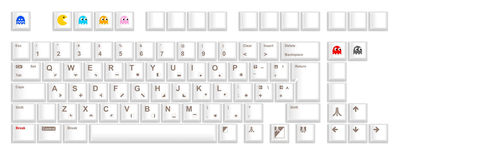
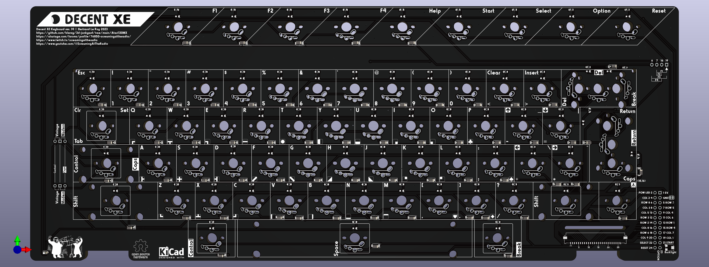
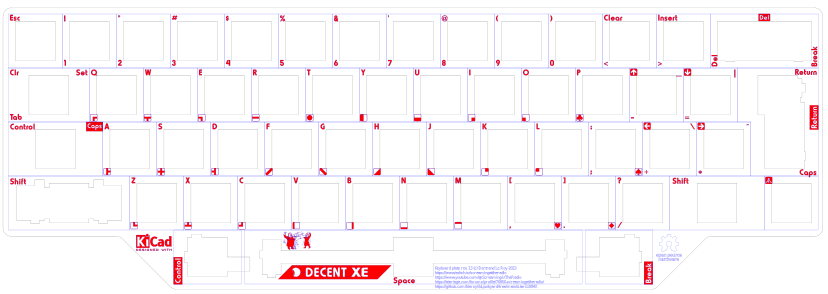
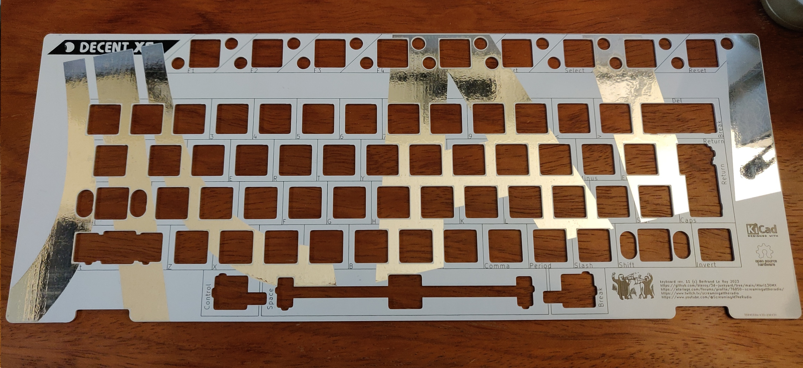

# Decent XE mechanical keyboard replacements for Atari XE computers

Whether you have an old Atari XE computer with a dead keyboard membrane, would like to use a XE keyboard with your favorite PC emulators, or just want to build a more modern XE keyboard, this is the project for you.

There are two versions of the keyboard: modern and vintage. Modern uses brand new MX-compatible key caps, while vintage uses the original Atari key caps and adapts them to modern switches.

There's been a number of previous projects to put a modern keyboard on Atari 8-bit computers. I don't think anyone's done it while preserving the original keycaps though (would love to be proven wrong). Once assembled, you can't tell the difference from an aesthetic point of view... Check this out:

But wait!... That's not all. Since the project started, there's been multiple revisions, adaptations to all kinds of demands from other Atari enthusiasts, and you now have many options to build the keyboard of your dreams...

## Project history

My first attempt at this was to replace the stem in a [Kailh Box Pink switch](https://novelkeys.com/collections/switches/products/kailh-box-switches?variant=40598132129959) with a 3D-printed version that replaces the regular MX cap footprint with an Atari XE cap footprint. The modified stems were printed with my first printer, an Elegoo Mars 2 Pro. Its 50 micron resolution was essential when replacing such a small and precise part.

This worked great, with switches that were a little more gritty than the originals but still a huge improvement over the mushy XE keyboard I was replacing.

As I made the project public on [Atariage forums](https://forums.atariage.com/topic/324588-atari-130xe-keyboard-rebuild-vintage-keycaps-on-modern-switches), I quickly discovered the key caps I had on my 130XE were only one of two variants, and not the most common at that. I've been supporting both variants, square and circle ever since.

The stabilizers were costar stabilizers for the left shift, which required some creative bending of the vintage stabilizer rod and always remained a little clunky. The space bar rod has a larger diameter and necessitated 3D-printed stabilizers that were, to be frank, terrible. They sorta did the job, just poorly.

The first plate I made was water-jet-cut steel. That was expensive and rusty. I quickly realized after that first attempt that PCB fabrication houses can make aluminum PCBs for cheap. Those are machined rather than laser or water-jet cut, but the quality is perfectly adequate for a fraction of the price. They are just PCBs without circuitry on them. I later learned how other handmade keyboard makers use the same trick, including with regular PCBs, although aluminum is clearly superior for this application.

The first connector I used was an ad-hoc cable made from breadboard jumper wires (I replaced the notoriously hard to source 24 pin Atari connector with pin headers). Based on early feedback, this was quickly replaced with a choice of standard flat cables, to the 1mm pitch 26 pin FFCs used today. Why 26 pins? Because 24 pin FFC connectors and cables don't exist or are hard to source whereas the 26 pin versions are commonly used in DVD players and printers. Also, that gives us two additional lines to separate the backlighting power from the rest, but that in itself came later, at first there was no backlighting and those two additional lines just duplicated the 5V and ground lines, which was just good practice at the time, but turned out to provide that feature for free later without breaking pinout back-compat.

On the side of the Atari motherboard, an adapter was needed that could plug into the original 24 pin connector or be soldered to pin headers, and had a 1mm pitch 26 pin FFC connector on the other side. The main difficulty is that there's very little space between the motherboard and the bottom of the keyboard.

The next breakthrough resulted from re-thinking the constraints:
* Keep compatibility with vintage key caps
* Keep the assembly the same height as the original so everything looks unchanged, including function keys flush to the case

Keeping the same height with MX switches meant replacing internal parts. This is time-consuming and results in lower-quality. What if instead you could work with lower switches that give enough vertical space to build an interface between the switch and the cap? That's what led me to consider low-profile switches. My first choice was to remain with Kailh switches, that I like quite a lot, and I picked Choc v1, specifically Robins that have a clicking behavior similar to Box Pinks. Using adapters instead of replacing internals however also gave the side benefit to allow people to choose the switches they prefer. If you prefer linear or tactile, that's fine.

I made a new version of the PCB for Choc switches which was also the first to have backlighting.

Then there were demands to support more types of low-profile switches to allow for cheaper alternatives to Kailh Chocs.

Around the same time, I had been trying to find reasonably affordable small batch key cap sets to make it possible to build a keyboard without depending on vintage parts. XLFreak is the one who designed and sourced new key caps from [WASD](https://www.wasdkeyboards.com/). The very wide space bar doesn't exist on modern keyboards, so we had to shuffle things around. I think the layout that came out of this is better than the original: we get a larger backspace key, an ISO return key, control moves to the left of the smaller 6.5U space bar, break to its right, caps moves to its modern place above left shift. I was able to lay out the PCB so it's compatible with both the vintage and the modern layouts with a single configuration header.

In order to simplify things and have a single unified PCB design, I designed a switch footprint that could accommodate four different kinds of switches: MX, Kailh Choc, Gateron low-pro and RedDragon low-pro.

I also moved the Raspberry Pi Pico connection off the board to a separate USB adapter board since not everybody needed it and it added routing complexity.

It was also a good time to update the stabilizer design. For modern caps, there was no reason not to use the better alternative that are Durock v2 stabilizers. For vintage caps, I wasn't able to swap left switch stabilizers because the way vintage shift keys are built doesn't leave space for 2U Durock v2 stabilizers.

That's pretty much where we are today.

## Options

### Key caps: vintage or modern?

My own preference was to use the original key caps from a vintage Atari XE computer. They can be scavenged from an existing computer, or from new old stock that's still available at the usual places. The result is, like above, visually indistinguishable from the original keyboard, but feels oh so much better.

XLFreak has been working on new caps in the style of old Atari caps, but that can be produced in small quantities. The nice thing about those is that no adapter is necessary and the end result is an amazing keyboard that is and feels in every way like a great modern keyboard.

### Switches

If you're using modern key caps, you may choose any MX-compatible switch.

If you're using vintage caps, you can pick any Kailh Choc, Gateron or RedDragon low-profile switch.

## Design

The Decent XE project is built on [an original PCB design](DecentXE.kicad_pro), [a custom aluminum plate](DecentXE-plate.kicad_pro), [Kailh Box Pink switches](https://www.kailhswitch.com/mechanical-keyboard-switches/smt-key-switches/box-blue-white-switches-for-mechanical.html), custom key caps from WASD, 3D printed adapters and Durock v2 and Costar stabilizers.

Here's [a video showing revision B of the project)](https://youtu.be/r8T07Rskkgs):

And here's [another](https://youtu.be/FDqwOca9oRQ/) showing the latest revision with modern caps:

## Bill of materials

This project is meant to be reproduced. You'll need a few things that are more or less easy to source, so I've made sure to give multiple roads to success and alternatives for most parts.

It's also an approach that could easily be adapted to other vintage computer keyboards, Atari or not. Everything is provided [under an open source license](../LICENSE) so you're encouraged to reproduce and fork the design.

### Atari XE computer

The project is designed around the conservation of the vintage look of Atari XE computers and the integration of the keyboard in its original case. As such, ideally, you should have a donor XE keyboard, and a host XE computer to receive the end product.

It is also possible however to build and use this keyboard and use it with an emulator on a PC or Mac through a USB adapter. In this way, you can get closer to the original experience even if you don't have access to the original hardware.

* Optimal: Atari XE computer
* Fine: a PC, mac or a MiSTer with [an emulator](https://www.virtualdub.org/altirra.html)

### Key caps

The best result will be obtained with [new key caps](Caps/wasd-inkscape-iso85-atari-130mx-White_Caps.svg).

Vintage key caps from an Atari XE computer can also be used to maintain a look that is indistinguishable from the original. Old-new stock of XE keyboards is also currently available without too much trouble and for a reasonable price.

* Optimal: MX-compatible set of key caps
* Fine: vintage set of XE key caps

### Function keys

If you're using modern key caps, you'll need to make a choice for function keys.

The first solution is to [3D-print your own](Caps/fn.stl) and then paint them. I recommend [Tamiya Sea Grey model paint](https://www.tamiyausa.com/shop/acrylic-paint-flat-mini-10ml/acrylic-mini-xf-83-m-sea-gray/) for a pretty good match with the Atari XE case color. You can mask the legends when painting to make them stand out.

The alternative is to use vintage function keys on adapters. That choice will require using low-profile switches for those five keys.

* Optimal: 3D-printed
* Fine: vintage function keys on adapters

### Switches

A choice of switches is highly personal and there are many options here. Get a sample set if you don't have a preferred kind. You can choose between MX-compatible switches for modern caps, Kailh Choc v1, Gateron or RedDragon low-profiles for vintage caps.

* Optimal: 62 MX-compatible switches of your preferred brand and kind (for modern caps)
* Fine: 62 Kailh Choc v1, Gateron or RedDragon low-profile switches (for vintage caps)

### Adapters

The switch adapters link vintage caps to modern switches. As such, you don't need them if you opted for modern caps.

In order to print them, you'll need a resin printer with a resolution of 50 micrometers (1/20th of a millimeter) or better. I use an [Elegoo Mars 2 Pro](https://www.elegoo.com/products/elegoo-mars-2-pro-mono-lcd-3d-printer), which is both excellent and inexpensive. The printing bed is rather small, so you may want to go for something larger, but keep in mind that resin printers involve a lot of cleanup and potential mess, and a larger bed means even more of that. There are alternatives to the Elegoo Mars, of course.

The choice of resin is very important, as the same design on the same printer can give wildly varying qualities of print. For instance, I stay away from all grey Elegoo resins, as I found them to blur the design and be very unreliable. The resin I've had the best results with is Elegoo's [clear red](https://www.elegoo.com/collections/resin/products/elegoo-standard-resin?variant=32365787807792).

If you don't own a resin printer, or don't want or can't buy one (a good reason not to adopt one is if you live in an apartment, for example), there is probably a maker space not far from your home or workplace where you can access one.

Online printing services have recently become very inexpensive, and the quality of their prints can't be rivalled by any hobbyist printer available today. The trick for small parts such as these adapters is to group them in [batches](Stems/kailh-choc-to-xe-circle-set.stl) so they count as a single part. I stopped printing locally after the prototyping phase, and am now ordering all my 3D prints from JLCPCB.

Finally, there's two types of low-profile switches that can be used with the DecentXE PCB: Kailh Choc v1 and MX-like (Gateron and RedDragon). There are adapters in the repo for all combinations of those switch types and vintage Atari caps.

The Choc type with circle caps combination has the additional complication that it's not symmetrical with respect to a 90 degree rotation. Because three of the switches (return, delete and break) are rotated 90 degrees in the vintage layout, we also need three adapters that are rotated 90 degrees so we can fit the caps in their correct orientation.

* Optimal: order from a fab house such as JLCPCB
    - 6x [set of circle adapters](Stems/kailh-choc-to-xe-circle-set.stl) plus 3x [90 degree circle adapter for the return key](Stems/kailh-choc-to-xe-circle-90.stls) or 7x [set of square adapters](Stems/kailh-choc-to-xe-square-set.stl)
* Fine: print your own with a resin printer

### Stabilizers

If you're using modern caps, just use Durock v2 stabilizers for backspace, Return, left shift and the space bar.

The Atari XE keyboard has stabilizers on the left SHIFT key and on the space bar. Some versions also have stabilizers on control and right shift, but anything 2U and smaller can work well without stabilizers.

The left shift stabilizer is made with a standard metal bar that fits in standard costar stabilizers, for which the plate is designed. Those stabilizers can be bought for a very reasonable price from many places. You could print your own but I'm not providing design files for them at this time.

The space bar can use Durock v2 stabilizers, for which I've made adapters for both types of vintage Atari space bars.

* Optimal (modern caps): 1x 6.5U and 3x 2U Durock v2 stabilizers
* Fine (vintage caps):
    * Vintage Atari XE left shift stabilizer metal part
    * 2x standard costar stabilizers
    * 1x 6.5U Durock v2 stabilizer set
    * 3D-printed [stabilizer adapters](Stabilizers/durock-v2-spacebar-circle-adapter.stl)

### Main board

The [Atari130MX KiCad project](DecentXE.kicad_pro) should have everything you need to order a 2 layer PCB from any manufacturing house. The board requires surface-mount diodes, LEDs, resistors and connectors that are best assembled at the fabrication house: nobody wants to solder 62 of the same very tiny components by hand. I think. I don't.

* Optimal:
    - [DecentXE main board Gerber files](Fabrication/DecentXE.zip)
    - [DecentXE BOM file](Fabrication/DecentXE-BOM.csv)
    - [DecentXE Position file](Fabrication/DecentXE-POS.csv)

### Plate

While it is possible to build and operate a keyboard without a plate, it will not be as nicely aligned and won't feel as solid as it would with a proper plate.

There's a number of possible materials that the plate can be manufactured from. [The SVG file for it](DecentXE-plate-brd.svg) should be all you need if you decide to go with any laser-cuttable material, and nowadays that includes metal. The price will depend on the material you choose, but there is a better and cheaper alternative.

I've also designed a [PCB version](DecentXE-plate.kicad_pro) that can be made in 1.6mm aluminum for a much more reasonable price.

In terms of weight, the keyboard assembled with an aluminum plate is about 430g.

* Optimal: 1.6mm aluminum PCB. Aluminum PCBs can be made for similar prices as regular PCBs nowadays, and that constitutes the best price / performance compromise currently available.
    - [DecentXE aluminum plate Gerber files](Fabrication/DecentXE-plate.zip)
* Great but expensive: laser-cut or waterjet-cut metal
* Not fine: laser-cut acrylic. Really, don't even try, it'll shatter. Some other laser-cut plastics may be OK, but I can't help you with that, I don't know.

When using vintage caps, you may need to add some spacers between the board and the plate while building, in addition to the switches themselves. I'm using stacked washers that I glue in place.

### Connectors and adapters

The original Atari XE keyboard's connector was just a part of the mylar membrane. We need a replacement for that. Note that the clearance between the Atari XE motherboard and the bottom of the keyboard is very small at about 16mm.

The adapter can fit into the original Atari motheboard's keyboard connector if made in 0.6mm thickness. You can also replace that connector with pin headers that offer more flexibility.

* Optimal:
    * 2 [FFC 26 position 1mm pitch connectors](https://www.digikey.com/en/products/detail/molex/0522072633/4444523)
    * FFC 26 position 1mm Type B (contacts on opposite sides) ribbon cable, 15cm at least
    * [XE keyboard Adapter](Fabrication/DecentXE-adapter.zip) fabricated in 0.6mm thickness
    * [6mm horizontal rotary potentiometer, 2kOhms](https://www.digikey.com/en/products/detail/cui-devices/PTN06-D02CB20/17141151) for backlighting dimming
    * Optional: 1x24 2.54mm pin headers
* Terrible:
    * 24 wires and some permanent soldering you should be ashamed of

### Misc & optional components

* Power LED, white or red (you can re-use the one from your old XE keyboard)

## Fabrication and assembly instruction

Once you've sourced all the components, it's time to assemble. The following instructions attempt to reflect all the choices you may have made in selecting components.

### Printing function caps and adapters (optional)

There are two known shapes of key caps, requiring distinct adapters. The first type of key cap has square stems, while the second have circular stems.

In this repository, you'll find [OpenScad](Stems/keeb-stem.scad) and [STL](Stems) files for [both](Stems/kailh-choc-to-xe-square.stl) [types](Stems/kailh-choc-to-xe-circle.stl) of stems. If you need to modify anything about the stems, you'd need to regenerate the STL from the OpenScad file. There is [a single OpenScad file](Stems/keeb-stem.scad) that covers both types of stems through configuration. Otherwise, just load the STL in your printer's slicer software.

Depending on the size of your printer bed, given the size of the part, you should be able to print in batches. You'll need 62 stems total for the whole keyboard. I still recommend you experiment with a single part first to verify your printer and choice of resin are appropriate. Even when you've ensured that, chances are any batch will have bad parts so quality control is important. Don't hesitate to reject any part that seems defective, as only perfectly printed parts will operate smoothly.

When slicing the model, do use support. I orient the model with the Atari key side (the square hole) towards the printer's plate, away from the screen, which is probably the bottom in your slicing software (because resin printers print upside down).

It's often a good idea with resin printers to rotate the model 30 degrees, but the stems will actually come out better being printed vertically.

On the Elegoo Mars 2 Pro, I'm able to print batches of 18 stems with not too many defective ones.

Here's some additional general advice about resin printing:

* Wear eye and hand protection, and even a respirator if operating in sub-optimal ventilation conditions any time you're manipulating uncured resin. But you should not have sub-optimal ventilation. That stuff is toxic and messy. UV light is also bad for your skin and eyes.
* Treat uncured resin as the toxic waste that it is, as well as alcohol that has been mixed with uncured resin. Expose any paper towel you use to clean up uncured resin with a UV flashlight before disposing of them. Also cure support and any rejected part before disposing of them.
* Consult your local waste disposal authority on proper ways of disposing of uncured resin or contaminated material.
* When generating the sliced print file from the model, make sure to apply the proper exposition settings from your printer and resin manufacturers. Exposition times are not the same depending on the resin you use, and may result in drastic variations in quality. I use [the settings provided by Elegoo](https://www.elegoo.com/blogs/3d-printer-user-guide/elegoo-printers-resin-setting-sheet) since that's the brand of printer and resin I use.
* Clean the parts in a bath of 99% isopropyl alcohol. Some light brushing with a toothbrush can help. [Specialized curing stations](https://www.elegoo.com/collections/clean-cure-series/products/washing-and-curing-station-v2-0) are great if you can afford them thanks to their large capacity and built-in agitation and timer. My print quality went up considerably since I bought one of these.
* After cleaning, carefully separate the parts from the printing plate. This will be a lot easier if you used reasonably-sized support. It's possible for the tool to slip and do damage to you or your surroundings, so proceed carefully.
* If you can buy and install a magnetic plate on your printer, they really help a lot to streamline your workflow. [WhamBam](https://whambamsystems.com/fbs-for-resin) makes great ones.
* Cure the parts with UV light for a few minutes. A curing station is great for that, but also be aware the stems have two holes that the UV may have trouble reaching in your curing station. I shine my UV flashlight directly into the hole to make sure all surfaces are cured.
* Don't overcure: resin can become brittle if overexposed. A few minutes of exposition should be more than enough. You'll see and feel it when it's cured, the surface texture should be noticeably different when its done: not sticky, looking smooth and dry, and feeling hard under touch.
* After curing, cut the parts away from the support using a nipper. Your tools can get sticky with uncured resin over time even if you clean them with isopropyl alcohol after each usage, and will be deteriorating fast, be aware of that when you buy them.
* Clean all surfaces that have been in contact with uncured resin with isopropyl alcohol, then expose paper towels with UV light before disposing.
* Make sure your FEP is in good condition, and change it when it's starting to show visible damage. The state of the FEP has drastic effects on the quality of the print, and we need all the resolution we can get for this project. Also, a hole in your FEP will lead to leaks between it and the screen, resulting in a thick layer of cured resin over your screen. You'll then have to replace the screen.
* Move the parts around from one batch to the next: you're going to need multiple batches (I do batches of 15 to keep parts near the center where the printer is most reliable), and if they are all at the same position, you will repeatedly stress the same spots on the FEP, leading to its accelerated degradation.

### Optional: replace the Atari connector

I do recommend unsoldering the Atari connector from the motherboard and replacing it with some pin headers to gain some vertical space in your XE case. You can then solder the adapter onto those headers parallel to the motherboard. This should ensure there's plenty of space and no excessive mechanical constraints on the hardware. I understand some of you will prefer not to touch their precious XE motherboards, and the latest version of the adapter should also leave enough vertical space.

### Installing a modern keyboard (assembled)

I do sell assembled modern keyboards, but you still need to get those into your Atari. This section goes through the details of doing that.

You may have to separate your printed Fn keys using some nippers and then press fit them on the corresponding switches.

The FFC cable should already be attached to the back of the keyboard. Verify the connection is solid and readjust if necessary (the connectors have two tabs on the side that you can pull to free the cable; the cable should be fully inserted with the contacts facing away from the PCB; make sure the tabs are both fully pushed back to ensure a solid connection).

[skip to the common section](#common-section-inserting-the-adapter)

### Installing a vintage keyboard (assembled)

I do sell assembled vintage keyboards, but you still need to get those into your Atari. This section goes through the details of doing that.

Usually this will come with the adapters for your flavor of vintage keys in a small bag. You'll need to separate each adapter using nippers. The small parts linking the adapters during fabrication are positioned to not get in the way, but it's still a good idea to cut them as flush as possible.

Insert each adapter into one of the switches. Note that the delete, break and return keys are the only ones for which the switches are rotated 90 degrees, so they need different adapters.

Use a key cap extractor to remove the keys from your vintage keyboard (a key extractor is the best way to make sure you don't damage the caps). Make sure to be especially gentle if you have the square variant, those break easily.

Put the two space bar stabilizer adapters into your vintage space bar. You can set aside the old metal rod for this key, you won't need it. The alignment of the stabilizers and the adapters is not always perfect. If that's a problem in your build, you can try to adjust the OpenScad model to move the footprint and better align with your space bar. Even with good alignment, I recommend salvaging the spring from the original keyboard and inserting it into the new keyboard. It does make a big difference for vintage builds.

Remove the stabilizer rod for your left shift key. You'll need to slightly bend this so it can go around the new switch and into the new stabilizer. This may require some fiddling. In the worst case, the left shift stabilizer can be omitted if you can't find a way to make it work. This is my least favorite part of those keyboards...

Assemble the caps back onto the new keyboard by gently pressing them into place.

[skip to the common section](#common-section-inserting-the-adapter)

### Modern keyboard (kit)

If you ordered a kit or parts from the BOM, there is a specific order in which you should assemble.

#### Assemble the stabilizers

The stabilizers consist of a larger part that has the threaded part, a smaller part that slides into the previous one, a metal bar linking two assemblies of the two previous parts, and some hardware. The stabilizers are best assembled in this order: slide the smaller part into the larger one (make sure you orient it properly), then insert one end of the metal rod into that assembly and push it into place so it clicks and is properly secured. Once you've done that with both ends of the stabilizer, you should be able to verify both ends lift together and with no friction (some people like to lube their stabilizers by the way).

Once the stabilizers are assembled, you can put them in their respective places on the top side of the PCB. Insert the bottom, non-threaded part first, try to lay the stabilizer's surface flat on the PCB, and push the top threaded part into place. This usually moves the other end a bit, so make sure both ends are properly inserted all the way into the holes in the PCB.

Turn the PCB over. Position one of the small washers around each of the screw holes for the stabilizers and secure it with a screw. Repeat this for the space stabilizer, the left shift and the return key. Do not do it for the backspace / del key as the screw would get in the way of the FFC connector. This is a minor design flaw that I'll remove in a future revision, but it's fine, the stabilizer won't move if you've properly installed it.

#### Solder the power LED

Use needle-nose pliers to fold the legs of the power LED to the correct length so the LED when laid flat has its whole body outside of the PCB's perimeter, but just so. The long leg (the anode) goes to the right, its short leg to the left (you can see that pad is connected to the ground plane of the PCB). Solder that in place and cut the extra length of the legs. You can reuse those cut legs for the next step.

#### Configure the keyboard for the modern layout

Solder two jumper wires to the left of the PCB to configure it for Caps. This rewires the key that's above left shift and that's normally Control on a vintage keyboard. Control on the modern keyboard goes to the left of the space bar, and this key is reconfigured to be Caps. The two wires should short from the middle position to the right position. The silkscreen has helper text for this.

#### Mount the switches onto the plate

Insert switches into the aluminum or aluminium plate depending on whether you are in the US :D with the LED window to the back and the pins to the front. The exception to this is the return key that should have its LED window to the right and pins to the left. Note that there are some differences with the vintage layout: the del/backspace key is two units wide, so put the switch in the middle position (there are three positions to accommodate for vintage layouts). Same for return, put it in the middle position among the three available vertically on the right of the board. There are also two additional positions around the space bar, each with its own switch. You might want to not position the del and return switches before the plate is in place as it may move, and it's fine to insert it later.

#### Get the plate and PCB together

After making sure all the switch pins are vertical and none are bent out of place, carefully align the plate and switches with the stabilizers and the PCB. Slowly and carefully complete that assembly, making sure no pins get bent. Once that is done, the plate and PCB should be a few millimeters apart, more or less evenly spaced across the whole surface. You may want  to secure them together with tape or clothespins until you've soldered enough of them.

#### Solder the switches onto the PCB.

Solder each switch onto the PCB.

#### Solder the FFC connector

Solder the FFC connector in place. This is the only SMT component you'll have to solder. There are several methods to do that, and the 1mm pitch is not too bad. If you're not used to SMD soldering, I'd recommend trying your hand on one of the training boards that you can find online. There's also plenty of tutorials out there to get you started.

I recommend at this point to test your work. Get your multimeter and set it in continuity mode, then verify the connection in order between each of the holes next to the FFC connector and the pins of the connector. Directions here assume you put the connector to the bottom-right of your work area. You'll want to touch very gently on the connector side so you don't artificially create a connection by pushing on the pin. Hole one is marked as such on the silkscreen and corresponds to the connector pin closest to it. Once you've got a solid beep for the first pin, move one of your probes to the next hole and check the beeping stops (if it doesn't, that means the pin you were testing and the next are shorted). Hole numbers go like this: move down one hole, then up and left diagonally, then repeat. The pins just go in order going to the left.

You should be able to test all the pins this way to pin 24. The connector has two more lines for the LED backlighting. They should be connected to two of the four holes you can see aligned vertically on the board to the right of the connector.

#### Add the cable

And then you're pretty much done for the keyboard itself, just pull the two tabs for the connector, insert the cable all the way with contacts facing away from the PCB, then push the tabs back in.

#### Assemble the adapter

Now you need to assemble your adapter. The process is pretty much a repeat of the procedure to assemble the connector on the main board. To check your work, you'll verify continuity between the connector pins and the edge contacts on the bottom of this little board, in reverse order (start on the left of the edge connector and on the right of the FFC connector). For the last two pins, one is connected to edge contact 1 and the other to the bottom-left contact of the pot that you're going to solder next (look for the three holes to the left of the FFC connector).

Solder the small pot. If you don't care about backlighting or about being able to change the intensity, you could leave it open, short it or put a resistor in its place.

[skip to the common section](#common-section-inserting-the-adapter)

### Vintage keyboard (kit)

If you ordered a kit or are building one from parts from the BOM, there is a specific order in which you should assemble.

#### Assemble the space stabilizer

Assemble the space stabilizer. The stabilizers consist of a larger part that has the threaded part, a smaller part that slides into the previous one, a metal bar linking two assemblies of the two previous parts, and some hardware. The stabilizers are best assembled in this order: slide the smaller part into the larger one (make sure you orient it properly), then insert one end of the metal rod into that assembly and push it into place so it clicks and is properly secured. Once you've done that with both ends of the stabilizer, you should be able to verify both ends lift together and with no friction (some people like to lube their stabilizers by the way).

Once the stabilizer is assembled, you can put both ends in their respective places on the top side of the PCB. Insert the bottom, non-threaded part first, try to lay the stabilizer's surface flat on the PCB, and push the top threaded part into place. This usually moves the other end a bit, so make sure both ends are properly inserted all the way into the holes in the PCB.

Turn the PCB over. Position one of the small washers around each of the screw holes for the stabilizers and secure it with a screw.

#### Assemble the left shift stabilizer

The left shift stabilizer is more problematic and potentially the most frustrating part of this build. Worst case, it may be fine to just omit this stabilizer because if improperly installed it can make things worse. The stabilizer consists of two plastic parts that should fit into slots around the switch's position. Depending on whether you have circle or square caps, it should be installed upside up or upside down. Those stabilizers are very tricky to put in place. Once they are in place, you'll need (later, we'll get back to that) to get the metal rod from your vintage left shift, remove it, then bend it slightly so it can go around the switch and still be inserted into the new stabilizer. I'm not kidding when I say this is frustrating.

#### Assemble the power LED

Use needle-nose pliers to fold the legs of the power LED to the correct length so the LED when laid flat has its whole body outside of the PCB's perimeter, but just so. The long leg (the anode) goes to the right, its short leg to the left (you can see that pad is connected to the ground plane of the PCB). Solder that in place and cut the extra length of the legs. You can reuse those cut legs for the next step.

#### Configure the keyboard for the vintage layout

Solder two jumper wires to the left of the PCB to configure it for Control. This keeps the vintage layout wiring for the Control key. The two wires should short from the middle position to the left position. The silkscreen has helper text for this and should make it clear you are wiring for Control.

#### Mount the switches onto the plate

Insert switches into the aluminum or aluminium plate depending on whether you are in the US :D with the LED window to the back and the pins to the front. The exceptions to this are the delete, break and return switches that are rotated 90 degrees. If your switches have two smaller legs around the center cylinder, you may have to nip the bottom one for the return key so it can get in place correctly.

#### Get the plate and PCB together

After making sure all the switch pins are vertical and none are bent out of place, carefully align the plate and switches with the stabilizers and the PCB. Slowly and carefully complete that assembly, making sure no pins get bent. Once that is done, the plate and PCB should be a few millimeters apart, more or less evenly spaced across the whole surface. Low-profile switches have a tendency to not attach to the plate as well as full-sized switches, so don't worry if some of these fall out during assembly, you'll have a chance to set them back in later. At this point, you want to have enough to ensure proper alignment. Another thing with low-profile switches is that they're not as good at maintaining the distance between PCB and plate. To make that distane more even with the distance imposed by the space stabilizer, I glue a couple of washers between plate and PCB on the top of the assembly to keep them apart. You may want  to also secure them together with tape or clothespins until you've soldered enough switches.

#### Solder the switches

Solder the switches onto the PCB.

#### Solder the FFC connector

Solder the FFC connector in place. This is the only SMT component you'll have to solder. There are several methods to do that, and the 1mm pitch is not too bad. If you're not used to SMD soldering, I'd recommend trying your hand on one of the training boards that you can find online. There's also plenty of tutorials out there to get you started.

I recommend at this point to test your work. Get your multimeter and set it in continuity mode, then verify the connection in order between each of the holes next to the FFC connector and the pins of the connector. Directions here assume you put the connector to the bottom-right of your work area. You'll want to touch very gently on the connector side so you don't artificially create a connection by pushing on the pin. Hole one is marked as such on the silkscreen and corresponds to the connector pin closest to it. Once you've got a solid beep for the first pin, move one of your probes to the next hole and check the beeping stops (if it doesn't, that means the pin you were testing and the next are shorted). Hole numbers go like this: move down one hole, then up and left diagonally, then repeat. The pins just go in order going to the left.

You should be able to test all the pins this way to pin 24. The connector has two more lines for the LED backlighting. They should be connected to two of the four holes you can see aligned vertically on the board to the right of the connector.

#### Add the cable

And then you're pretty much done for the keyboard itself, just pull the two tabs for the connector, insert the cable all the way with contacts facing away from the PCB, then push the tabs back in.

#### Assemble the adapter

Now you need to assemble your adapter. The process is pretty much a repeat of the procedure to assemble the connector on the main board. To check your work, you'll verify continuity between the connector pins and the edge contacts on the bottom of this little board, in reverse order (start on the left of the edge connector and on the right of the FFC connector). For the last two pins, one is connected to edge contact 1 and the other to the bottom-left contact of the pot that you're going to solder next (look for the three holes to the left of the FFC connector).

Solder the small pot. If you don't care about backlighting or about being able to change the intensity, you could leave it open, short it or put a resistor in its place.

[skip to the "Vintage keyboard (assembled)" section](#installing-a-vintage-keyboard-assembled)

### Common section: inserting the adapter

Remove your existing keyboard, pulling the membrane connector carefully using both hands to avoid accidentally folding it.

Insert the adapter (or do the replacement described above). The FFC connector should face the front of the case. There's also a little triangular mark on the part of the adapter that plugs into the Atari; that should be on the left (pin 1).

Then position the keyboard to the back of the XE case so you have enough space to work and the cable can reach the adapter's connector. Open the connector, insert the cable with the contacts facing away from the board, then push back the two tabs, making sure the connection is solid and the cable can't move.

You can now power your computer. The power LED on the keyboard should go on and the backlighting should too. It's a good idea to go to the diagnostics and try the keyboard diagnostics. I've already done that on all the keyboards I shipped, but you never know what could happen in transit.

The little pot on the adapter can be rotated with a small screwdriver. This adjusts the brightness of the backlight LEDs (this can also limit the current the backlighting draws).

And that's it. Let me know if you have any questions or need to troubleshoot anything.

Enjoy!
