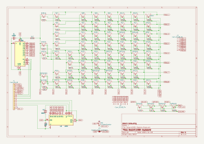
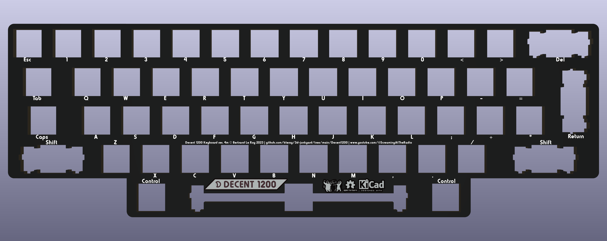
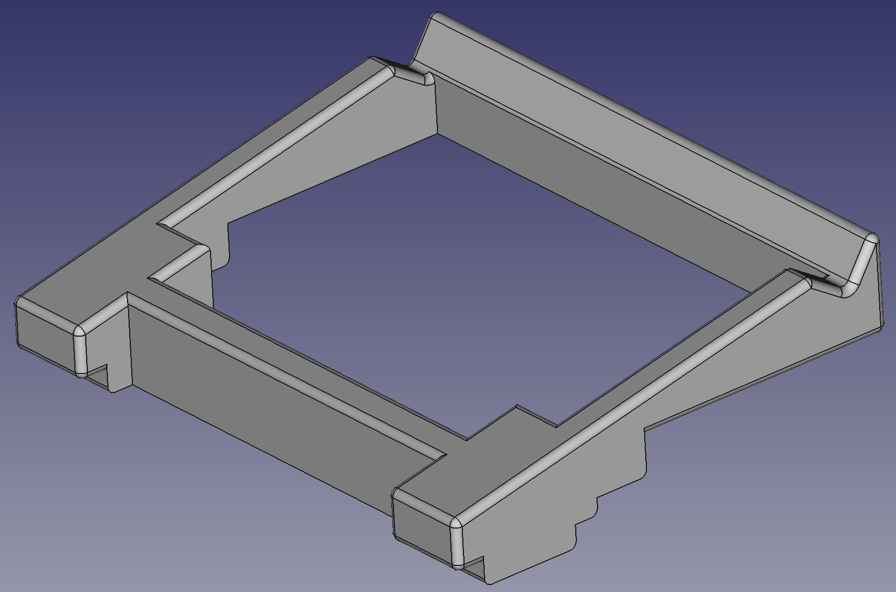
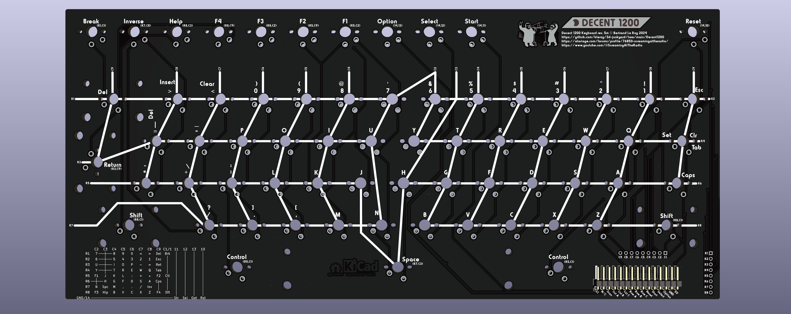

# Decent 1200 mechanical keyboard replacement for Atari 1200XL computers

Whether you have a vintage Atari 1200XL computer with a deficient keyboard or just want a better keyboard, this is the project for you.

There are two versions of the keyboard: modern and vintage. Modern uses brand new MX-compatible key caps and switches, while vintage keeps the original vintage Atari caps and adapts them to modern switches.

The vintage version can use Kailh Choc v2 low-profile switches, in which case 3D-printed adapters bridge one of the supported variants of XL key caps to the Choc switches' MX footprint.

There's been a number of mechanical keyboard builds for Atari computers that are all great but tend to be one-off projects that are not designed to be reproduced or commercially produced. This project does all that and more.

If you're looking to modify an XE computer, head over to [the DecentXE project](https://github.com/bleroy/3d-junkyard/tree/main/Atari130MX). For 600XL and 800XL keyboards, go to [the DecentXL project](https://github.com/bleroy/3d-junkyard/tree/main/DecentXL)

## Current version

The current revision of the Decent 1200 keyboard is: rev. 3.

## Can I buy one?

The project is open-source, and I encourage everyone to build their own. I also sell kits and assembled keyboards (both modern and vintage) for those who are not comfortable with ordering parts, PCBs or using a soldering iron.

How expensive is it? It depends on what you're ordering, but this is a made-to-order custom mechanical keyboard, so not cheap.

## Project history

This is a brand new design that uses a lot of lessons learned from building the [DecentXE](https://github.com/bleroy/3d-junkyard/tree/main/Atari130MX) and the [award-winning DecentXL](https://github.com/bleroy/3d-junkyard/tree/main/DecentXL), but adapts to the specificities of the 1200XL.

## Options

### Key caps: modern or vintage?

The modern versions of Decent keyboards are the best quality keyboards. It's a solid design that just feels great. In comparison, the vintage versions tend to feel more wobbly and are generally of lower quality. They are also more difficult to build, which is why I stopped producing them myself. I want to keep the quality of the assembled keyboards I build as high as possible.

The modern version also has a slightly modified layout with a large return keys, and relocated control keys around the shorter space bar. Caps is relocated to where it is on a modern keyboard, above left shift (that's where Atari originally placed the control key, now left of space).

If you absolutely want to keep the look and layout of your keyboard as close to the original as possible, you can use vintage caps (scavenged from the computer you're modifying or bought new old stock or used), but be aware of the quality difference. The result is visually indistinguishable from the original, if it wasn't for the backlighting, and does feel much better than the original, but is significantly less nice than the modern version... You'll also have to build it yourself since I no longer ship assembled vintage versions. See building instructions below to get a feel of the build difficulty.

### Switches

Switches are largely a matter of taste. The Decent 1200 PCB can be mounted with either MX-compatible switches or with Kailh Choc v1 switches.

It's your choice of caps that determines what type of switch to use:

* Modern: choose MX-compatible switches
* Vintage: choose Kailh Choc v1

With any type of switch, there is a wide array of choices. If you're new to the world of mechanical keyboards, there are 3 main families of switch experiences:

* Linear (often red): the switch reacts with mostly constant resistance throughout the course of the key press until it hits the bottom.
* Tactile (often brown): there is a higher resistance at a specific point of the key's course, providing tactile feedback to pressing the key.
* Clicky (often white): an even more pronounced and localized resistance is accompanied with an audible and satisfying click.

## Design

The Decent 1200 project is constituted of the following parts (this is not a BOM but a list of custom parts created for this project; see below for the actual BOM):

* A PCB with adjustable blue backlighting.
* An aluminum plate to hold the switches firmly aligned and rigidify the assembly.
* A custom set of MX-compatible modern key caps.
* 3D-printed adapters for vintage caps.
* 3D-printed console keys with vinyl texture stickers.
* 3D-printed brackets to connect the boards to the 1200XL top case shell.

## Bill of materials

This project is meant to be reproduced. You'll need a few things that are more or less easy to source, so I've made sure to give multiple roads to success and alternatives for most parts.

It's also an approach that can be easily adapted to other vintage computer keyboards, Atari or not.

### Atari 1200XL computer

The project is designed around the conservation of the vintage look of the Atari 1200XL computer and the integration of the keyboard in its original case. As such, ideally you'd have a host 1200XL computer to receive the end product.

### Key caps and adapters

You'll need a set of caps.

If you've decided to go for modern, you'll need a set of modern caps that you can order from me or from [WASD](https://www.wasdkeyboards.com/decentx-by-xl-freak-85-key-custom-cherry-mx-keycap-set.html). Make sure to specify a 2.25U left shift.

If you have a complete set of vintage key caps, you'll need 55 [adapters](../DecentXL/Adapters/kailh-choc-to-xl-cross-x10.stl) (more affordable if printed as 6x sets of 10).

[JLCPCB](https://jlcpcb.com/) and [PCBWay](https://www.pcbway.com/) are examples of fabrication houses that can produce high-quality prints of adapters for cheap, but there's plenty of other places where these can be done. You can also print your own (with a resin printer).

### Console keys (Help, Start, Select, Option, Reset, F1-F4, Break, Reverse video)

You'll need 11 new [3D-printed console keys](./Caps/Decent1200-console-choc.stl) (more affordable if printed as a [set of twelve](./Caps/Console-set-XL-Choc-x12.stl)). The printed console keys fit on top of Kailh Choc v1 switches, not the MX switches used for the rest of the keyboard.

3D-printed console keys will look great if you apply a [brushed metal vinyl sticker](https://www.amazon.com/dp/B08L4GZRDY/ref=sspa_dk_detail_2?pd_rd_i=B087KRL4NY&pd_rd_w=HzYnW&content-id=amzn1.sym.f734d1a2-0bf9-4a26-ad34-2e1b969a5a75&pf_rd_p=f734d1a2-0bf9-4a26-ad34-2e1b969a5a75&pf_rd_r=VYGSYS1YEDTZ7QRRJN26&pd_rd_wg=Nd7sq&pd_rd_r=3f4a2c8d-a713-44c7-b8ae-544c3b0b1f53&s=automotive&sp_csd=d2lkZ2V0TmFtZT1zcF9kZXRhaWw&th=1). The stickers can be cut with a simple vinyl cutter such as a Cricut using [this template](./PrintedParts/ConsoleKeyStickers.svg).

### Switches

For a modern layout, you'll need 67 switches total corresponding to your cap type. You need 56 switches for the main keyboard, and 11 for the console keys. That means that you'll need 56 MX switches and 11 Kailh Choc v1 switches.

Vintage uses all Kailh Choc switches for both main keyboard and console keys with some extras due to stabilization using switches on some keys (69).

### Stabilizers and adapters

#### Modern

The modern version of the Decent 1200 keyboard uses four 2U Durock v2 stabilizers for both shift keys, return and delete, and one 6.25U Durock v2 stabilizer for the space bar.

#### Vintage

The vintage version requires a Durock stabilizer with a hand-made custom-length stabilizer rod made from [1/16" copper rods](https://www.mcmaster.com/8859K511/) and [custom printed stems](./PrintedParts/DurockInsert.stl). 

Shift and delete keys use two lateral switches as a stabilizing method.

### PCB

Use [the Gerber](./Keyboard/production/Decent1200_keyboard_3.zip), [BOM](./Keyboard/production/Decent1200_keyboard_3-bom.csv) and [position](./Keyboard/production/Decent1200_keyboard_3-positions.csv) files to order a PCB with all the SMD parts assembled. That includes a pair of 4051 chips that decode and encode queries to the keyboard matrix. The 1200XL is the only Atari computer to have those chips on the keyboard and not on the motherboard, which reduces the number of wires necessary in the connector, but makes the keyboard slightly more expensive. It also makes it necessary to have a PCB for the keyboard, a requirement Atari dropped in later computers for the much cheaper membrane-based keyboards in some XL computers and in the XE computers. Note that the PCB has through-hole footprints for the original 4051 chips Atari was using in their keyboards. This is usually going to remain unpopulated, and is only there to allow using vintage chips instead of the modern surface-mounted ones that should come assembled on the PCBs.

### Plate

The plate is just an aluminum PCB. Download [the Gerber](./Plate/production/Decent1200_plate.zip) and have it produced in 1.6mm aluminum. I recommend having this done in black as it will be visible through the gaps between keys and on the sides.

There's also a printed plate to help with the alignment of console keys (to be made available shortly).

### Connectors

The connector to the motherboard is a pair of cables with Dupont connectors on both ends. We need 15 pins spaced 2.54mm (0.1") on a single line. 15-pin connectors pretty much don't exist, but 9-pin and 6-pin ones are easy and cheap to source, for example on AliExpress. The cables should be at least 10cm long.

You'll also need 15 pin 2.54mm angled headers.

### Brackets

The XL keyboard is mounted to the top of the Atari case using 3D-printed brackets:

* [STL file for the brackets](./PrintedParts/Decent1200Brackets.stl)
  

For our keyboards, we can't unfortunately just have correctly placed holes in the PCBs because the columns extend beyond the planes where they need to be located. Instead, the columns go under the PCB and fit into 3D-printed adapters that hold the PCBs in place and receive the screws.

### Padding

There's some space in the 1200XL case under the keyboard, which can cause some buckling in the middle. To prevent that, you can print two padding parts that sit on top of the RF shield and support the keyboard around the middle.

* [STL file for the support pads](./PrintedParts/KeyboardMiddleSupport1200.stl)
  

### Spring

If you went for a vintage keyboard, the wide space bar may need a spring. The original spring from the Atari keyboard should work, but you can also source a new 17mm x 9mm one.

### Hardware

When using MX or Alps switches, the plate will usually naturally be held at a constant height by the switches. When using low-profile switches however, it's a little trickier and I recommend using the two mounting holes at the top of the main PCB and plate to add screws and nuts or [standoffs that keep the plate at a constant distance of 3.5mm (or 1/8 freedom units)](https://www.mcmaster.com/92510A400/) from the PCB.

## Assembly

Once you've gathered all the parts, you can assemble them in the following order:

### Mount the stabilizers

The stabilizers consist of a larger part that has the threaded part, a smaller part that slides into the previous one, a metal bar linking two assemblies of the two previous parts, and some hardware. The stabilizers are best assembled in this order: slide the smaller part into the larger one (make sure you orient it properly), then insert one end of the metal rod into that assembly and push it into place so it clicks and is properly secured. Once you've done that with both ends of the stabilizer, you should be able to verify both ends lift together and with no friction (some people like to lube their stabilizers by the way).

Once the stabilizers are assembled, you can put them in their respective places on the top side of the PCB. Insert the bottom, non-threaded part first, try to lay the stabilizer's surface flat on the PCB, and push the top threaded part into place. This usually moves the other end a bit, so make sure both ends are properly inserted all the way into the holes in the PCB.

Turn the PCB over. Position one of the small washers around each of the screw holes for the stabilizers and secure it with a screw.

The vintage Decent 1200 keyboard only uses a stabilizer for the space bar (the other stabilized keys just have additional switches), but since the space bar is 9U and the cap footprint is different from MX caps, you'll need additional parts. First you'll need custom-printed stems for the stabilizers, that you'll assemble into the Durock stabilizers like you would the standard ones. Then you'll need a custom-length rod made from 1.6mm copper rods (see BOM for source). The rod must be cut to measured dimensions and bent carefully before being added to the stabilizers.

### Configure the keyboard for your layout

Solder two small jumper wires **horizontally** to the left of the PCB to configure it for Caps or Control. This rewires the key that's above left shift and that's normally Control on an original keyboard. Control on the modern keyboard goes to the left of the space bar, and this key is reconfigured to be Caps. The two wires should short from the middle position to the right position for modern, and from the middle to the left for vintage. The silkscreen has helper text for this.

### Mount the switches onto the plate

Insert switches into the aluminum plate with the LED window to the back and the pins to the front.

On the modern layout, the exception to this is the return key that should have its LED window to the left and pins to the right.

On the vintage layout, delete, return, shift and caps have a different orientation. It's more practical to wait and add those at the next step, while soldering the switches. Also note that stabilized keys need two switches on the vintage layout.

Note that the console keys do not have a place on the plate. That's because they will be aligned using a separate printed plate.

### Get the plate and PCB together

After making sure all the switch pins are vertical and none are bent out of place, carefully align the plate and switches with the stabilizers and the PCB. Slowly and carefully complete that assembly, making sure no pins get bent. Once that is done, the plate and PCB should be a few millimeters apart, evenly spaced across the whole surface.

If using low-profile switches, mount standoffs between the plate and main PCB using the two mounting holes on top of the boards.

You can secure the boards together with tape or clothespins until you've soldered enough switches.

### Solder the switches onto the PCBs

Solder each switch onto the PCBs.

Use a printed plate to align the console keys before soldering them. Note the console keys use Kailh Choc v1 switches on both vintage and modern versions.

Each console key, as well as Esc, Tab, Caps/Control, left shift and space have two possible positions, because the keyboard doesn't have the same width for vintage and modern. For modern, choose the position to the right, and for vintage, choose the leftmost one.

### Plug the cables

Solder the 15-pin angled header under the PCB (solder on the top of the PCB, header under). Plug one end of your cables onto those headers.

### Add cap adapters

If you need them (vintage), add the cap adapters to your switches.

### Add the key caps

Assemble the key caps onto the switches or cap adapters. If needed, don't forget to insert the stabilizer adapters into the relevant key caps before you press fit them onto the switches and stabilizers.

Apply brushed metal stickers to the console keys. I find that holding the stickers with an Exacto knife is a good way to get the alignment precisely right. Take you time for this, as misalignments tend to be very visible with the keys so close to one another.

Your keyboard is now assembled. Let's mount it into the computer.

### Assemble the brackets

You might want to briefly connect the keyboard before mounting it and turn the computer on to check the LEDs light up. If you need to tune the brightness of the backlight to the desired level, this is a good time to do it by turning the pot on the bottom-right of the board. If you do it later, you may have to remove the keyboard from the case.

Set the keyboard in its place under the top shell of the case and add the brackets on top of it, so the columns are fully insertd into them. There is some lateral freedom in the assembly to allow for the 0.25U narrower modern layout to be centered in the case: if you're using the modern layout, you'll want to shift the main board a few millimeters to the right to perfectly center the keyboard. Console keys should be a good guide of the proper alignment is you soldered them correctly.

Once everything looks properly aligned, add the screws.

Plug the other end of the cables into the Atari motherboard's connector.

Close the case. Congratulations, you're done! Turn your computer on and enjoy your mechanical keyboard. It's a good idea to go into the Atari diagnostics or BASIC and check every key works.

## Troubleshooting

Defects and mistakes happen. If when testing your keyboard, if you notice a key or a bunch of them don't work, testing and fixing the keyboard is usually quite easy.

The back of the board shows the matrix the keyboard is built on. It's easy, from the indications there to figure out what pins a switch is supposed to connect. It's like coordinates: the keyboard is essentially a matrix of switches. You can test continuity using the empty R1-8 and C1-8 vias around the connector. Connect your multimeter, press the switch. You can also test the switch directly, and test continuity from it to its neighbours and to the connectors. Most problems can be found this way, and if the keyboard needs repairs, it's usually easy to pull an additional wire to fix a damaged trace.

## Appendix: Can I keep my vintage console keys?

I would really encourage you not to try, as the new printed keys with vinyl stickers look really great. The problem with keeping the vintage console keys is that there's almost no clearance between the upper plane of the PCB as it needs to be for the rest of the keyboard and the bottom of the console keys at rest. Even low-profile switches are too tall to fit in there. Console keys would need to be on a second PCB positioned lower for this to work, which would be a lot more expensive and a less solid assembly.

The only reasonable solution I found is to add the footprint of small tactile button and 3D print parts that can hold the console keys above them. The result is unpleasant and unreliable in my opinion. I'm still providing all the files to reproduce it, but I really don't recommend it.

* [Console key pads, main cluster](./Adapters/ConsoleKeyKeyPads.stl)
* [Reset key pad](./Adapters/ResetKeyPad.stl)
* [Console key stems x12](./Adapters/ConsoleKeyAdapter1200-x12.stl)

## Acknowledgements

I want to thank [XLFreak](https://forums.atariage.com/profile/63723-xl-freak/) for designing the modern key cap set for this project.

Thanks to [Jamm](https://forums.atariage.com/profile/61205-jamm/) who has been very patiently loaning me his 1200XL for months so I could design this keyboard.

And of course, many thanks to all those who provided feedback on the [DecentXE keyboard](https://github.com/bleroy/3d-junkyard/tree/main/Atari130MX) over its many revisions or bought a keyboard.
