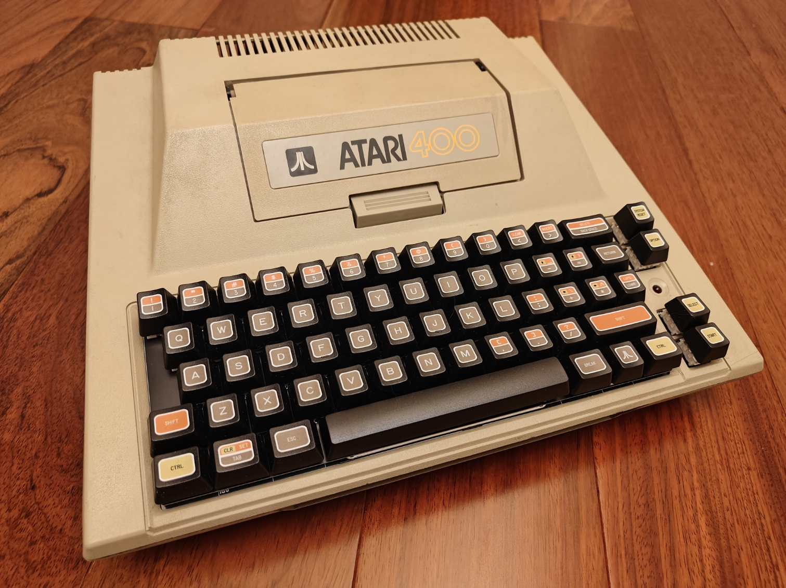
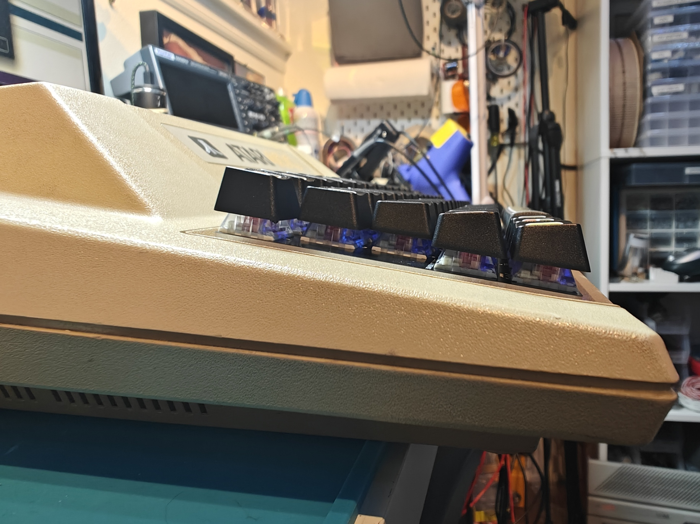
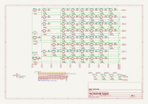
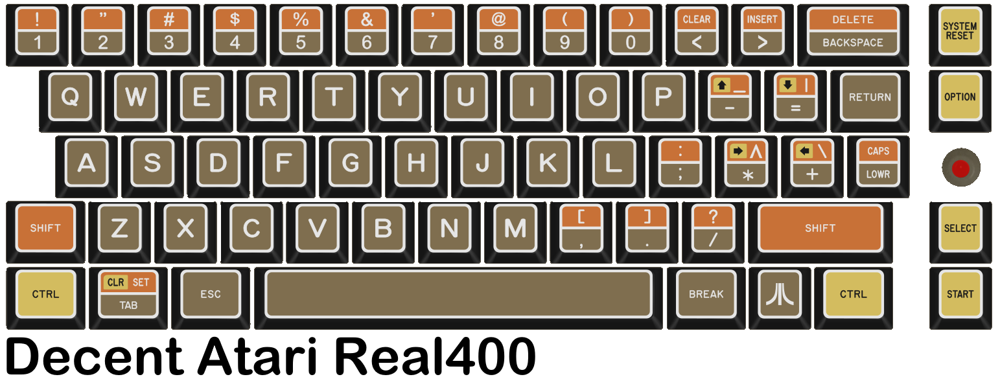
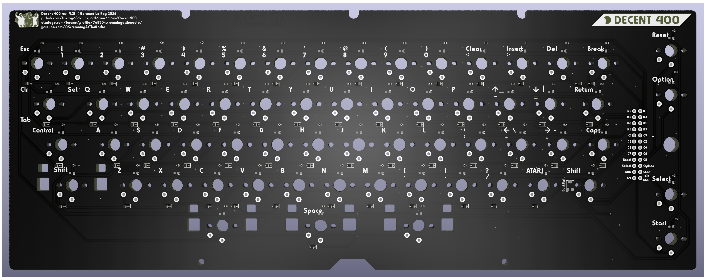
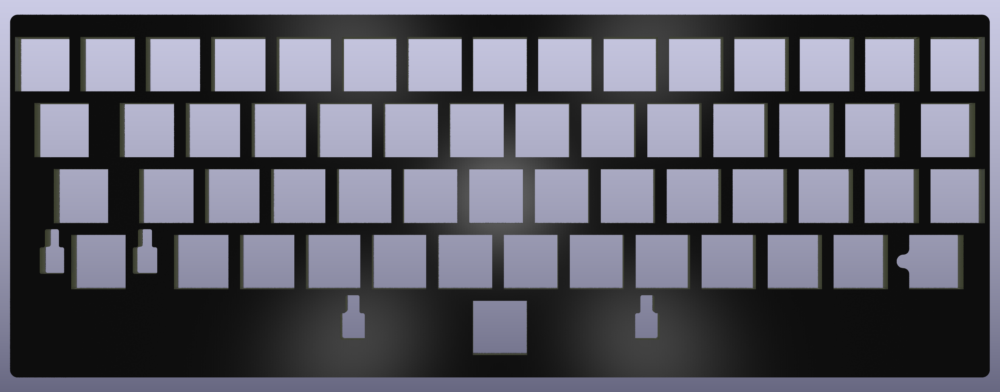
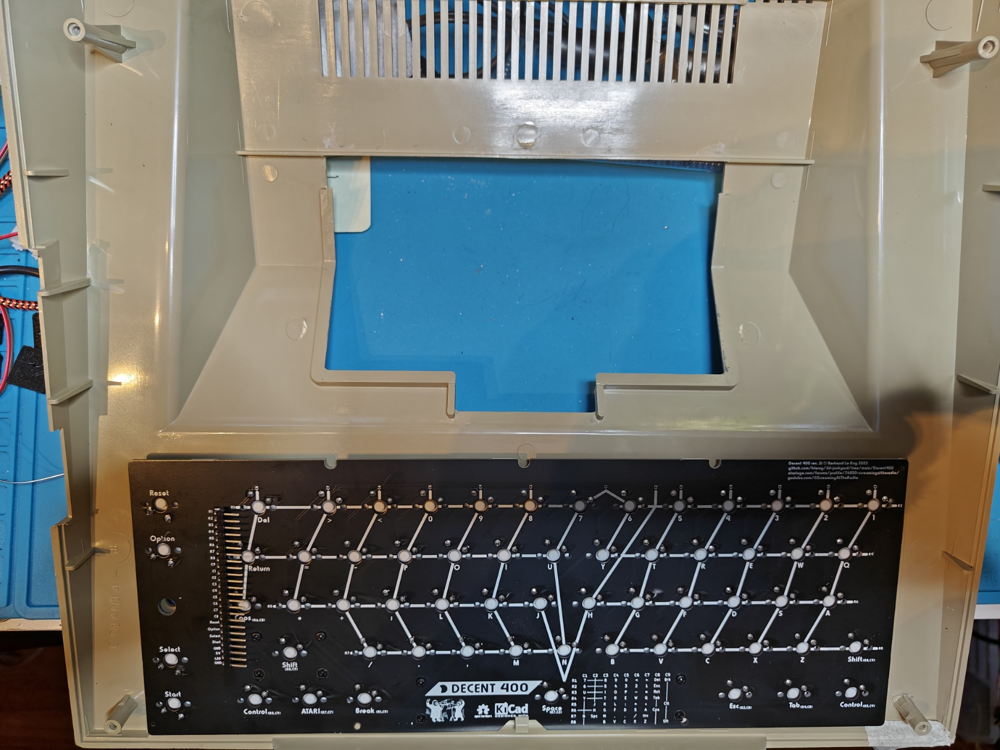
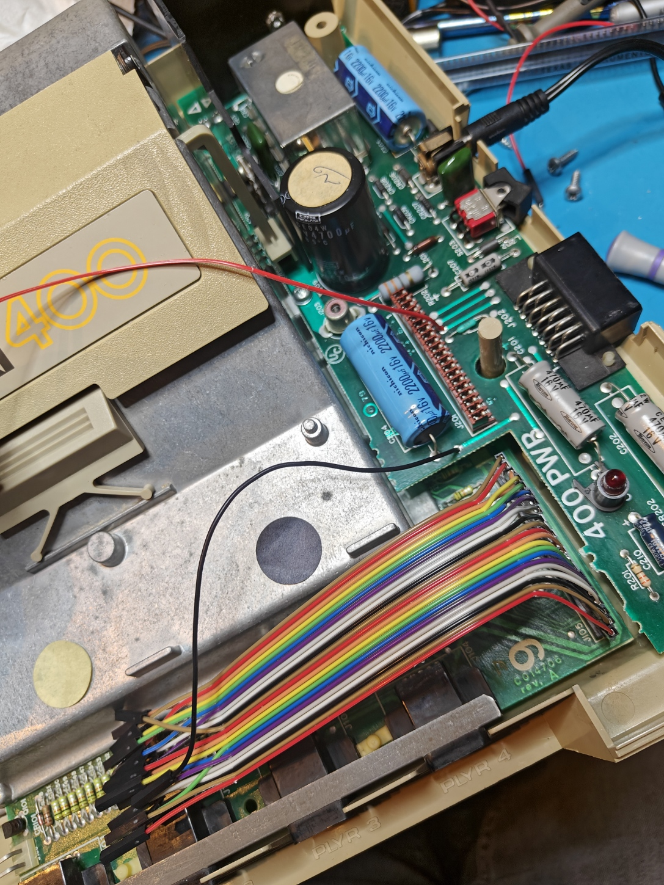
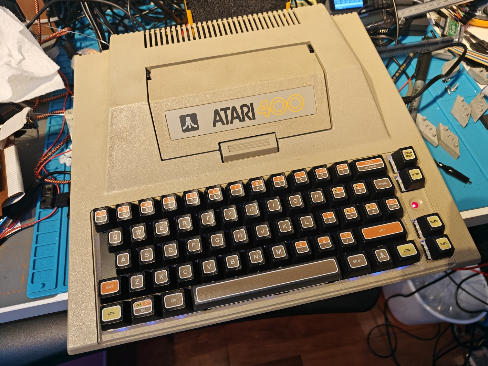
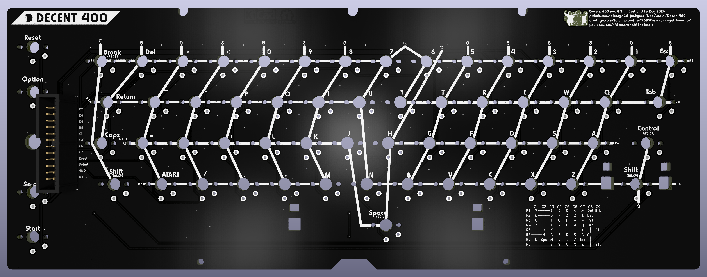

# Decent 400 mechanical keyboard replacement for Atari 400 computers

If you always wished the Atari 400 had a real keyboard, this is the project for you.

There's been a number of aftermarket keyboards for the Atari 400, but they all faced a big issue: the original membrane "keyboard"'s "keys" are much smaller than standard key caps. There just isn't enough space in the case for a sane layout with full-sized keys. It took a lot of attempts before coming up with the realization that there was an untapped degree of freedom in the design: the spacing of the keys. This is even more true of low-profile key caps, and given how infinitely taller MX switches and caps are compared to the original membrane thing, it made sense to try to build the Decent400 as a low-profile mechanical keyboard. I was finally able in late 2025 to fit the original layout of the computer in its very small space, with modern switches.

There was one final obstacle though, which is that as I ḿ writing this readme, no company in the world will print low-profile key caps. My only option was to somehow find a way to do it myself. When I heard about the [Eufymake](https://www.eufymake.com/) kickstarter for a UV printer capable of transferring a full-color design onto any material, it was clear it could be the last piece to the puzzle. It was a big investment, but I bet on it and waited and waited and waited. Finally, the printer arrived and check this out:

** photos here **

If you're looking to modify an XE computer, head over to [the DecentXE project](../Atari130MX/). For 600XL and 800XL keyboards, go to [the DecentXL project](../DecentXL/). For the 1200XL keyboard, go to [the Decent1200 project](../Decent1200/). For the 800, go to [the Decent800 project](../Decent800/).

## Current version

The current revision of the Decent 400 keyboard is: rev. 4.2i.

## Can I buy one?

The project is open-source, and I encourage everyone to build their own (access to a UV printer can be an obstacle, but you can buy the printed key caps from me). I also sell kits and assembled keyboards for those who are not comfortable with ordering parts, PCBs or using a soldering iron.

How expensive is it? It depends on what you're ordering, but this is a made-to-order custom mechanical keyboard, so not cheap.

## Project history

This is a brand new design that uses a lot of lessons learned from building the [DecentXE](https://github.com/bleroy/3d-junkyard/tree/main/Atari130MX) and the [award-winning DecentXL](https://github.com/bleroy/3d-junkyard/tree/main/DecentXL), but adapts to the specificities of the 400.

## Options

### Switches

Switches are largely a matter of taste. The Decent 400 PCB can be mounted with any Kailh Choc v1 switch.

With any type of switch, there is a wide array of choices. If you're new to the world of mechanical keyboards, there are 3 main families of switch experiences:

* Linear (often red): the switch reacts with mostly constant resistance throughout the course of the key press until it hits the bottom.
* Tactile (often brown): there is a higher resistance at a specific point of the key's course, providing tactile feedback to pressing the key.
* Clicky (often white): an even more pronounced and localized resistance is accompanied with an audible and satisfying click.

My personal preference goes to Choc Robin switches, which are very pleasant clicky switches.

## Design

The Decent 400 project is constituted of the following parts (this is not a BOM but a list of custom parts created for this project; see below for the actual BOM):

* A PCB with adjustable blue backlighting.
* An aluminum or FR4 plate to hold the switches firmly aligned and rigidify the assembly.
* A custom set of Choc v1-compatible modern key caps.
* A connector adapter board
* Cables

## Bill of materials

This project is meant to be reproduced. You'll need a few things that are more or less easy to source, so I've made sure to give multiple roads to success and alternatives for most parts.

It's also an approach that can be easily adapted to other vintage computer keyboards, Atari or not.

### Atari 400 computer

The project is designed around the conservation of the vintage look of the Atari 400 computer and the integration of the keyboard in its original case. As such, you'll need a host 400 computer to receive the end product.

### Key caps

The key caps are the hardest part to source because at the time of writing, nobodyś printing custom low-profile caps.

As UV printers are becoming relatively affordable, it has become possible to print blank caps at home.

You'll need a set of blank caps that can be printed in a Eufymake UV printer.
I'm providing a set of templates and printing support to make it easier to get conistent results.

The space bar key cap is almost impossible to source and must be [printed with black filament](./Caps/SpaceBar-Choc-v1-6U25.3mf).

### Switches

You'll need 63 Choc v1 switches.

### Stabilizers and adapters

The Decent 400 keyboard uses one 2U stabilizers for the left shift key, and one 6.25U stabilizer for the space bar.
Make sure you order the correct low-profile stabilizers.

### PCB

Use [the Gerber](./Keyboard/production/Decent400_keyboard_4.2i.zip), [BOM](./Keyboard/production/bom.csv) and [position](./Keyboard/production/positions.csv) files to order a PCB with all the SMD parts assembled.

The main PCB needs a 2x12 pin male IDC connector.

### Plate

The plate is just a PCB, which can be done in aluminum or FR4. Download [the Gerber](./Plate/production/Decent400_Plate_4.2i.zip) and have it produced in 1.2mm. It is important to check the thickness is 1.2mm and not the default 1.6mm, so that the Choc switches can properly grip it. I recommend having this done in black.

### Connectors

The keyboard connects to the motherboard through a small interface board. A pin header goes into the motherboard connector, and an IDC connector goes to the keyboard. There's also a pair of headers that can be connected to 5V and ground on the 400's power board to provide backlighting.

The connector board needs another 2x12 pin male IDC connector a 22 precision male pin header a a 2 pin angled male header.

You'll need a 24 wire 1.27mm pitch flat cable. 10cm or 15cm is fine since the connector board will be very close to the keyboardś connector.

You'll also need a 22 pin 2.54mm precision male header and a 2 pin 2.54mm pitch angled male header. Finally, two Dupont wires will connect the backlighting to 5V and ground on the Atariś power board.

## Assembly

Once you've gathered all the parts, you can assemble them in the following order:

### Mount the switches onto the plate

Insert switches into the plate with the LED window to the back and the pins to the front.

### Mount the stabilizers

The stabilizers consist of two parts and a rod. They must first be assembled and then added to the plate from the underside.

Thereś plenty of tutorials that get into the details of installing those stabilizers. Here's one:

[Kailh Chox stabilizer installation](https://docs.keeb.io/choc-stabs)

### Get the plate and PCB together

After making sure all the switch pins are vertical and none are bent out of place, carefully align the plate and switches with the PCB. Slowly and carefully complete that assembly, making sure no pins get bent. Once that is done, the plate and PCB should be a few millimeters apart, evenly spaced across the whole surface.

You may secure the boards together with tape or clothespins until you've soldered enough switches.

### Solder the switches onto the PCBs

Solder each switch onto the PCBs.

Note the console key switches are not within the area covered by the plate and need to be soldered separately after being carefully aligned by hand.

### Assemble the connector board

Solder the 24 pin IDC connector to the top of the connector board, the 22 pin header to the bottom and the 2 pin power header to the top.

### Plug the cables

Solder the second 24-pin IDC connector to the bottom of the keyboard and connect both ends of the flat cable into the IDC connectors. 

### Add the key caps

Assemble the key caps onto the switches starting with the stabilized keys. Don't add the caps to the console keys as that will make it difficult to get the keyboard through the tight console key holes.

Your keyboard is now assembled. Let's mount it into the computer.

### Removing the old keyboard

Opening the Atari 400 can be tricky if you haven't done it before. There are some great tutorials and videos showing how to do that. You only need to remove the top of the case, no need to fully disassemble the computer.

Once the top of the case is free, carefully lift it and unplug the keyboard ribbon cable from the connector on the motherboard.

Carefully remove the membrane abomination from the top of the case, taking care not to break the two very small pegs that hold it on the bottom. Some bending will be necessary.

Get the new keyboard in place under the top of the case. Getting the console key switches through is usually the trickiest part. Also take care to get the PCB in place on the bottom.

The top will still be floating, but it will be held by the shielding when we reassemble the computer.

### Connect the LED power lines

The keyboard's backlighting needs to get power from the 400 board since the keyboard connector doesn't have a 5V line. Power and ground taps can be found on the power board.

The black wire is ground and the red one is 5V.

### Connect the keyboard

Carefully insert the pin header on the bottom of the connector board into the motherboard's keyboard connector.

Connect the two power lines to the remaining two pins on the connector board.

### Close the case

Close the case, making sure to hold the keyboard while you're doing it and screw it shut. Now would be a good time to add those console key caps.

Congratulations, you're done! Turn your computer on and enjoy your mechanical keyboard. It's a good idea to go into BASIC and check every key works. There are also [keyboard testers](https://forums.atariage.com/index.php?app=core&module=attach&section=attach&attach_rel_module=post&attach_id=443022) that will allow for a complete check.

## Troubleshooting

Defects and mistakes happen. If when testing your keyboard, you notice a key or a bunch of them don't work, testing and fixing the keyboard is usually quite easy.

The back of the board shows the matrix the keyboard is built on. It's easy, from the indications there to figure out what pins a switch is supposed to connect. It's like coordinates: the keyboard is essentially a matrix of switches with diodes behind them. You can test continuity using the connector pins and the diode testing mode of your multimeter. Connect your multimeter, press the switch. You can also test the switch directly, and test continuity from it to its neighbours and to the connectors. Most problems can be found this way, and if the keyboard needs repairs, it's usually easy to pull an additional wire to fix a damaged trace.

## Acknowledgements

I want to thank [XLFreak](https://forums.atariage.com/profile/63723-xl-freak/) for designing early versions of the modern key cap set for this project.

And of course, many thanks to all those who provided feedback on the [DecentXE keyboard](https://github.com/bleroy/3d-junkyard/tree/main/Atari130MX) over its many revisions or bought a keyboard.
