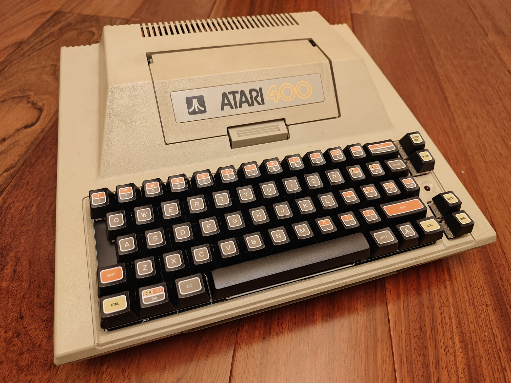
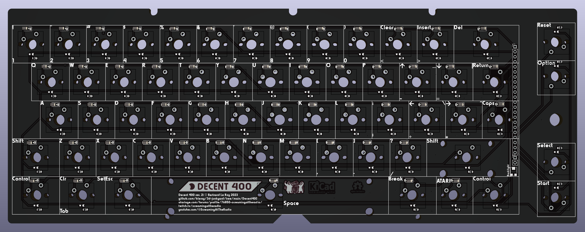
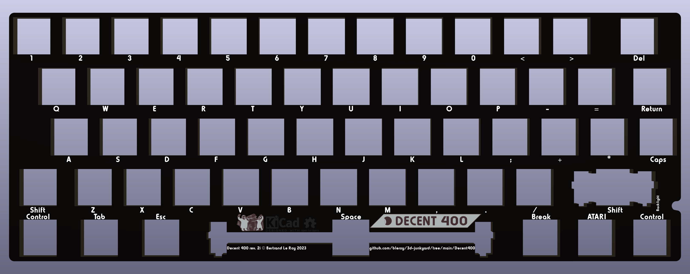
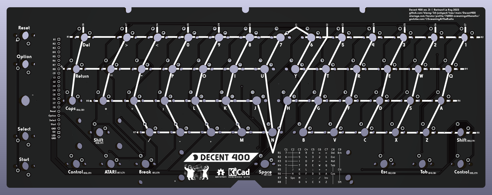

# Decent 400 mechanical keyboard replacement for Atari 400 computers

If you always wished the Atari 400 had a real keyboard, this is the project for you.

There's been a number of aftermarket keyboards for the Atari 400, but they all faced a big issue: the original membrane "keyboard"'s "keys" are much smaller than standard key caps. There just isn't enough space in the case for a sane layout with full-sized keys. It took a lot of attempts before coming up with the realization that there was an untapped degree of freedom in the design: the spacing of the keys. My research showed that it is possible to reduce the spacing between key caps by 1/32 of a keyboard unit (which is 3/4" or 19.05mm) and still have a working, non-jamming keyboard. Together with allowing keys to imperceptibly go over the boundary of the case, this allowed for a 13.75U wide keyboard whereas standard spacing only allows for 13.25U. Half a unit may not look like much, but that actually unlocks a layout that feels more netural than anything that's been tried before.

We have return in the right place, a wide delete key, and two wide shift key. We don't have enough space for the left column of esc, tab and control, but the good news is that we have some room around the space bar, so we can rotate that column 90 degrees and put it there. We also have room on the right of space, so we can squeeze break, inverse and a second control key. This feels natural and is very pleasant to use.

Another design challenge is that there's only space inside the case for a PCB and nothing more. That means that almost all of the volume of the keyboard is outside of the case. This makes for a tall keyboard, but it's still able to retain the charm of the original.

If you're looking to modify an XE computer, head over to [the DecentXE project](../Atari130MX/). For 600XL and 800XL keyboards, go to [the DecentXL project](../DecentXL/). For the 1200XL keyboard, go to [the Decent1200 project](../Decent1200/).

## Current version

The current revision of the Decent 400 keyboard is: rev. 2i.

## Can I buy one?

The project is open-source, and I encourage everyone to build their own. I also sell kits and assembled keyboards for those who are not comfortable with ordering parts, PCBs or using a soldering iron.

How expensive is it? It depends on what you're ordering, but this is a made-to-order custom mechanical keyboard, so not cheap.

## Project history

This is a brand new design that uses a lot of lessons learned from building the [DecentXE](https://github.com/bleroy/3d-junkyard/tree/main/Atari130MX) and the [award-winning DecentXL](https://github.com/bleroy/3d-junkyard/tree/main/DecentXL), but adapts to the specificities of the 400.

## Options

### Switches

Switches are largely a matter of taste. The Decent 400 PCB can be mounted with any MX-compatible switch.

With any type of switch, there is a wide array of choices. If you're new to the world of mechanical keyboards, there are 3 main families of switch experiences:

* Linear (often red): the switch reacts with mostly constant resistance throughout the course of the key press until it hits the bottom.
* Tactile (often brown): there is a higher resistance at a specific point of the key's course, providing tactile feedback to pressing the key.
* Clicky (often white): an even more pronounced and localized resistance is accompanied with an audible and satisfying click.

## Design

The Decent 400 project is constituted of the following parts (this is not a BOM but a list of custom parts created for this project; see below for the actual BOM):

* A PCB with adjustable blue backlighting.
* An aluminum plate to hold the switches firmly aligned and rigidify the assembly.
* A custom set of MX-compatible modern key caps.

## Bill of materials

This project is meant to be reproduced. You'll need a few things that are more or less easy to source, so I've made sure to give multiple roads to success and alternatives for most parts.

It's also an approach that can be easily adapted to other vintage computer keyboards, Atari or not.

### Atari 400 computer

The project is designed around the conservation of the vintage look of the Atari 400 computer and the integration of the keyboard in its original case. As such, you'll need a host 400 computer to receive the end product.

### Key caps

You'll need a set of caps that you can order from me or from [WASD](https://www.wasdkeyboards.com/decentx-by-xl-freak-85-key-custom-cherry-mx-keycap-set.html).

### Switches

You'll need 62 MX compatible switches.

### Stabilizers and adapters

The Decent 400 keyboard uses one 2U Durock v2 stabilizers for the right shift key, and one 6.25U Durock v2 stabilizer for the space bar.

### PCB

Use [the Gerber](./Keyboard/production/Decent400_keyboard_2i.zip), [BOM](./Keyboard/production/Decent400_keyboard_2i-bom.csv) and [position](./Keyboard/production/Decent400_keyboard_2i-positions.csv) files to order a PCB with all the SMD parts assembled.

### Plate

The plate is just an aluminum PCB. Download [the Gerber](./Plate/production/Decent400_Plate_2i.zip) and have it produced in 1.6mm aluminum. I recommend having this done in black.

### Connectors

The connector to the motherboard is a pair of cables with male Dupont connectors on one end and female Dupont connector on the other end. LED power comes through a pair of wires that get soldered onto the power board on one end, and should have female Dupont connectors on the other side. We need 22 pins spaced 2.54mm (0.1") on a single line for the main keyboard signals and two for LED power. The cables should be at least 10cm long.

You'll also need a 24 pin 2.54mm angled header.

## Assembly

Once you've gathered all the parts, you can assemble them in the following order:

### Mount the stabilizers

The stabilizers consist of a larger part that has the threaded part, a smaller part that slides into the previous one, a metal bar linking two assemblies of the two previous parts, and some hardware. The stabilizers are best assembled in this order: slide the smaller part into the larger one (make sure you orient it properly), then insert one end of the metal rod into that assembly and push it into place so it clicks and is properly secured. Once you've done that with both ends of the stabilizer, you should be able to verify both ends lift together and with no friction (some people like to lube their stabilizers by the way).

Once the stabilizers are assembled, you can put them in their respective places on the top side of the PCB. Insert the bottom, non-threaded part first, try to lay the stabilizer's surface flat on the PCB, and push the top threaded part into place. This usually moves the other end a bit, so make sure both ends are properly inserted all the way into the holes in the PCB.

Turn the PCB over. Position one of the small washers around each of the screw holes for the stabilizers and secure it with a screw.

### Mount the switches onto the plate

Insert switches into the aluminum plate with the LED window to the back and the pins to the front.

### Get the plate and PCB together

After making sure all the switch pins are vertical and none are bent out of place, carefully align the plate and switches with the stabilizers and the PCB. Slowly and carefully complete that assembly, making sure no pins get bent. Once that is done, the plate and PCB should be a few millimeters apart, evenly spaced across the whole surface.

You can secure the boards together with tape or clothespins until you've soldered enough switches.

### Solder the switches onto the PCBs

Solder each switch onto the PCBs.

Note the console keys need to be soldered separately after being carefully aligned by hand. I usually solder one leg first, then adjust the alignment and solder the second one to secure it in place.

### Plug the cables

Solder the 24-pin angled header under the PCB (solder on the top of the PCB, header under). Make sure to leave enough space between the PCB and the pins. Plug one end of your cables onto those headers.

### Add the key caps

Assemble the key caps onto the switches starting with the stabilized keys. Don't add the caps to the console keys as that will make it difficult to get the keyboard through the tight console key holes.

Your keyboard is now assembled. Let's mount it into the computer.

### Removing the old keyboard

Opening the Atari 400 can be tricky if you haven't done it before. There are some great tutorials and videos showing how to do that. You only need to remove the top of the case, no need to fully disassemble the computer.

Once the top of the case is free, carefully lift it and unplug the keyboard ribbon cable from the connector on the motherboard.

Carefully remove the membrane abomination from the top of the case, taking care not to break the two very small pegs that hold it on the bottom. Some bending will be necessary.

Get the new keyboard in place under the top of the case. Getting the console key switches through is usually the trickiest part. Also take care to get the PCB in place on the bottom.

The top will still be floating, but it will be held by the shielding when we reassemble the computer.

### Connect the LED power lines

The keyboard's backlighting needs to get power from the 400 board since the keyboard connector doesn't have a 5V line. Power and ground taps can be found on the power board.

The black wire is ground and the red one is 5V.

### Connect the keyboard

Carefully insert the male connectors into the motherboard's keyboard connector. It's very easy to bend those Dupont connectors, so be gentle.

Connect the two power lines to the remaining two pins on the keyboard's connector. LED ground is the bottom pin, and 5V goes right above that.

### Close the case

Close the case, making sure to hold the keyboard while you're doing it and screw it shut. Now would be a good time to add those console key caps.

Congratulations, you're done! Turn your computer on and enjoy your mechanical keyboard. It's a good idea to go into BASIC and check every key works. There are also [keyboard testers](https://forums.atariage.com/index.php?app=core&module=attach&section=attach&attach_rel_module=post&attach_id=443022) that will allow for a complete check.

## Troubleshooting

Defects and mistakes happen. If when testing your keyboard, you notice a key or a bunch of them don't work, testing and fixing the keyboard is usually quite easy.

The back of the board shows the matrix the keyboard is built on. It's easy, from the indications there to figure out what pins a switch is supposed to connect. It's like coordinates: the keyboard is essentially a matrix of switches with diodes behind them. You can test continuity using the connector pins and the diode testing mode of your multimeter. Connect your multimeter, press the switch. You can also test the switch directly, and test continuity from it to its neighbours and to the connectors. Most problems can be found this way, and if the keyboard needs repairs, it's usually easy to pull an additional wire to fix a damaged trace.

## Acknowledgements

I want to thank [XLFreak](https://forums.atariage.com/profile/63723-xl-freak/) for designing the modern key cap set for this project.

And of course, many thanks to all those who provided feedback on the [DecentXE keyboard](https://github.com/bleroy/3d-junkyard/tree/main/Atari130MX) over its many revisions or bought a keyboard.
