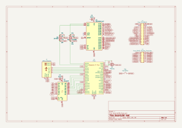
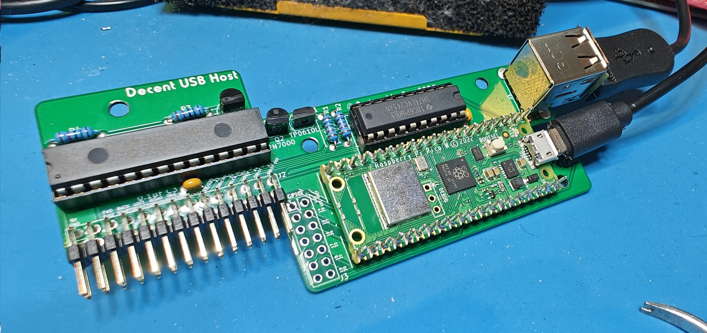
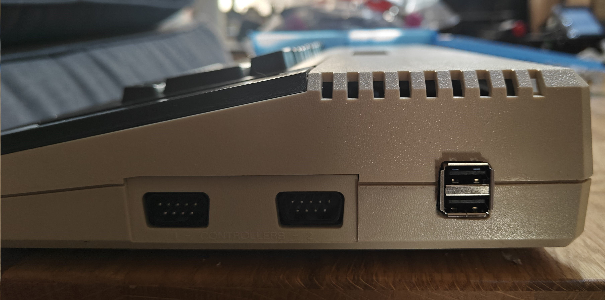

# DecentUSB Host - a USB / Bluetooth / Wifi host for Atari 8-bit computers

## Disclaimer

This is very much a prototype.
Both the hardware and the software are work in progress but the proof of concept is here.

## Summary

The DecentUSB Host aims at being a low-cost extension for Atari 8-bit computers that brings USB,
Bluetooh and Wifi capabilities to the platform.
It's open source both in hardware and software to allow the community to easily build new features.

The device is a multi-function interface to keyboards, gamepads or memory devices
in a single board that costs less than $15 to build.

The Raspberry Pi Pico has been a fantastic booster for retro-computer extensions.
Its fast PIO state machines and its extremely low price enable applications involving precise timing
of signals with a much lower barrier to entry than FPGAs.

Specifically, the Pico-W can act as a USB host, a Bluetooth host, and a WiFi card.
By connecting it internally to the relevant Atari 8-bit buses and signals, we can interface modern
devices with our favorite retro platform.

## Applications

Once drivers have been built, we should be able to support the following scenarios (non exhaustive list):

* USB and Bluetooth keyboards
* USB and Bluetooth gamepads
* USB and Bluetooth mouses
* USB stick drives and SD cards
* Internet access (potentially in a FujiNet-compatible way)
* Atari to PC communication (potentially in a SIO2PC-compatible way)

## Internal interfaces

The DecentUSB Host board exposes pins that connect to the following signals inside the Atari:

* GND and 5V power the Pi and its helper chips
* Pokey K0-6, KR1 and KR2: enables the device to simulate a keyboard
* Start, select, option, reset: enables console key control, for example through an external keyboard
* SIO clock in/out, data in/out and command: enables SIO device simulation
* Joystick port 1 up, down, left, right and fire as well as A_POT: enables joystick simulation
* Potentially other signals using the remaining free GPIOs on the Pi

## External interfaces

* USB-A: enables the connection of keyboards, gamepads, memory cards, etc.
* WiFi: enables connecting the Atari to a WiFi network
* Bluetooth: enables the connection of wireless keyboards, gamepads, etc.
* Extra GPIOs: can be used to connect a small screen and buttons to control the device (for example to select a disk image on a USB stick)

## Design

The board is organized around a Raspberry Pi Pico-W. Because the Pi Pico's GPIOs are 3.3V, we need level shifting
when communicating with Atari chips, that work with 5V.
A [74LS245 octal bus transceiver with 3-state outputs](https://www.ti.com/lit/ds/symlink/sn74ls245.pdf?ts=1721591805770&ref_url=https%253A%252F%252Fwww.ti.com%252Fproduct%252FSN74LS245%253Fbm-verify%253DAAQAAAAJ_____z09G5w-RuXKmyqPN9D01GsauQwYL8dDyMXiK44u71BrArA7bduJh3_OD8st1mj1Cc3ZQpKBlPkj0bqm2ZqPSW0lef3Epl4jaI_pUddQ0aPeXT9HDIQboftbEbC32nspc6P45mNWv85oCSzuZ3bw6x_tf0xGXKeRdpE4WSm0GdRcWSv3V-uQrgrP_k79VoEyhaTUUqllb1Mgz0MrIIXEplHwcklhPus3aLMropnEETrmvWX90fqZ9q2pWK7u4F95ruxiMyiBAu3lhsDOHY2GYXNoXjbwjd2Grb8x_CDRsfsvbxKD)
that is compatible with 3.3V and 5V does the fast level shifting we need to read the K0-6 and KR2 lines
from Pokey as well as EXT2 and make those signals available to the Pi on its GPIOs.

We also have a [MCP23017 5V-compatible GPIO extender](https://ww1.microchip.com/downloads/en/devicedoc/20001952c.pdf)
that we use to interface with other 5V signals (Pokey's KR1, SIO signals, joystick digital signals and
the console key signals).

Finally, power is supplied to the board through the Pi either from the Atari motherboard if that's connected,
or through the Pi's micro-USB port.
MOSFET Q3 takes care of selecting the correct power supply.
This enables the board to be safely programmed through the micro-USB port while the board is connected
inside the Atari.

Physically, the board is designed to fit in an Atari 800XL between the ROMs and the SIO port.
Optionally, the case can be modified on the right side behind the joystick ports to let a USB port through.
If the user doesn't want to use USB but only Bluetooth and Wifi, the board can operate without case mods.

In a XE computer, the board can be fitted closer to the keyboard connector.
The optional USB port can be exposed to the outside through a case mod that lets the new port through the
right side of the case in front of the joystick ports.

In other machines such as the 600XL or XEGS, the back of the case can let the USB port through.
If necessary, there could be optimized versions for each model or form factor.

## Future developments

### Hardware

The prototype relies on the Pi to host a USB port on GPIOs using the USB host library.
One of the disadvantages of this approach is that we're using the Pi's computing resources to wait for USB data.
The USB host library supports only one USB port and can only work in a blocking or polling way, meaning
that it's very difficult to handle other tasks while waiting for USB data without missing
any of it.

For those reasons, the next version of the hardware will include a specialized USB hosting chip such as
[the Microchip PIC16(L)F145X](https://ww1.microchip.com/downloads/aemDocuments/documents/OTH/ProductDocuments/DataSheets/PIC16LF1454-5-9-14-20-Pin-8-Bit-Flash-USB-Microcontroller-with-XLP-Technology-DS40001639C.pdf)
and a 2-port USB hub chip such as
[the Microchip USB2422 2-port USB hub controller](https://ww1.microchip.com/downloads/aemDocuments/documents/OTH/ProductDocuments/DataSheets/00001726B.pdf) to have two active USB ports without having to connect a hub.

The prototype was all through hole components, which is great for experimentation.
The production version of the board will use SMD components, which are easier to source and
will allow for an even more compact design.

I might also add enough GPIO extenders to plug into the PBI.

### Software

The software for the board is currently highly experimental and only establishes a proof of concept.
It can detect USB devices being added and removed. It recognizes any USB keyboard and can read its inputs.
It can map USB keystrokes to Pokey signals.
It can scan the Pokey keyboard pins and simulate keystrokes
(albeit imperfectly at this time because it does so in Python).

Over the next few months, the code will be extended and rewritten to use PIO state machines, which are
much faster than Python code. The main code will be rewritten in C, again for better perf.

I'll also write new drivers for gamepads, thumbdrives and Wifi.