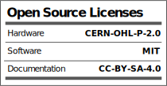
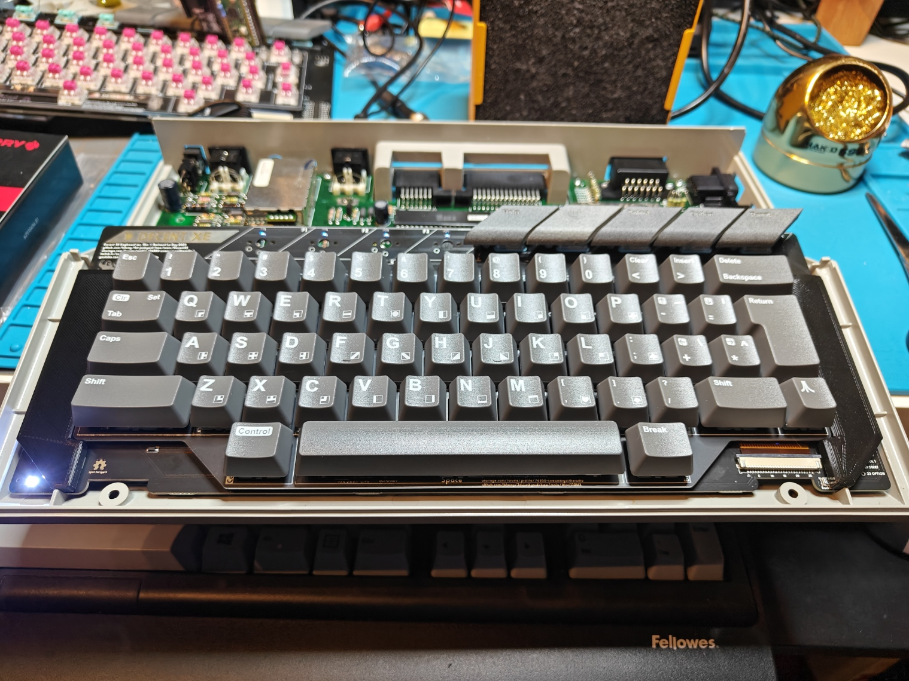
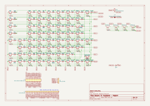
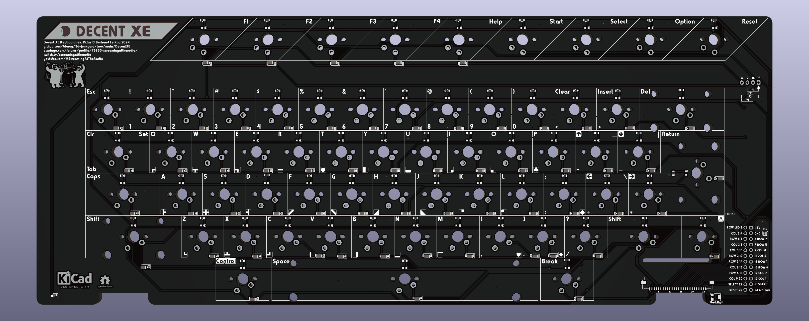
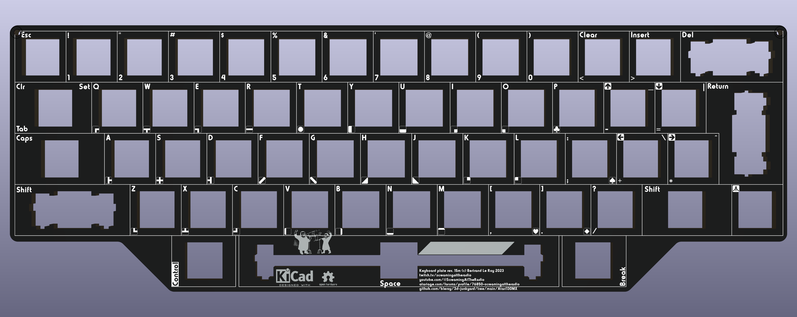
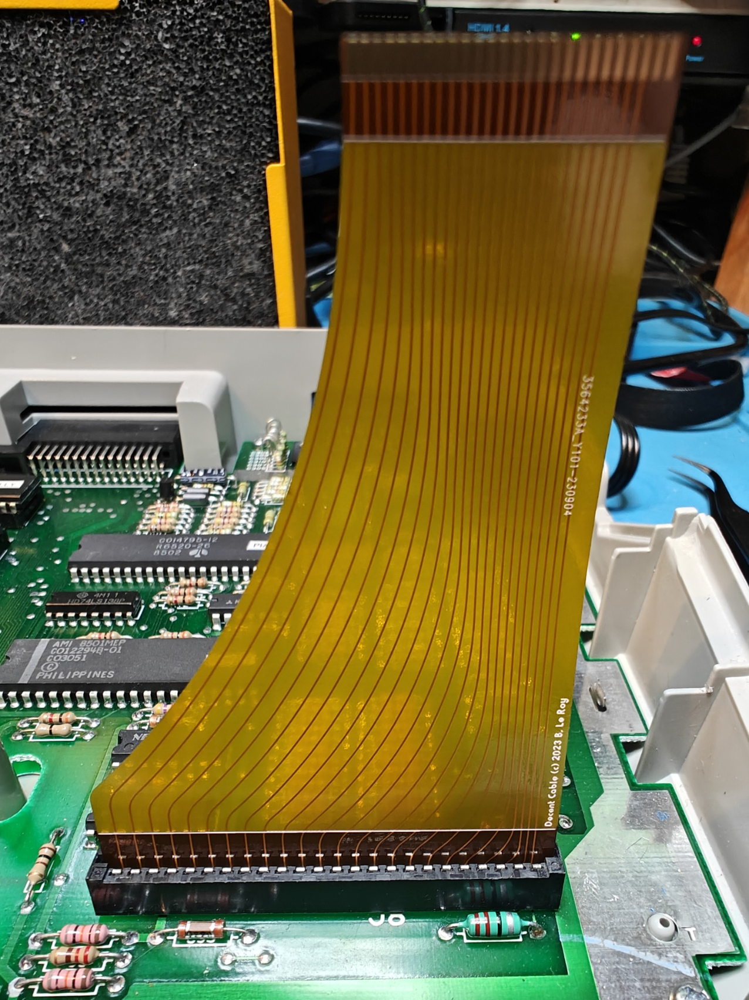

# Decent XE mechanical keyboard replacements for Atari XE computers

Whether you have an old Atari XE computer with a dead keyboard membrane, would like to use a XE keyboard with your favorite PC emulators, or just want to build a more modern XE keyboard, this is the project for you.

There are two versions of the keyboard: modern and vintage. Modern uses brand new MX-compatible key caps, while vintage uses the original Atari key caps and adapts them to modern switches.

There's been a number of previous projects to put a modern keyboard on Atari 8-bit computers. I don't think anyone's done it while preserving the original keycaps though (would love to be proven wrong). Once assembled, you can't tell the difference from an aesthetic point of view... Check this out:

But wait!... That's not all. Since the project started, there's been multiple revisions, adaptations to all kinds of demands from other Atari enthusiasts, and you now have many options to build the keyboard of your dreams...

## Current version

The current revision of the DecentXE keyboard is: **rev. 15.2**.

## Can I buy one?

The project is open-source, and I'm encouraging everyone to try to build their own. I do sell kits and assembled keyboards (both modern and vintage) for those who are not comfortable with ordering parts, PCBs or using a soldering iron. If you'd like to order something, [drop me a personal message on AtariAge](https://forums.atariage.com/profile/76850-screamingattheradio/). Keyboards and kits are made to order, so expect several weeks between ordering and receiving.

How expensive is it? It depends on what you're ordering, but this is a made-to-order custom mechanical keyboard, so, not cheap. You can find all the prices [in this thread](https://forums.atariage.com/topic/352558-decent-xe-mechanical-keyboard-for-atari-xe-computers-how-to-order-one/).

## Project history

My first attempt at this was to replace the stem in a [Kailh Box Pink switch](https://novelkeys.com/collections/switches/products/kailh-box-switches?variant=40598132129959) with a 3D-printed version that replaces the regular MX cap footprint with an Atari XE cap footprint. The modified stems were printed with my first printer, an Elegoo Mars 2 Pro. Its 50 micron resolution was essential when replacing such a small and precise part.

This worked great, with switches that were a little more gritty than the originals but still a huge improvement over the mushy XE keyboard I was replacing.

As I made the project public on [Atariage forums](https://forums.atariage.com/topic/324588-atari-130xe-keyboard-rebuild-vintage-keycaps-on-modern-switches), I quickly discovered the key caps I had on my 130XE were only one of two variants, and not the most common at that. I've been supporting both variants, square and circle ever since.

The stabilizers were costar stabilizers for the left shift, which required some creative bending of the vintage stabilizer rod and always remained a little clunky. The space bar rod has a larger diameter and necessitated 3D-printed stabilizers that were, to be frank, terrible. They sorta did the job, just poorly.

The first plate I made was water-jet-cut steel. That was expensive and rusty. I quickly realized after that first attempt that PCB fabrication houses can make aluminum PCBs for cheap. Those are machined rather than laser or water-jet cut, but the quality is perfectly adequate for a fraction of the price. They are just PCBs without circuitry on them. I later learned how other handmade keyboard makers use the same trick, including with regular PCBs, although aluminum is clearly superior for this application.

The first connector I used was an ad-hoc cable made from breadboard jumper wires (I replaced the notoriously hard to source 24 pin Atari connector with pin headers). Based on early feedback, this was quickly replaced with a choice of standard flat cables, to the 1mm pitch 26 pin FFCs used today. Why 26 pins? Because 24 pin FFC connectors and cables don't exist or are hard to source whereas the 26 pin versions are commonly used in DVD players and printers. Also, that gives us two additional lines to separate the backlighting power from the rest, but that in itself came later, at first there was no backlighting and those two additional lines just duplicated the 5V and ground lines, which was just good practice at the time, but turned out to provide that feature for free later without breaking pinout back-compat.

On the side of the Atari motherboard, an adapter was needed that could plug into the original 24 pin connector or be soldered to pin headers, and had a 1mm pitch 26 pin FFC connector on the other side. The main difficulty is that there's very little space between the motherboard and the bottom of the keyboard.

The next breakthrough resulted from re-thinking the constraints:
* Keep compatibility with vintage key caps
* Keep the assembly the same height as the original so everything looks unchanged, including function keys flush to the case

Keeping the same height with MX switches meant replacing internal parts. This is time-consuming and results in lower-quality. What if instead you could work with lower switches that give enough vertical space to build an interface between the switch and the cap? That's what led me to consider low-profile switches. My first choice was to remain with Kailh switches, that I like quite a lot, and I picked Choc v1, specifically Robins that have a clicking behavior similar to Box Pinks. Using adapters instead of replacing internals however also gave the side benefit to allow people to choose the switches they prefer. If you prefer linear or tactile, that's fine.

I made a new version of the PCB for Choc switches which was also the first to have backlighting.

Then there were demands to support more types of low-profile switches to allow for cheaper alternatives to Kailh Chocs.

Around the same time, I had been trying to find reasonably affordable small batch key cap sets to make it possible to build a keyboard without depending on vintage parts. XLFreak is the one who designed and sourced new key caps from [WASD](https://www.wasdkeyboards.com/) (no longer in activity). The very wide space bar doesn't exist on modern keyboards, so we had to shuffle things around. I think the layout that came out of this is better than the original: we get a larger backspace key, an ISO return key, control moves to the left of the smaller 6.5U space bar, break to its right, caps moves to its modern place above left shift. I was able to lay out the PCB so it's compatible with both the vintage and the modern layouts with a single configuration header.

In order to simplify things and have a single unified PCB design, I designed a switch footprint that could accommodate four different kinds of switches: MX, Kailh Choc, Gateron low-pro and RedDragon low-pro.

I also moved the Raspberry Pi Pico connection off the board to a separate USB adapter board since not everybody needed it and it added routing complexity.

It was also a good time to update the stabilizer design. For modern caps, there was no reason not to use the better alternative that are Durock v2 stabilizers. For vintage caps, I wasn't able to swap left switch stabilizers because the way vintage shift keys are built doesn't leave space for 2U Durock v2 stabilizers.

That was where we were with revision 11, which shipped as a pre-order to readers of [the AtariAge forum thread](https://forums.atariage.com/topic/324588-atari-130xe-keyboard-rebuild-vintage-keycaps-on-modern-switches/).

**Revision 12** moved the FFC connector to the top side of the board so it could be assembled at the fab house with the other surface-mount components, and moved to the bottom-right of the board, next to the break key. The FFC cable is now routed to the front between the two halves of the shield.

The power LED is now surface-mount like the backlight LEDs.

The optional function keys (F1-4) pins are now duplicated on a separate header on the top-right of the board to enable easy wiring of those pins to keys placed for example in an extension device.

The adapter that plugs into the motherboard was now smaller, leaving more space above and removing the requirement to replace the Atari keyboard connector and replace it with pin headers (although that was still recommended). The adapter's FFC connector was now moved to the left of the connector instead of above it.

The plate outline has been modified to let more power LED light through.

The silkscreen has been updated to give clearer instructions about configuring the keyboard for vintage or modern modes.

**Revision 13** changes console keys (Help, Start, Select, Option and Reset) to use low-profile switches, which enables thinner 3D-printed key caps that better fit the XE case.

The PCB now has a visual representation of the keyboard matrix with pin numbers, making debugging easier.

The PCB and plate have a consistent Harry Fatt typeface, and each key gets all its glyphs represented, which makes it easier to use the keyboard without caps.

**Revision 14** replaced the adapter and flat cable with a flexible PCB.

**Revision 15** splits the modern and vintage designs. This removes the requirement to have configuration headers and greatly simplifies the layout of the PCBs. I also stopped building assembled vintage keyboards myself with this version, instead focusing on the higher quality modern keyboards. The files for vintage remain available for thos who want to build their own.

**Revision 16**

[x] Power LED switched to red in BOM
[x] Optional red LED diffuser 3D model
[x] Mid-keyboard support 3D model
[x] Back of the board padding 3D model for better fit in the XE case
[x] Console keys have stabilization holes in PCB and plate
[x] Plate covers the whole width of the keyboard and conoles keys area
[x] PCB made 1.75mm deeper to reach the case's fins on the back of the keyboard area
[x] Remove legends from plate front so it's a uniform black between key caps

## Options

### Key caps: vintage or modern?

My own original preference was to use the original key caps from a vintage Atari XE computer. They can be scavenged from an existing computer, or from new old stock that's still available at the usual places. The result is, like above, visually indistinguishable from the original keyboard, but feels oh so much better.

XLFreak has been working on new caps in the style of old Atari caps, but that can be produced in small quantities. The nice thing about those is that no adapter is necessary and the end result is an amazing keyboard that is and feels in every way like a great modern keyboard. This is now my preferred option to upgrade Atari XE keyboards.

### Switches

If you're using modern key caps, you may choose any MX-compatible switch. You'll need 5 low-profile Kailh Choc v1 switches for the conole keys.

If you're using vintage caps, you can pick any Kailh Choc v1 low-profile switch.

## Design

The Decent XE project is built on [an original PCB design](./Keyboard/DecentXE-Modern.kicad_pcb), [a custom aluminum plate](./Plate/DecentXE-plate-modern.kicad_pcb), [MX-compatible switches](https://www.kailhswitch.com/mechanical-keyboard-switches/smt-key-switches/box-blue-white-switches-for-mechanical.html), [Kailh Choc v1 low-profile switches](http://www.kailh.com/en/Products/Ks/CS/), [custom key caps from GoblinTech](https://goblintechkeys.com/collections/60-keycap), 3D printed adapters and Durock v2 and Costar stabilizers.

Here's [a video showing revision B of the project)](https://youtu.be/r8T07Rskkgs):

And here's [another](https://youtu.be/FDqwOca9oRQ/) showing the revision 11 with modern caps:

## Bill of materials

This project is meant to be reproduced. You'll need a few things that are more or less easy to source, so I've made sure to give multiple roads to success and alternatives for most parts.

It's also an approach that could easily be adapted to other vintage computer keyboards, Atari or not. Everything is provided [under an open source license](../LICENSE) so you're encouraged to reproduce and fork the design.

### Atari XE computer

The project is designed around the conservation of the look of Atari XE computers and the integration of the keyboard in its original case. As such, you'll need a host XE computer to receive the end product.

It is also possible however to build and use this keyboard and use it with an emulator on a PC or Mac through a USB adapter. In this way, you can get closer to the original experience even if you don't have access to the original hardware.

* Optimal: Atari XE computer
* Fine: a PC, mac or a MiSTer with [an emulator](https://www.virtualdub.org/altirra.html)

### Key caps

The best result will be obtained with [new key caps](https://goblintechkeys.com/collections/60-keycap).

Vintage key caps from an Atari XE computer can also be used to maintain a look that is indistinguishable from the original. Old-new stock of XE keyboards is also currently available without too much trouble and for a reasonable price.

* Optimal: [MX-compatible set of key caps](https://goblintechkeys.com/collections/60-keycap)
* Fine: vintage set of XE key caps

### Console keys (Help, Start, Select, Option, Reset)

If you're using modern key caps, you'll need to make a choice for console keys.

The first solution is to [3D-print your own](./Caps/fn-console-set-choc.stl) and then paint them. I recommend [Tamiya Sea Grey model paint](https://www.tamiyausa.com/shop/acrylic-paint-flat-mini-10ml/acrylic-mini-xf-83-m-sea-gray/) for a pretty good match with the Atari XE case color. You can mask the legends when painting to make them stand out.

I'm also working on a set of vinyl stickers that could provide an alternative to painting and might even allow for shine-through caps. Stay tuned...

The alternative is to use vintage function keys on adapters. That choice will require using adapters on top of the low-profile switches for those five keys.

* Good: 3D-printed
* Optimal: vintage function keys on adapters

### Switches

A choice of switches is highly personal and there are many options. Get a sample set if you don't have a preferred kind. You can choose between MX-compatible switches for modern caps and any Kailh Choc v1 switch for conole switches or for the vintage version.

There are three main categories for switches:
* linear (such as reds): the resistance from the switch is about constant as it's pressed.
* tactile (such as browns): there's a slight bump of resistance as the switch is pressed, giving more feedback than linear switches.
* clicky (such as whites): there's a bump in resistance, accompanied with an audible and satisfying clicking sound.

Console keys should now be mounted on Kailh Choc v1 low-profile switches, so you'll need to buy 5 that match the characteristics of your main keyboard choice (clicky, linear or tactile).

* Optimal: 57 MX-compatible switches of your preferred brand and kind (for modern caps) + 5 Kailh Choc v1 switches for the console keys
* Fine: 62 Kailh Choc v1 low-profile switches (for vintage caps)

### Adapters

The switch adapters link vintage caps to modern switches. As such, you don't need them if you opted for all modern caps. If you're using vintage console keys, you'll need 5 adapters.

The best option today is to simply have the adapters printed, for example by JLCPCB.

Online printing services have become very inexpensive, and the quality of their prints can't be rivalled by any hobbyist printer available today. The trick for small parts such as these adapters is to group them in [batches](./Stems/kailh-choc-to-xe-circle-set.stl) so they count as a single part. I stopped printing locally after the prototyping phase, and am now ordering all my 3D prints from JLCPCB.

If you decide to print them, you'll need a resin printer with a resolution of 50 micrometers (1/20th of a millimeter) or better.

The choice of resin is very important, as the same design on the same printer can give wildly varying qualities of print. For instance, I stay away from all grey Elegoo resins, as I found them to blur the design and be very unreliable. The resin I've had the best results with is Elegoo's [clear red](https://www.elegoo.com/collections/resin/products/elegoo-standard-resin?variant=32365787807792). Resin prints also tend to be brittle, and it's no fun trying to remove a broken leg from inside a switch's stem or a key cap.

There are adapters in the repo for all types of vintage XE caps. You can even generate your own by using [the OpenScad model](./Stems/keeb-stem.scad), which is fully parametric.

* Optimal: order from a fab house such as JLCPCB
    - 7x [set of circle adapters](./Stems/kailh-choc-to-xe-circle-set.stl) or 7x [set of square adapters](Stems/kailh-choc-to-xe-square-set.stl) if you're going full vintage.
    - 5 adapters, circle or square. You can use one of the sets above (10 adapters per set).
* Fine: print your own with a resin printer

I also sell adapters separately from keyboards.

### Board padding (obsolete as of rev. 16)

For the most stable results, you can add two [padding 3D-printed parts](./Stabilizers/HeightPadding.stl) on top of the main board at the bottom left and right:

Those can be printed on any 3D printer as they don't require a lot of precision.

[Additional padding](./Misc/XE-rev-before-16-depth-padding.stl) can be added to the back of the board to prevent the keyboard from moving to the back of the computer.

### Mid-keyboard support

While the XE case provides some support to the middle of the keyboard with a column, pressing the console keys can still cause some bending of the board. To prevent that, [support](./Misc/XE-mid-keeb-support.stl) can be added to the left of the console keys.

### Power LED coloring

If you have a board with a white power LED and your XE case has a transparent LED window, you can still make thepower LED shine red using a [LED diffuser](./Misc/LED-red-lens.stl) printed in transparent red.

### Stabilizers

If you're using modern caps, just use Durock v2 stabilizers for backspace, Return, left shift and the space bar.

The Atari XE keyboard has stabilizers on the left SHIFT key and on the space bar. Some versions also have stabilizers on control and right shift, but anything 2U and smaller can work well without stabilizers.

The left shift stabilizer is made with a standard metal bar that fits in standard costar stabilizers, for which the vintage plate is designed. There are two possible orientations for the costar stabilizers that work best for the circle and square variants of vintage key caps. Those stabilizers can be bought for a very reasonable price from many places.

The vintage space bar can use Durock v2 stabilizers, for which I've made adapters for both types of vintage Atari space bars.

* Optimal (modern caps): 1x 6.5U and 3x 2U Durock v2 stabilizers
* Fine (vintage caps):
    * Vintage Atari XE left shift stabilizer metal part
    * 2x standard costar stabilizers
    * 1x 6.5U Durock v2 stabilizer set
    * 3D-printed stabilizer adapters [for circle](./Stabilizers/durock-v2-spacebar-circle-adapter.stl) or [square](./Stabilizers/durock-v2-spacebar-square-adapter.stl)

### Main board

The [DecentXE KiCad project](./Keyboard/DecentXE-Modern.kicad_pcb) should have everything you need to order a 2 layer PCB from any manufacturing house. The board requires surface-mount diodes, LEDs, resistors and connectors that are best assembled at the fabrication house: nobody wants to solder 62 of the same very tiny components by hand. I think. I don't.

* Optimal:
    - [DecentXE Modern main board Gerber files](./Keyboard//production/Decent_XE_Keyboard_-_Modern_16.zip)
    - [DecentXE Modern BOM file](./Keyboard/production/Decent_XE_Keyboard_-_Modern_16-bom.csv)
    - [DecentXE Modern Position file](./Keyboard/production/Decent_XE_Keyboard_-_Modern_16-positions.csv)
* Fine:
    - [DecentXE Vintage main board Gerber files](./Keyboard//production/Decent_XE_Keyboard_-_Vintage_15.zip)
    - [DecentXE Vintage BOM file](./Keyboard/production/Decent_XE_Keyboard_-_Vintage_15-bom.csv)
    - [DecentXE Vintage Position file](./Keyboard/production/Decent_XE_Keyboard_-_Vintage_15-positions.csv)

### Plate

While it is possible to build and operate a keyboard without a plate, it will not be as nicely aligned and won't feel as solid as it would with a proper plate.

In terms of weight, the keyboard assembled with an aluminum plate is about 430g.

* Optimal: 1.6mm aluminum PCB. Aluminum PCBs can be made for similar prices as regular PCBs nowadays, and that constitutes the best price / performance compromise currently available.
    - [DecentXE Modern aluminum plate Gerber files](./Plate/production/Decent_XE_Keyboard_Plate_-_Modern_16m.zip)
    - [DecentXE Vintage aluminum plate Gerber files](./Plate/production/Decent_XE_Keyboard_Plate_Vintage_15v.zip)
* Great but expensive: laser-cut or waterjet-cut metal
* Not fine: laser-cut acrylic. Really, don't even try, it'll shatter. Some other laser-cut plastics may be OK, but I can't help you with that, I don't know.

When using vintage caps, you may need to add some spacers between the board and the plate while building, in addition to the switches themselves. I've been using stacked washers.

There's a smaller, 3D-printed plate for the console keys that also adjusts the height of the switches relative to the PCB:

* [Console key plate](./Stabilizers/LowProRaiserPlate.stl)

### Connector

The original Atari XE keyboard's connector was just a part of the mylar membrane. We need a replacement for that. Note that the clearance between the Atari XE motherboard and the bottom of the keyboard is very small at about 16mm.

The current solution is a custom flexible PCB that can plug directly into the Atari motherboard connector, and is compatible with a modern 1mm 26 positions surface-mounted connector on the other side:

If your Atari connector is damaged, or you don't have one, it's also possible to solder [an adapter](../Atari130MX/Atari130MX-adapter/Atari130MX-adapter.kicad_pro) and use a standard 1mm pitch 26 position flat cable.

* Optimal:
    * [Flexible PCB](../DecentXL/DecentXL-Cable/production/DecentXL_Flexible_Cable_2.zip).
* Fine:
    * [FFC 26 position 1mm Type A](https://www.digikey.com/en/products/detail/adafruit-industries-llc/5386/16129671?s=N4IgTCBcDaIIwFsEAIAOBLALgYwBbLADY10A7EAXQF8g) (contacts on the same side on both ends) ribbon cable, 15cm at least.  Here's also [an Amazon source](https://www.amazon.com/uxcell-Flexible-Cable-Ribbon-Player/dp/B07RWRX6YT/r).
    * [XE keyboard Adapter](../Atari130MX/Fabrication/DecentXE-adapter.zip)
    * 1x24 2.54mm pin headers

## Fabrication and assembly instruction

Once you've sourced all the components, it's time to assemble. The following instructions attempt to reflect all the choices you may have made in selecting components.

Jan Beta ha a great video where he shows the full assembly process (the mistake he makes with the config jumpers can no longer be made: those are gone from the design).

### Printing console caps and adapters (optional)

There are two known shapes of vintage key caps, requiring distinct adapters. The first type of key cap has square stems, while the second has circular stems.

In this repository, you'll find [OpenScad](./Stems/keeb-stem.scad) and [STL](./Stems) files for [both](./Stems/kailh-choc-to-xe-circle-set.stl) [types](./Stems/kailh-choc-to-xe-circle-set.stl) of stems. If you need to modify anything about the stems, you'd need to regenerate the STL from the OpenScad file. There is [a single OpenScad file](./Stems/keeb-stem.scad) that covers both types of stems through configuration. Otherwise, just send the STL file to your 3D printing manufacturer.

You'll need 62 adapters total for the whole vintage keyboard, and only 5 for modern if you want to re-use your vintage console keys.

### Optional: replace the Atari connector

If you lack the original Atari connector on your motherboard (rare), you may want to use an adapter and solder that in.

### Installing a modern keyboard (assembled)

I do sell assembled modern keyboards, but you still need to get those into your Atari. This section goes through the details of doing that.

The FFC cable should already be attached to the keyboard.

[skip to the common section](#common-section-inserting-the-adapter)

### Installing a vintage keyboard (assembled)

Use a key cap extractor to remove the keys from your vintage keyboard (a key extractor is the best way to make sure you don't damage the caps). Make sure to be especially gentle if you have the square variant, those break easily.

Put the two space bar stabilizer adapters into your vintage space bar. You can set aside the old metal rod for this key, you won't need it. The alignment of the stabilizers and the adapters is not always perfect. If that's a problem in your build, you can try to adjust the OpenScad model to move the footprint and better align with your space bar. Even with good alignment, I recommend salvaging the spring from the original keyboard and inserting it into the new keyboard. It does make a big difference for vintage builds.

Remove the stabilizer rod for your left shift key. You'll need to slightly bend this so it can go around the new switch and into the new stabilizer. This may require some fiddling. In the worst case, the left shift stabilizer can be omitted if you can't find a way to make it work. This is my least favorite part of those keyboards...

Assemble the caps back onto the new keyboard by gently pressing them into place.

[skip to the common section](#common-section-inserting-the-adapter)

### Modern keyboard (kit)

If you ordered a kit or parts from the BOM, there is a specific order in which you should assemble.

#### Assemble the Durock stabilizers

The stabilizers consist of a larger part that has the threaded part, a smaller part that slides into the previous one, a metal bar linking two assemblies of the two previous parts, and some hardware. The stabilizers are best assembled in this order: slide the smaller part into the larger one (make sure you orient it properly), then insert one end of the metal rod into that assembly and push it into place so it clicks and is properly secured. Once you've done that with both ends of the stabilizer, you should be able to verify both ends lift together and with no friction (some people like to lube their stabilizers for added smoothness).

Once the stabilizers are assembled, you can put them in their respective places on the top side of the PCB. Insert the bottom, non-threaded part first, try to lay the stabilizer's surface flat on the PCB, and push the top threaded part into place. This usually moves the other end a bit, so make sure both ends are properly inserted all the way into the holes in the PCB.

Turn the PCB over. Optionally position a small washers around each of the screw holes for the stabilizers. Secure the stabilizer into place with a screw. Repeat this for the space stabilizer, the left shift, the delete key and the return key.

#### Solder the console key switches

The console key switches go *under* the plate, and as such need to be soldered before the other switches are inserted into the plate and soldered.

#### Add the cable

Insert the flexible PCB from below the PCB into its slot through the PCB, so the contacts are on the bottom and can face the board.

Pull the two tabs for the connector, then insert the contacts into the connector, pushing the cable as far as it will go. Push the tabs back in.

At this point, I usually test continuity between a few of the solder points on the board to the other end of the connector, in order to check the cable is properly inserted and secure.

#### Mount the switches onto the plate

Insert switches into the aluminum plate with the LED window to the back and the pins to the front. The exception to this is the modern return key that should have its LED window to the left and pins to the right.

Note that the console keys do not have a place on the plate. That's because they use low-profile switches that wouldn't reach the height of the plate. We'll assemble those later.

#### Get the plate and PCB together

After making sure all the switch pins are vertical and none are bent out of place, carefully align the plate and switches with the stabilizers and the PCB. Slowly and carefully complete that assembly, making sure no pins get bent. Once that is done, the plate and PCB should be a few millimeters apart, more or less evenly spaced across the whole surface. You may want  to secure them together with tape or clothespins until you've soldered enough of them.

#### Solder the switches onto the PCB.

Solder each switch onto the PCB.

Once you've done all the full-size switches, insert the low-profile switches for the console keys into their 3D-printed plate, then align that to the PCB. Solder the switches.

Even after soldering, you can make small adjustments by melting the solder around one of the pins and carefully moving the switch, then reflow the other pin of the same switch to relieve constraints or further adjust.

[skip to the common section](#common-section-inserting-the-adapter)

### Vintage keyboard (kit)

If you ordered a kit or are building one from parts from the BOM, there is a specific order in which you should assemble.

#### Assemble the space stabilizer

Assemble the space stabilizer. The stabilizers consist of a larger part that has the threaded part, a smaller part that slides into the previous one, a metal bar linking two assemblies of the two previous parts, and some hardware. The stabilizers are best assembled in this order: slide the smaller part into the larger one (make sure you orient it properly), then insert one end of the metal rod into that assembly and push it into place so it clicks and is properly secured. Once you've done that with both ends of the stabilizer, you should be able to verify both ends lift together and with no friction (some people like to lube their stabilizers by the way).

Once the stabilizer is assembled, you can put both ends in their respective places on the top side of the PCB. Insert the bottom, non-threaded part first, try to lay the stabilizer's surface flat on the PCB, and push the top threaded part into place. This usually moves the other end a bit, so make sure both ends are properly inserted all the way into the holes in the PCB.

Turn the PCB over. Optionally position a small washers around each of the screw holes for the stabilizers. Secure the stabilizer with a screw.

#### Add the cable

Insert the flexible PCB from below the PCB into its slot through the PCB, so the contacts are on the bottom and can face the board.

Pull the two tabs for the connector, then insert the contacts into the connector, pushing the cable as far as it will go. Push the tabs back in.

At this point, I usually test continuity between a few of the solder points on the board to the other end of the connector, in order to check the cable is properly inserted and secure.

#### Mount the switches onto the plate

Insert switches into the aluminum plate with the LED window to the back and the pins to the front.

#### Get the plate and PCB together

After making sure all the switch pins are vertical and none are bent out of place, carefully align the plate and switches with the stabilizers and the PCB. Slowly and carefully complete that assembly, making sure no pins get bent.

Once that is done, the plate and PCB should be a few millimeters apart, more or less evenly spaced across the whole surface. Low-profile switches have a tendency to not attach to the plate as well as full-sized switches, so don't worry if some of these fall out during assembly, you'll have a chance to set them back in later. At this point, you want to have enough switches in place to ensure proper alignment.

Another thing with low-profile switches is that they're not as good at maintaining the distance between PCB and plate. To make that distane more even with the distance imposed by the space stabilizer, there are two holes for M2 screws at the top of the plate and main board. Use three M2 nuts to keep the correct distance between the plate and PCB. Secure everything from the top with one final nut.

#### Assemble the left shift stabilizer

The left shift stabilizer is more problematic and potentially the most frustrating part of this build. Worst case, it may be fine to just omit this stabilizer because if improperly installed it can make things worse. The stabilizer consists of two plastic parts that should fit into slots around the switch's position. Depending on whether you have circle or square caps, it should be installed upside up or upside down. Those stabilizers are very tricky to put in place. Once they are in place, you'll need (later, we'll get back to that) to get the metal rod from your vintage left shift, remove it, then bend it slightly so it can go around the switch and still be inserted into the new stabilizer. I'm not kidding when I say this is frustrating.

#### Solder the switches

Solder the switches onto the PCB. The Choc switches will barely stick out on the back of the PCB. This is normal, but makes soldering a little more difficult. Give the iron enough time to heat up the vias, the solder and the pins and create a proper join, even if that join ends up relatively flat.

Dont's forget the console keys. Since those do not mount on the plate, use a 3D-printed console key plate to align the switches precisely and keep the switches at the correct height.

Even after soldering, you can make small adjustments by melting the solder around one of the pins and carefully moving the switch, then reflow the other pin of the same switch to relieve constraints or further adjust.

### Common section: inserting the cable

Remove your existing keyboard, pulling the membrane connector carefully using both hands to avoid accidentally folding it.

Insert the flexible PCB into the connector on the motherboard.

Add the height padding on top of your keyboard's main PCB, to the bottom left and right.

You can now power your computer. The power LED on the keyboard should go on and the backlighting should too (this is a good time to set the potentiometer on the bottom left to a brightness level you're comfortabel with). 

It's a good idea to go to the diagnostics and try the keyboard diagnostics. If you got your keyboard from me, I've already done that, but you never know what could happen in transit.

Once you've verified everything works, just add the top of the case back.

And that's it. Let me know if you have any questions or need to troubleshoot anything.

Enjoy!

## License

All hardware in this repository is licensed under [CERN Open Hardware License v2](https://ohwr.org/cern_ohl_p_v2.pdf).
All software in this repository is licensed under the [MIT license](https://mit-license.org/).
All documentation in this repository is licensed under [Creative Commons Creative Commons Attribution-ShareAlike 4.0 International Public License](https://creativecommons.org/licenses/by-sa/4.0/legalcode).

Full terms can be found in the [LICENSE](./LICENSE) file or on the web sites linked above.

## Certification

This project is [certified open source hardware by OSHWA](https://certification.oshwa.org/us002378.html).
