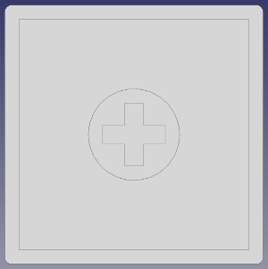
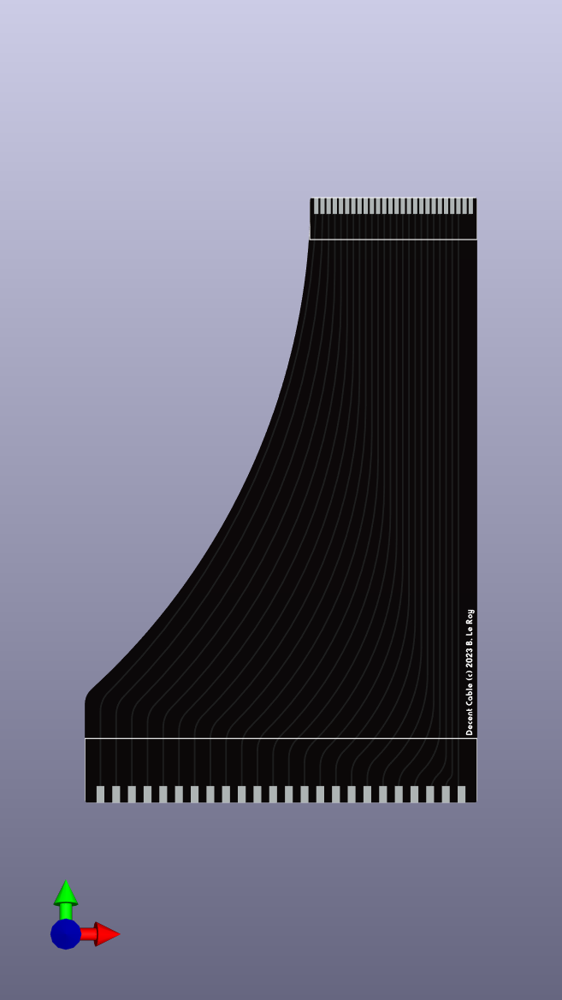

# Decent XL mechanical keyboard replacement for Atari 600XL and 800XL computers

Whether you have a vintage Atari 800XL or 600XL computer with a deficient keyboard or just want a better keyboard, this is the project for you.

There are two versions of the keyboard: modern and vintage. Modern uses brand new MX-compatible key caps and switches, while vintage keeps the original vintage Atari caps and adapts them to modern switches.

The vintage version can use Kailh Choc v2 low-profile switches, in which case 3D-printed adapters bridge one of the supported variants of XL key caps to the Choc switches' MX footprint, or [Alps-compatible switches](http://matias.ca/switches/) if you're fortunate enough to own one of the Alps XL keyboards, without needing any adapters[^1].

There's been a number of mechanical keyboard builds for Atari computers that are all great but tend to be one-off projects that are not designed to be reproduced or commercially produced. None of them let you keep the vintage key caps. This project does all that and more.

If you're looking to modify an XE computer, head over to [my previous project](https://github.com/bleroy/3d-junkyard/tree/main/Atari130MX).

## Current version

The current revision of the DecentXL keyboard is: rev. 1.1.

## Can I buy one?

The project will eventually be open-sourced, and I'll be encouraging everyone to build their own. I will sell kits and assembled keyboards (both modern and vintage) for those who are not comfortable with ordering parts, PCBs or using a soldering iron.

How expensive is it? It depends on what you're ordering, but this is a made-to-order custom mechanical keyboard, so not cheap.

## Project history

This is a brand new design that uses a lot of lessons learned from building the [DecentXE keyboards](https://github.com/bleroy/3d-junkyard/tree/main/Atari130MX), but adapts to the many complicated subtleties of the XL line of computers.

## Options

### Key caps: modern or vintage?

If you want to keep the look and layout of your keyboard as close to the original as possible, you should use vintage caps (scavenged from the computer you're modifying or bought new old stock or used). The result would be visually indistinguishable from the original, if it wasn't for the backlighting, but feels oh so much better...

If you don't have access to a good-looking full set of vintage keys, or want to go for something modernized, the modern caps look great and have a new layout with large return and delete keys, and control and break relocalized around the shorter space bar.

### Switches

Switches are largely a matter of taste. The DecentXL PCB can be mounted with MX-compatible switches, Alps-compatible switches, or Kailh Choc v2 switches.

It's your choice of caps that determines what type of switch to use:

* Vintage Alps: choose Alps-compatible switches
* Vintage other: choose Kailh Choc v2
* Modern: choose MX-compatible switches

With any type of switch, there is a wide array of choices. If you're new to the world of mechanical keyboards, there are 3 main families of switch experiences:

* Linear (often red): the switch reacts with mostly constant resistance throughout the course of the key press until it hits the bottom.
* Tactile (often brown): there is a higher resistance at a specific point of the key's course, providing tactile feedback to pressing the key.
* Clicky (often white): an even more pronounced and localized resistance is accompanied with an audible and satisfying click.

## Design

The DecentXL project is constituted of the following parts (this is not a BOM but a list of custom parts created for this project; see below for the actual BOM):

* A main PCB with surface-mounted anti-ghosting diodes, adjustable blue backlighting and flexible cable connection.
* A daughter board for the backlighted console keys and red surface-mounted power LED. The daughter board is connected to the main board with a 10-pin flexible cable.
* An aluminum plate to hold the switches firmly aligned and rigidify the assembly. Available in Alps version and MX/Choc version.
* A custom set of MX-compatible modern key caps.
* 3D-printed adapters for non-Alps vintage caps.
* 3D-printed console keys.
* A flexible PCB to connect the main board to the Atari motherboard.
* 3D-printed brackets to hold the daughter board in place slightly below the main board's level, and to connect the boards to the XL top case shell.

## Bill of materials

This project is meant to be reproduced. You'll need a few things that are more or less easy to source, so I've made sure to give multiple roads to success and alternatives for most parts.

It's also an approach that can be easily adapted to other vintage computer keyboards, Atari or not.

### Atari 600XL or 800XL computer

The project is designed around the conservation of the vintage look of the Atari XL computers and the integration of the keyboard in its original case. As such, ideally you'd have a donor XL computer and a host XL computer to receive the end product.

### Key caps and adapters

You'll need a set of caps.

If you've decided to go for modern, you'll need a set of modern caps that you can order from me or from [WASD](https://www.wasdkeyboards.com/). Make sure to specify you want a 2.25U left shift.

The key cap set is defined by [this SVG file](./Caps/DecentXL-Charcoal-Caps.svg).

If you have a complete set of vintage key caps, identify the type of cap by looking underneath one of your caps. Currently supported shapes are:

* Alps:
  
  

  No adapters are necessary, just make sure to buy Alps-compatible switches [^1].

* Cross:

  

  You'll need 62 [cross adapters](../Adapters/low-pro-to-XL-cross.stl) (more affordable if printed as 7x [sets of 10](../Adapters/low-pro-to-XL-cross-set.stl)).

* Square:

  

  You'll need 62 [square adapters](../Adapters/low-pro-to-XL-square.stl) (more affordable if printed as 7x [sets of 10](../Adapters/low-pro-to-XL-square-set.stl)).

If your key caps look nothing like those above (there are many different XL key footprints), please contact me. If you're OK sending me a key, I can measure it and make a new adapter for it, after which I'll send your key back.

[PCBWay](https://www.pcbway.com/) is an example of a fabrication house that can produce high-quality prints of adapters for cheap, but there's plenty of other places where these can be done. You can also print your own (with a resin printer).

### Console keys (Help, Start, Select, Option and Reset)

You can re-use your existing vintage console keys if you went for a vintage keyboard. Just use the same adapters as for other keys. Models also exist for new 3D printed console keys if you lost one.

If you're building a modern keyboard, you'll need new [3D-printed console keys](./Caps/ConsoleXL-MX-Single.stl) (more affordable if printed as a [set of five](./Caps/ConsoleXL-MX-Set-5.stl) or [ten](./Caps/ConsoleXL-MX-Set-10.stl)).

3D-printed console keys will look great if you apply a [brushed metal vynil sticker](https://www.amazon.com/dp/B08L4GZRDY/ref=sspa_dk_detail_2?pd_rd_i=B087KRL4NY&pd_rd_w=HzYnW&content-id=amzn1.sym.f734d1a2-0bf9-4a26-ad34-2e1b969a5a75&pf_rd_p=f734d1a2-0bf9-4a26-ad34-2e1b969a5a75&pf_rd_r=VYGSYS1YEDTZ7QRRJN26&pd_rd_wg=Nd7sq&pd_rd_r=3f4a2c8d-a713-44c7-b8ae-544c3b0b1f53&s=automotive&sp_csd=d2lkZ2V0TmFtZT1zcF9kZXRhaWw&th=1).

If you want modern caps for the main keyboard, but want to keep your original console keys, you can use low-profile switches and adapters for console keys, and MX switches for the rest of the keyboard.

### Switches

62 switches corresponding to your cap type (MX for modern, Matias for vintage Alps, Kailh Choc v2 for non-Alps vintage).

### Stabilizers and adapters

All keyboards need one 2U Durock v2 stabilizer for the left shift and a 6.5U for the space bar.

I recommend also stabilizing the delete and return keys with 2U stabilizers for the modern layout.

Vintage keys will need a stabilizer adapter fit into the key caps so they can attach to the stabilizers. The stabilizer adapters 3D models for each supported type of key cap will be added at a future date.

Contact me if you have an as yet unsupported shape of vintage cap. If you're OK sending me your space and left shift for measurements, I can design new adapters and send you back your caps.

### Main and daughter boards

Use [the Gerber](./DecentXL-keyboard/production-pcb/gerber.zip), [BOM](./DecentXL-keyboard/production-pcb/bom.csv) and [position](./DecentXL-keyboard/production-pcb/positions.csv) files to order a PCB with all the SMD parts assembled.

The daughter board is a separate order with its own [Gerber](./DecentXL-keyboard/production-console-pcb/gerber.zip), [BOM](./DecentXL-keyboard/production-console-pcb/bom.csv and [position](./DecentXL-keyboard/production-console-pcb/positions.csv) files.

You'll just need to add the switches and [the backlighting modulation pot](https://www.digikey.com/en/products/detail/cui-devices/PTN06-D02CB20/17141151).

### Plate

The plate is just an aluminum PCB. Download [the Gerber for the MX / Kailh Choc v2](./DecentXL-plate/production-plate/gerber.zip) or [Alps](./DecentXL-plate/production-plate-alps/gerber.zip) and have it produced. I recommend having this done in black as it will be visible through the gaps between keys and on the sides.

### Connectors

The connector to the motherboard is [a flexible PCB](./DecentXL-Cable/production/gerber.zip). The fabrication house will usually ask you to specify what zones to apply rigidifiers to. There are two rectangles on the silkscreen that specify that.

The connector between the main board and the daughter board is a [0.5mm pitch 10 pin 50mm FFC cable with contacts on the same side](https://www.aliexpress.us/item/3256805404128305.html?spm=a2g0o.order_list.order_list_main.5.1f031802ttMIvh&gatewayAdapt=glo2usa).

### Brackets

The XL keyboard is mounted to the top of the Atari case. On the original keyboard, a metal plate has bent parts that extend beyond the PCB or membrane and fit the corresponding screw columns on the top shell of the case.

* [STL file for the left bracket](./Brackets/DecentXL-Left-Bracket.stl)
  
* [STL file for the right bracket](./Brackets/DecentXL-Right-Bracket.stl)
  

For our keyboards, we can't unfortunately just have correctly placed holes in the PCBs because the columns extend beyond the planes where they need to be located. Instead, the columns go around the PCB and fit into 3D-printed adapters that hold the PCBs in place and receive the screws.

### Potentiometer

The backlighting luminosity can be changed with a [2kOhms 6mm potentiometer](https://www.digikey.com/en/products/detail/cui-devices/PTN06-D02CB20/17141151) mounted on the bottom-right of the main board.

### Spring

If you went for a vintage keyboard, the wide space bar will need a spring. The original spring from the Atari keyboard will work, but you can also [source a new 17mm x 8.5 one](https://www.mcmaster.com/9434K52/).

### Hardware

When using MX or Alps switches, the plate will usually naturally be held at a constant height by the switches. When using low-profile switches however, it's a little trickier and I recommend using the two mounting holes at the top of the main PCB and plate to add screws and nuts or [standoffs that keep the plate at a constant distance of 3.5mm (or 1/8 freedom units)](https://www.mcmaster.com/92510A400/) from the PCB.

## Assembly

Once you've gathered all the parts, you can assemble them in this order:

### Mount the stabilizers

The stabilizers consist of a larger part that has the threaded part, a smaller part that slides into the previous one, a metal bar linking two assemblies of the two previous parts, and some hardware. The stabilizers are best assembled in this order: slide the smaller part into the larger one (make sure you orient it properly), then insert one end of the metal rod into that assembly and push it into place so it clicks and is properly secured. Once you've done that with both ends of the stabilizer, you should be able to verify both ends lift together and with no friction (some people like to lube their stabilizers by the way).

Once the stabilizers are assembled, you can put them in their respective places on the top side of the PCB. Insert the bottom, non-threaded part first, try to lay the stabilizer's surface flat on the PCB, and push the top threaded part into place. This usually moves the other end a bit, so make sure both ends are properly inserted all the way into the holes in the PCB.

Turn the PCB over. Position one of the small washers around each of the screw holes for the stabilizers and secure it with a screw.

### Configure the keyboard for your layout

Solder two jumper wires to the left of the PCB to configure it for Caps or Control. This rewires the key that's above left shift and that's normally Control on an original keyboard. Control on the modern keyboard goes to the left of the space bar, and this key is reconfigured to be Caps. The two wires should short from the middle position to the right position for modern, and from the middle to the left for vintage. The silkscreen has helper text for this.

### Mount the switches onto the plate

Insert switches into the aluminum or aluminium plate depending on whether you are in the US :D with the LED window to the back and the pins to the front.

On modern layouts, the exception to this is the return key that should have its LED window to the right and pins to the left. Note that there are some differences with the vintage layout: the del/backspace key is two units wide, so put the switch in the middle position (there are three positions to accommodate for vintage layouts). Same for return, put it in the middle position among the three available vertically on the right of the board. There are also two additional positions around the space bar, each with its own switch. You might want to not position the del and return switches before the plate is in place as it may move, and it's fine to insert it later.

On vintage layouts, delete, return and caps have a different orientation. It's more practical to wait and add those at the next step, while soldering the switches.

Note that the console keys do not have a place on the plate. That's because they will be on the daughter board that doesn't use a plate.

### Get the plate and PCB together

After making sure all the switch pins are vertical and none are bent out of place, carefully align the plate and switches with the stabilizers and the PCB. Slowly and carefully complete that assembly, making sure no pins get bent. Once that is done, the plate and PCB should be a few millimeters apart, evenly spaced across the whole surface.

If using low-profile switches, mount standoffs between the plate and main PCB using the two mounting holes on top of the boards.

You can secure the boards together with tape or clothespins until you've soldered enough switches.

### Solder the switches onto the PCBs

Solder each switch onto the PCBs. There are 4 additional positions around the space bar, control and break keys for F1-4 optional keys. Usually you won't mount switches onto those, just ignore them unless you have a modified case that can accommodate them.

### Solder the potentiometer

Solder the potentiometer *under* the PCB so it remains accessible without having to remove the keyboard from the case.

### Assemble the daughter board

Carefully align the switches on the daughter board and solder them in place. Mounting the caps before soldering can help achieve better alignment. Soldering one leg, adjusting orientation, then soldering the second leg, is a way to improve alignment in the absence of a guiding plate.

Apply brushed metal stickers if using 3D-printed console keys.

### Assemble the brackets

Gently insert the PCBs into the brackets. There is some lateral freedom in the assembly to allow for the 0.25U narrower modern layout to be centered in the case: if you're using the modern layout, you'll want to shift the main board a few millimeters to the right to perfectly center the keyboard.

### Plug the cables

Add the cable linking the daughter board to the main board.

Plug the smaller end of the custom cable into the connector on the bottom-right of the keybaord PCB.

For both cables, contacts go on the bottom side.

### Add cap adapters

If you need them, add the cap adapter to your switches.

### Add the key caps

Assemble the key caps onto the switches or cap adapters. If needed, don't forget to insert the stabilizer adapters into the relevant key caps before you press fit them onto the switches and stabilizers.

Your keyboard is now assembled. Let's mount it into the computer.

## Mounting the keyboard into the computer

Align the bracket screw holes with the correct columns on the top shell of your Atari XL case and screw the keyboard in place. If using the modern layout, use this time to precisely center your keyboard in its window, then secure the screws in place.

Plug the larger end of the custom cable into the Atari motherboard's connector. You might want to briefly turn the computer on to check the LEDs light up and set the brightness to the desired level by turning the pot on the bottom-right of the board.

Close the case. Congratulations, you're done! Turn your computer on and enjoy your mechanical keyboard. It's a good idea to go into the Atari diagnostics and check every key works.

## Troubleshooting

Defects and mistakes happen. If when testing your keyboard, if you notice a key or a bunch of them don't work, testing and fixing the keyboard is usually quite easy.

The back of the board shows the matrix the keyboard is built on. It's easy, from the indications there to figure out what pins a switch is supposed to connect. It's like coordinates: the keyboard is essentially a matrix of switches. You can test continuity using the empty pinout connector footprint above the FFC connector. Connect your multimeter, press the switch. Be aware that there's an anti-ghosting diode in series with each switch, so setup your multimeter accordingly or you may get false negatives. You can also test the switch directly, and test continuity from it to its neighbours and to the connectors. Most problems can be found this way, and if the keyboard needs repairs, it's usually easy to pull an additional wire to fix a damaged trace.

## Acknowledgements

I want to thank [XLFreak](https://forums.atariage.com/profile/63723-xl-freak/) for designing the modern key cap set for this project.

Thanks to [Wildstar87](https://forums.atariage.com/profile/29638-wildstar87/) who has been loaning me various XL keyboards and case parts to check their footprints and design adapters.

And of course, many thanks to all those who provided feedback on the [DecentXE keyboard](https://github.com/bleroy/3d-junkyard/tree/main/Atari130MX) over its 13 revisions or bought a keyboard.

## Footnotes

[^1]: Alps configuration untested as of 7/28