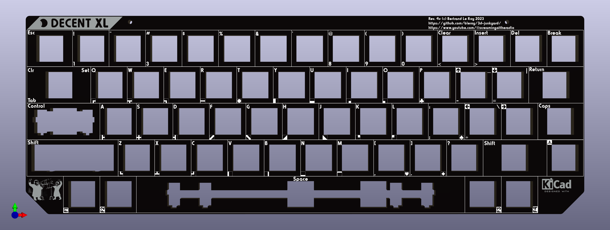

# Decent XL mechanical keyboard replacement for Atari 600XL and 800XL computers

Whether you have a vintage Atari 800XL or 600XL computer with a deficient keyboard or just want a better keyboard, this is the project for you.

There are two versions of the keyboard: modern and vintage. Modern uses brand new MX-compatible key caps and switches, while vintage keeps the original vintage Atari caps and adapts them to modern switches.

The vintage version can use Kailh Choc v2 low-profile switches, in which case 3D-printed adapters bridge one of the supported variants of XL key caps to the Choc switches' MX footprint.

There's been a number of mechanical keyboard builds for Atari computers that are all great but tend to be one-off projects that are not designed to be reproduced or commercially produced. This project does all that and more.

If you're looking to modify an XE computer, head over to [the DecentXE project](https://github.com/bleroy/3d-junkyard/tree/main/Atari130MX).

## Current version

The current revision of the DecentXL keyboard is: rev. 4 (4v designates the vintage version, and 4m the modern version).

## Can I buy one?

The project is open-source, and I encourage everyone to build their own. I also sell kits and assembled keyboards (both modern and vintage) for those who are not comfortable with ordering parts, PCBs or using a soldering iron.

How expensive is it? It depends on what you're ordering, but this is a made-to-order custom mechanical keyboard, so not cheap.

## Project history

This is a brand new design that uses a lot of lessons learned from building the [DecentXE keyboards](https://github.com/bleroy/3d-junkyard/tree/main/Atari130MX), but adapts to the many complicated subtleties of the XL line of computers.

The DecentXL keyboard won first prize at the [2023 ABBUC hardware contest](https://abbuc.de/forum/viewtopic.php?f=3&t=1658).

## Options

### Key caps: modern or vintage?

The modern versions of Decent keyboards are the best quality keyboards. It's a solid design that feels great. In comparison, the vintage versions tend to feel more wobbly and are generally of lower quality. They are also more difficult to build, which is why I stopped producing them myself. I want to keep the quality of the assembled keyboards I build as high as possible.

The modern version also has a slightly modified layout with large delete and return keys, and relocated break and control keys around the shorter space bar. Caps is relocated to where it is on a modern keyboard, above left shift (that's where Atari originally placed the control key, now left of space).

If you absolutely want to keep the look and layout of your keyboard as close to the original as possible, you can use vintage caps (scavenged from the computer you're modifying or bought new old stock or used), but be aware of the quality difference. The result is visually indistinguishable from the original, if it wasn't for the backlighting, and does feel much better than the original, but is significantly less nice than the modern version... You'll also have to build it yourself since I no longer ship assembled vintage versions. See building instructions below to get a feel of the build difficulty.

### Switches

Switches are largely a matter of taste. The DecentXL modern PCB can be mounted with MX-compatible switches. The vintage PCB can be mounted with Kailh Choc v1 switches.

It's your choice of caps that determines what type of switch to use:

* Modern: choose MX-compatible switches
* Vintage: choose Kailh Choc v1

With any type of switch, there is a wide array of choices. If you're new to the world of mechanical keyboards, there are 3 main families of switch experiences:

* Linear (often red): the switch reacts with mostly constant resistance throughout the course of the key press until it hits the bottom.
* Tactile (often brown): there is a higher resistance at a specific point of the key's course, providing tactile feedback to pressing the key.
* Clicky (often white): an even more pronounced and localized resistance is accompanied with an audible and satisfying click.

## Design

The DecentXL project is constituted of the following parts (this is not a BOM but a list of custom parts created for this project; see below for the actual BOM):

* A PCB with surface-mounted anti-ghosting diodes, adjustable blue backlighting and flexible cable connection (revisions before rev. 4 have two PCBs, as the console keys are separate).
* An aluminum plate to hold the switches firmly aligned and rigidify the assembly.
* A custom set of MX-compatible modern key caps.
* 3D-printed adapters for vintage caps.
* 3D-printed console keys with vinyl texture stickers.
* A flexible PCB to connect the main board to the Atari motherboard.
* 3D-printed brackets to connect the boards to the XL top case shell (when rails are not available or using a revision lower than 3).
* A 3D-printed LED diffuser.

## Bill of materials

This project is meant to be reproduced. You'll need a few things that are more or less easy to source, so I've made sure to give multiple roads to success and alternatives for most parts.

It's also an approach that can be easily adapted to other vintage computer keyboards, Atari or not.

### Atari 600XL or 800XL computer

The project is designed around the conservation of the vintage look of the Atari XL computers and the integration of the keyboard in its original case. As such, ideally you'd have a host XL computer to receive the end product.

### Key caps and adapters

You'll need a set of caps.

If you've decided to go for modern, you'll need a set of modern caps that you can order from me or from [GoblinTech](https://goblintechkeys.com/collections/60-keycap). Make sure to specify a 2.25U left shift.

The key cap set is defined by [this SVG file](./Caps/Atari%20XL.svg).

If you have a complete set of vintage key caps, identify the type of cap by looking underneath one of your caps. Currently supported shapes are:

* Alps:
  
  

  You'll need 62 [Alps adapters](./Adapters/kailh-choc-to-xl-alps-x10.stl) (more affordable if printed as 7x sets of 10).

* Cross (AWC):

  

  You'll need 63 [cross adapters](./Adapters/kailh-choc-to-xl-cross-x10.stl) (more affordable if printed as 7x sets of 10).

* Square (Stackpole):

  

  You'll need 62 [square adapters](./Adapters/kailh-choc-to-xl-square-stackpole-x10.stl) (more affordable if printed as 7x sets of 10).

If your key caps look nothing like those above (there are many different XL key footprints), please contact me. If you're OK sending me a key, I can measure it and make a new adapter for it, after which I'll send your key back.

[JLCPCB](https://jlcpcb.com/) and [PCBWay](https://www.pcbway.com/) are examples of fabrication houses that can produce high-quality prints of adapters for cheap, but there's plenty of other places where these can be done. You can also print your own (with a resin printer).

### Console keys (Help, Start, Select, Option and Reset)

You'll need new [3D-printed console keys](./Caps/ConsoleXL-Choc-Single.stl) (more affordable if printed as a [set of five](./Caps/Console-set-XL-Choc-x5.stl) or [ten](./Caps/Console-set-XL-Choc-x10.stl)). The printed console keys fit on top of Kailh Choc v1 switches, not the MX switches used for the rest of the keyboard.

3D-printed console keys will look great if you apply a [brushed metal vinyl sticker](https://www.amazon.com/dp/B08L4GZRDY/ref=sspa_dk_detail_2?pd_rd_i=B087KRL4NY&pd_rd_w=HzYnW&content-id=amzn1.sym.f734d1a2-0bf9-4a26-ad34-2e1b969a5a75&pf_rd_p=f734d1a2-0bf9-4a26-ad34-2e1b969a5a75&pf_rd_r=VYGSYS1YEDTZ7QRRJN26&pd_rd_wg=Nd7sq&pd_rd_r=3f4a2c8d-a713-44c7-b8ae-544c3b0b1f53&s=automotive&sp_csd=d2lkZ2V0TmFtZT1zcF9kZXRhaWw&th=1).

If using a revision before 4, you can re-use your existing vintage console keys for a vintage keyboard. Just use the same adapters as for other keys.

### Switches

For a modern layout, you'll need 62 switches total corresponding to your cap type. You need 57 switches for the main keyboard, and 5 for the console keys. That means that you'll need 57 MX switches and 5 Kailh Choc v1 switches.

Vintage uses all Kailh Choc switches for both main keyboard and console keys (62). Some vintage variants require additional switches that are used as stabilizers. For instance, Alps has two switches for the space bar. Both cross and Alps use two switches on the sides for the left shift, and remove the central switch. That means Alps needs two additional switches, bringing the total to 64, and cross (AWC) one additional switches for a total of 63.

### Stabilizers and adapters

#### Left shift

All keyboards except Alps and cross (AWC) need one 2U Durock v2 stabilizer for the left shift.

For modern keyboards, the stabilizer can be used as-is.

For Alps, you'll need special adapters specifically for left shift (not yet available).

For cross (AWC), you can use the same adapters as for other keys.

For square (Stackpole), you'll need in-key adapters (not yet available).

#### Space bar

Modern keyboards use a 6.25U space bar and as such can use a standard 6.25U Durock v2 stabilizer.

Vintage keyboards use a 9U spacebar for which no off-the-shelf modern stabilizer exist.

Alps keyboards have a second stabilizing switch to the right of the center one. This may be enough to stabilize the space bar, but it should also be possible to add a Durock stabilizer with a hand-made custom-length stabilizer rod made from [1/16" copper rods](https://www.mcmaster.com/8859K511/) and custom printed stems (not yet available).

Cross (AWC) keyboards require a Durock stabilizer with a hand-made custom-length stabilizer rod made from [1/16" copper rods](https://www.mcmaster.com/8859K511/) and custom printed stems (not yet available).

#### Delete and return

I recommend also stabilizing the delete and return keys with 2U stabilizers for the modern layout.

Contact me if you have an as yet unsupported shape of vintage cap. If you're OK sending me your space and left shift for measurements, I can design new adapters and send you back your caps.

### PCB

For the modern version, use [the Gerber](./DecentXL-keyboard/production/DecentXL_keyboard_-_Modern_4.2m-bom.csv), [BOM](./DecentXL-keyboard/production/DecentXL_keyboard_-_Modern_4.2m-bom.csv) and [position](./DecentXL-keyboard/production/DecentXL_keyboard_-_Modern_4.2m-positions.csv) files to order a PCB with all the SMD parts assembled.

For vintage versions, use [the Gerber](./DecentXL-keyboard/production/DecentXL_keyboard_4v.zip), [BOM](./DecentXL-keyboard/production/DecentXL_keyboard_4v-bom.csv) and [position](./DecentXL-keyboard/production/DecentXL_keyboard_4v-positions.csv) files to order a PCB with all the SMD parts assembled.

### Plate

The plate is just an aluminum PCB. Download [the Gerber for the modern](./DecentXL-plate/production/DecentXL_modern_plate_4m.zip) or [vintage](./DecentXL-plate/production/DecentXL_vintage_plate_4v.zip) and have it produced. I recommend having this done in black as it will be visible through the gaps between keys and on the sides.

### Connectors

The connector to the motherboard is [a flexible PCB](./DecentXL-Cable/production/gerber.zip). The fabrication house will usually ask you to specify what zones to apply rigidifiers to. There are two rectangles on the silkscreen that specify that.

### Brackets

The XL keyboard is mounted to the top of the Atari case. On some original keyboards, a metal plate has bent parts that extend beyond the PCB or membrane and fit the corresponding screw columns on the top shell of the case. Some models have a pair of metal rails that can be re-used for both modern and vintage versions of the keyboard. If your original keyboard had those, then you don't need to print brackets and can just use those rails.

* [STL file for the left bracket](./Brackets/DecentXL-Left-Bracket.stl)
  
* [STL file for the right bracket](./Brackets/DecentXL-Right-Bracket.stl)
  

For our keyboards, we can't unfortunately just have correctly placed holes in the PCBs because the columns extend beyond the planes where they need to be located. Instead, the columns go around the PCB and fit into 3D-printed adapters that hold the PCBs in place and receive the screws.

### Spring

If you went for a vintage keyboard, the wide space bar may need a spring. The original spring from the Atari keyboard should work, but you can also source a new 17mm x 9mm one.

### Hardware

When using MX or Alps switches, the plate will usually naturally be held at a constant height by the switches. When using low-profile switches however, it's a little trickier and I recommend using the two mounting holes at the top of the main PCB and plate to add screws and nuts or [standoffs that keep the plate at a constant distance of 3.5mm (or 1/8 freedom units)](https://www.mcmaster.com/92510A400/) from the PCB.

### LED diffuser

The new power LED is quite small, and it's a good idea to diffuse its light. There's [a part that you can print in transparent filament or resin](https://github.com/bleroy/3d-junkyard/blob/main/DecentXL/readme.md). It should fit in the LED hole of the top shell of the case.

[Model for the LED diffuser](./Misc/LedDiffuser600XL.stl)

## Assembly

Once you've gathered all the parts, you can assemble them in the following order:

### Mount the stabilizers

The stabilizers consist of a larger part that has the threaded part, a smaller part that slides into the previous one, a metal bar linking two assemblies of the two previous parts, and some hardware. The stabilizers are best assembled in this order: slide the smaller part into the larger one (make sure you orient it properly), then insert one end of the metal rod into that assembly and push it into place so it clicks and is properly secured. Once you've done that with both ends of the stabilizer, you should be able to verify both ends lift together and with no friction (some people like to lube their stabilizers by the way).

Once the stabilizers are assembled, you can put them in their respective places on the top side of the PCB. Insert the bottom, non-threaded part first, try to lay the stabilizer's surface flat on the PCB, and push the top threaded part into place. This usually moves the other end a bit, so make sure both ends are properly inserted all the way into the holes in the PCB.

Turn the PCB over. Position one of the small washers around each of the screw holes for the stabilizers and secure it with a screw.

#### Special vintage stabilizers

Stabilizing vintage caps can be challenging. If you went down that route, be patient: it can be done, but it's difficult.

Bending a copper rod to be the correct distance between stabilizers is hard, but can be done with a good pair of pliers, and fulsh cutters.

In some cases you'll have to print adapters that either fit inside the key cap or replace the stem of a Durock stabilizer.

### Configure the keyboard for your layout (Rev. 2 and 3 only!)

Solder two small jumper wires **horizontally** to the left of the PCB to configure it for Caps or Control. This rewires the key that's above left shift and that's normally Control on an original keyboard. Control on the modern keyboard goes to the left of the space bar, and this key is reconfigured to be Caps. The two wires should short from the middle position to the right position for modern, and from the middle to the left for vintage. The silkscreen has helper text for this.

Revisions 4 and after require no configuration because modern and vintage are separate, pre-configured PCBs.

### Mount the switches onto the plate

Insert switches into the aluminum plate with the LED window to the back and the pins to the front.

On modern layouts, the exception to this is the return key that should have its LED window to the left and pins to the right.

On vintage revisions preceding 4, delete, return and caps have a different orientation. It's more practical to wait and add those at the next step, while soldering the switches.

Note that the console keys do not have a place on the plate. That's because they will be aligned using a separate printed plate.

There are 4 additional positions around the space bar, control and break keys for F1-4 optional keys. Usually you won't mount switches onto those, just ignore them unless you have a modified case that can accommodate them.

### Get the plate and PCB together

After making sure all the switch pins are vertical and none are bent out of place, carefully align the plate and switches with the stabilizers and the PCB. Slowly and carefully complete that assembly, making sure no pins get bent. Once that is done, the plate and PCB should be a few millimeters apart, evenly spaced across the whole surface.

If using low-profile switches, mount standoffs between the plate and main PCB using the two mounting holes on top of the boards.

You can secure the boards together with tape or clothespins until you've soldered enough switches.

### Solder the switches onto the PCBs

Solder each switch onto the PCBs. Use a printed plate to align the console keys before soldering them.

### Assemble the daughter board (Rev. 2 and 3 only!)

This is only for older revisions of the boards. The current versions don't have a daughter board.

Carefully align the switches on the daughter board using the printed console plate. Solder them in place. Mounting the caps before soldering can help achieve better alignment. Soldering one leg, adjusting orientation, then soldering the second leg, is a way to improve alignment, especially in the absence of a guiding plate.

### Assemble the brackets

If you have rails, you can skip this part.

Gently insert the PCBs into the brackets. There is some lateral freedom in the assembly to allow for the 0.25U narrower modern layout to be centered in the case: if you're using the modern layout, you'll want to shift the main board a few millimeters to the right to perfectly center the keyboard.

### Plug the cables

If you're on a rev. 2 or rev. 3 PCB, add the cable linking the daughter board to the main board.

The cable that connects the keyboard to the motherboard is a flexible PCB. Pass the smaller end of the custom cable through the hole in the bracket (if using bracckets, through the hole in the PCB otherwise) and then plug it into the connector on the bottom-right of the keyboard PCB. This can be tricky to get right: make sure the cable is inserted sufficiently that closing the connector will hold it in place and properly connected. You can verify continuity on the pads at the extremities to verify you got this right.

Contacts go on the bottom side.

### Add cap adapters

If you need them (vintage), add the cap adapters to your switches.

### Add the key caps

Assemble the key caps onto the switches or cap adapters. If needed, don't forget to insert the stabilizer adapters into the relevant key caps before you press fit them onto the switches and stabilizers.

Apply brushed metal stickers to the console keys. I find that holding the stickers with an Exacto knife is a good way to get the alignment precisely right. Take you time for this, as misalignments tend to be very visible with the keys so close to one another. Avoid touching the underside of the stickers as fingerprints can cause oxydation of the brushed metal layer in the sticker.

Your keyboard is now assembled. Let's mount it into the computer.

## Mounting the keyboard into the computer

You might want to briefly connect the keyboard before mounting it and turn the computer on to check the LEDs light up. If you need to tune the brightness of the backlight to the desired level, this is a good time to do it by turning the pot on the bottom-right of the board. If you do it later, you may have to remove the keyboard from the case.

Before you assemble the keyboard into the top shell, make sure you've inserted the printed LED diffuser into the LED hole. It should just fit into 600XL cases, and require some tape to hold it in place on 800XL.

If you have rails, mounting the keyboard should be very easy: just position your keyboard on the back of the top case, then screw the rails on top of that. You have some freedom on the horizontal alignment of the keyboard (not a lot, but enough to get your console keys properly centered).

If using brackets, align the bracket screw holes with the correct columns on the top shell of your Atari XL case and screw the keyboard in place. Make sure to precisely center your keyboard in its window, moving it in the barckets if necessary, then secure the screws in place. This can take some trial and error. Take your time so your keyboard is nicely centered.

Plug the larger end of the custom cable into the Atari motherboard's connector.

Close the case. Congratulations, you're done! Turn your computer on and enjoy your mechanical keyboard. It's a good idea to go into the Atari diagnostics or BASIC and check every key works.

## Troubleshooting

Defects and mistakes happen. If when testing your keyboard, if you notice a key or a bunch of them don't work, testing and fixing the keyboard is usually quite easy.

The back of the board shows the matrix the keyboard is built on. It's easy, from the indications there to figure out what pins a switch is supposed to connect. It's like coordinates: the keyboard is essentially a matrix of switches. You can test continuity using the empty pinout connector footprint above the FFC connector. Connect your multimeter, press the switch. Be aware that there's an anti-ghosting diode in series with each switch, so setup your multimeter accordingly or you may get false negatives. You can also test the switch directly, and test continuity from it to its neighbours and to the connectors. Most problems can be found this way, and if the keyboard needs repairs, it's usually easy to pull an additional wire to fix a damaged trace.

## Acknowledgements

I want to thank [XLFreak](https://forums.atariage.com/profile/63723-xl-freak/) for designing the modern key cap set for this project.

Thanks to [Wildstar87](https://forums.atariage.com/profile/29638-wildstar87/) who has been loaning me various XL keyboards and case parts to check their footprints and design adapters.

Thanks to ABBUC members for voting for this project and giving it first prize at the 2023 hardware contest.

And of course, many thanks to all those who provided feedback on the [DecentXE keyboard](https://github.com/bleroy/3d-junkyard/tree/main/Atari130MX) over its many revisions or bought a keyboard.
