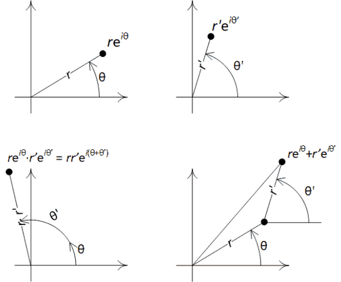

# Fun with Fourier Transforms

Nowadays all we hear about around digital image processing is machine learning. Yet there's another technique that's [been around forever](https://www.cis.rit.edu/class/simg716/Gauss_History_FFT.pdf), that's relatively simple to understand, and that can be used for a wide variety of applications such as Optical Character Recognition. That technique is Fourier analysis, and in particular the [Fast Fourier Transform](https://en.wikipedia.org/wiki/Fast_Fourier_transform).

FFT transforms a signal (amplitude variations over time and/or space) into its harmonic components. What does harmonic mean? Basically sine waves: instead of considering the direct variations in amplitude of the signal, we decompose these variations into a weighed sum of single frequency oscillations. We can then represent the same signal as a graph with the frequency on the X axis and the weight of each frequency as the Y axis.

This is also known under the name "spectrum". We're all familiar with the spectral decomposition of light by a prism.

## First, a short refresher on complex numbers

For the mathematical part of this article, we'll deal with complex numbers, because they are so much better when dealing with sine waves than real numbers. Don't be scared, complex arithmetic is not that complicated despite what you may remember from high school maths.

Feel free to skip all the maths part of this article however, we'll have enough fun stuff that doesn't require any.

Complex numbers have two components: a real component and an "imaginary" component. A real number is just a complex number with a zero imaginary part. An imaginary number is a complex number with a zero real part.

The complex number with a zero real part and an imaginary part of <math><mn>1</mn></math> is called <math><mi>i</mi></math>.

The most common notation for a complex number with a real part of <math><mi>a</mi></math> and an imaginary part of <math><mi>b</mi></math> is:

<math><mfenced><mrow><mi>a</mi><mo>+</mo><mi>b</mi><mo>&it;</mo><mi>i</mi></mrow></mfenced></math>

To add two complex numbers, just add the real parts together, and the imaginary parts together:

<math>
    <mrow>
        <mfenced><mrow><mi>a</mi><mo>+</mo><mi>b</mi><mo>&it;</mo><mi>i</mi></mrow></mfenced>
        <mo>+</mo>
        <mfenced><mrow><mi>c</mi><mo>+</mo><mi>d</mi><mo>&it;</mo><mi>i</mi></mrow></mfenced>
        <mo>=</mo>
        <mrow>
            <mfenced><mrow><mi>a</mi><mo>+</mo><mi>c</mi></mrow></mfenced>
            <mo>+</mo>
            <mfenced><mrow><mi>b</mi><mo>+</mo><mi>d</mi></mrow></mfenced>
            <mo>&it;</mo>
            <mi>i</mi>
        </mrow>
    </mrow>
</math>

Things get more interesting with multiplication, but are easy to derive from the axiom that <math><mrow><mi>i</mi><mo>&times;</mo><mi>i</mi><mo>=</mo><mn>-1</mn></mrow></math>:

<math>
    <mrow>
        <mfenced><mrow><mi>a</mi><mo>+</mo><mi>b</mi><mo>&it;</mo><mi>i</mi></mrow></mfenced>
        <mo>&times;</mo>
        <mfenced><mrow><mi>c</mi><mo>+</mo><mi>d</mi><mo>&it;</mo><mi>i</mi></mrow></mfenced>
        <mo>=</mo>
        <mrow>
            <mfenced><mrow><mi>a</mi><mo>&it;</mo><mi>c</mi><mo>-</mo><mi>b</mi><mo>&it;</mo><mi>d</mi></mrow></mfenced>
            <mo>+</mo>
            <mfenced><mrow><mi>a</mi><mo>&it;</mo><mi>d</mi><mo>+</mo><mi>b</mi><mo>&it;</mo><mi>c</mi></mrow></mfenced>
            <mi>i</mi>
        </mrow>
    </mrow>
</math>

The real and imaginary parts of a complex numbers can be viewed as the <math><mi>a</mi></math> and <math><mi>b</mi></math> coordinates on a plane, which we call the complex plane. There is then an alternative notation for complex numbers that uses the distance <math><mi>r</mi></math> from the origin and the angle <math><mi>&theta;</mi></math> from the horizontal real axis to the line joining the origin to the complex number. For reasons that are pretty neat, but that I won't get into, this can be efficiently represented as:

<math><mrow><mi>r</mi><msup><mi>e</mi><mrow><mi>i</mi><mi>&theta;</mi></mrow></msup></mrow></math>

What's convenient about this notation is that the multiplication is a lot easier to compute. The amplitudes multiply as expected, and the angles *add up*:

<math>
    <mrow>
        <mrow><mi>r</mi><mo>&it;</mo><msup><mi>e</mi><mrow><mi>i</mi><mo>&it;</mo><mi>&theta;</mi></mrow></msup></mrow>
        <mo>&times;</mo>
        <mrow><mi>r'</mi><mo>&it;</mo><msup><mi>e</mi><mrow><mi>i</mi><mo>&it;</mo><mi>&theta;'</mi></mrow></msup></mrow>
        <mo>=</mo>
        <mrow><mi>r</mi><mo>&it;</mo><mi>r'</mi><mo>&it;</mo><msup><mi>e</mi><mrow><mi>i</mi><mo>&it;</mo><mfenced><mi>&theta;</mi><mo>+</mo><mi>&theta;'</mi></mfenced></mrow></msup></mrow>
    </mrow>
</math>

In this notation, it's addition that's trickier.

Here's an illustration of what we've learned so far about the angular notation:

So why do complex numbers work so well with sine waves? Well, simply because if you remember the simplest of trigonometry, the definitions of sine and cosine enable us to go easily from the angular notation back to the coordinate notation. The complex number on the plane forms a right triangle where <math><mi>a</mi></math> and <math><mi>b</mi></math> coordinates are the adjacent and opposed sides to the <math><mi>&theta;</mi></math> angle, and <math><mi>r</mi></math> is the hypothenuse.

<math>
    <mrow>
        <mo>{ </mo>
        <mtable>
            <mtr>
                <mtd><mrow><mi>a</mi><mo>=</mo><mi>r</mi><mo>&it;</mo><mi>cos</mi><mo>&af;</mo><mi>&theta;</mi></mrow></mtd>
            </mtr>
            <mtr>
                <mtd><mrow><mi>b</mi><mo>=</mo><mi>r</mi><mo>&it;</mo><mi>sin</mi><mo>&af;</mo><mi>&theta;</mi></mrow></mtd>
            </mtr>
        </mtable>
    </mrow>
</math>

In other words, the cosine and sine of the angle are the coordinates of <math><msup><mi>e</mi><mrow><mi>i</mi><mo>&it;</mo><mi>&theta;</mi></mrow></msup></math> on the complex plane. An exponential being easier to work with than sines and cosines, this explains why physicists use complex exponential notation so much when working with waves.

## Slow Fourier Transform

Let's start with the *reverse* Fourier transform, the one that gets you back the original wave from its spectral representation. The formula for the inverse discrete Fourier transform of an array of <math><mi>N</mi></math> numbers is:

<math>
    <mrow>
        <msub><mi>x</mi><mi>n</mi></msub>
        <mo>=</mo>
        <mfrac><mn>1</mn><mi>N</mi></mfrac>
        <mo>&it;</mo>
        <mstyle displaymode="true"><munderover>
            <mo>&sum;</mo>
            <mrow><mi>k</mi><mo>=</mo><mn>0</mn></mrow>
            <mrow><mi>N</mi><mo>-</mo><mn>1</mn></mrow>
        </munderover></mstyle>
        <msub><mi>X</mi><mi>k</mi></msub>
        <msup>
            <mi>e</mi>
            <mrow>
                <mi>i</mi>
                <mo>&it;</mo>
                <mfrac>
                    <mrow><mn>2</mn><mi>&pi;</mi></mrow>
                    <mi>N</mi>
                </mfrac>
                <mo>&it;</mo>
                <mi>k</mi>
                <mo>&it;</mo>
                <mi>n</mi>
            </mrow>
        </msup>
    </mrow>
</math>

This is pretty straightforward, we're just multiplying harmonics of increasing frequency with their weights, and that gives us the wave form.

Interestingly, the direct Fourier transform looks almost exactly the same:

<math>
    <mrow>
        <msub><mi>X</mi><mi>k</mi></msub>
        <mo>=</mo>
        <mstyle displaymode="true"><munderover>
            <mo>&sum;</mo>
            <mrow><mi>n</mi><mo>=</mo><mn>0</mn></mrow>
            <mrow><mi>N</mi><mo>-</mo><mn>1</mn></mrow>
        </munderover></mstyle>
        <msub><mi>x</mi><mi>n</mi></msub>
        <msup>
            <mi>e</mi>
            <mrow>
                <mo>-</mo>
                <mi>i</mi>
                <mo>&it;</mo>
                <mfrac>
                    <mrow><mn>2</mn><mi>&pi;</mi></mrow>
                    <mi>N</mi>
                </mfrac>
                <mo>&it;</mo>
                <mi>n</mi>
                <mo>&it;</mo>
                <mi>k</mi>
            </mrow>
        </msup>
    </mrow>
</math>

This is convenient as it means the algorithm for the direct and reverse transforms is going to be nearly identical.

Of course the complexity of a brute force implementation of this formula is <math><mrow><mi>O</mi><mo>&af;</mo><mo>(</mo><mfenced><msup><mi>N</mi><mn>2</mn></msup></mfenced><mo>)</mo></mrow></math>, which is not great.

## Implementing one-dimensional Cooley-Tukey

Fast Fourier Transform really is a category of algorithms more than a single algorithm. All known FFT algorithms have <math><mrow><mi>O</mi><mo>&af;</mo><mo>(</mo><mfenced><mrow><mi>N</mi><mo>&it;</mo><mi>log</mi><mo>&af;</mo><mi>N</mi></mrow></mfenced><mo>)</mo></mrow></math> complexity.

In this article, we'll use Cooley-Tukey, which is a simple divide and conquer implementation that takes advantage of the fact that the FFTs of the even-indexed samples and of the odd-indexed samples for the signal look very much the same, apart from a multiplicative factor, and are each smaller transforms that only require half the terms.

In other words, we can split a FFT into two smaller FFTs that each use half the data. Assuming we started with a sample size that's a power of two, we can keep doing that until we reach a size sample of 1 and the transform is trivial. Doing so requires <math><mrow><msub><mi>log</mi><mn>2</mn></msub><mo>&af;</mo><mi>N</mi></mrow></math> subdivisions, and then adding the results back up the recursion, which gives the <math><mi>N</mi></math> multiplicator in the complexity.