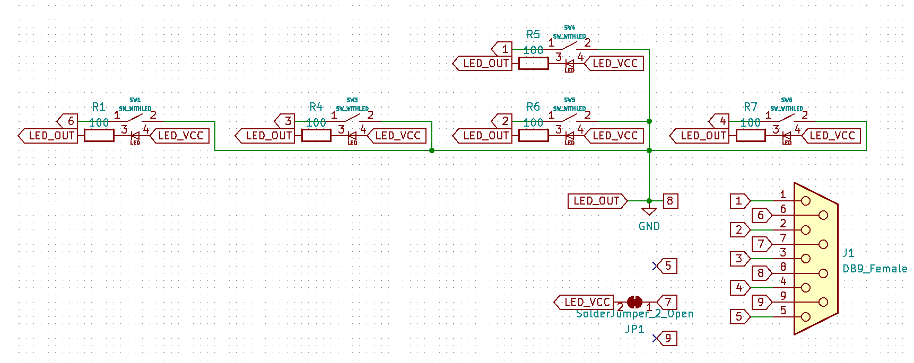
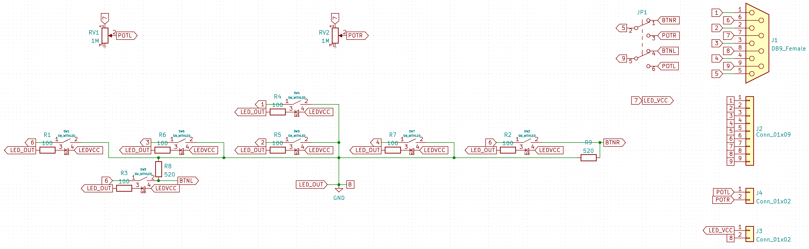

# JoyKey - an Atari-compatible joystick built with mechanical switches

## JoyKey Mini vs. JoyKey XL

There are two models of JoyKey: JoyKey Mini and JoyKey XL.

The Mini is a small and simple four directions and fire controller with a 9-pin Atari-compatible plug. It's designed with Atari 8-bit computers and consoles in mind, but it can be used with any compatible retro systemm such as the C64.

The XL is designed to maximize the potential of the Atari 8-bit joystick port.
It has the same four directions and fire as the Mini, but adds two fire buttons using the Atari 7800 wiring and two analog paddles.

## Configuration

The Mini has no configuration, just plug and play. The XL has a single switch in the back to choose to use the paddles or the two additional fire buttons.
In paddle mode, the additional fires act as the regular fire button.

### LED configuration

The LED circuit is using the 5V from pin 7 and ground from pin 8 by default.
If the device you're connecting the JoyKey to doesn't have 5V on pin 7, or if you want to externally provide power, you can choose to not connect those pins on the JoyKey and instead privide power through the J3 LED power connector.

## Schematic

### JoyKey Mini

### JoyKey XL

## Fabrication

* [JoyKey Mini Gerber files](Fabrication/JoyKeyMini.zip)
* [JoyKey Mini BOM](Fabrication/JoyKeyMini-BOM.csv)
* [JoyKey Mini Positions](Fabrication/JoyKeyMini-all-pos.csv)
* [JoyKey Mini Enclosure bottom part](Case/JoyKeyMiniCase-Bottom.stl)
* [JoyKey Mini Enclosure top part](Case/JoyKeyMiniCase-Top.stl)
* [JoyKey XL Gerber files](Fabrication/JoyKeyXL.zip)
* [JoyKey XL BOM](Fabrication/JoyKeyMX-BOM.csv)
* [JoyKey XL Positions](Fabrication/JoyKeyMX-top-pos.csv)
* [JoyKey XL Al plate Gerber files](Fabrication/JoyKeyMX-plate.zip)
* [JoyKey XL Enclosure bottom part](Case/JoyKeyMiniCase-Bottom.stl)
* [JoyKey XL Enclosure top part](Case/JoyKeyMiniCase-Top.stl)
