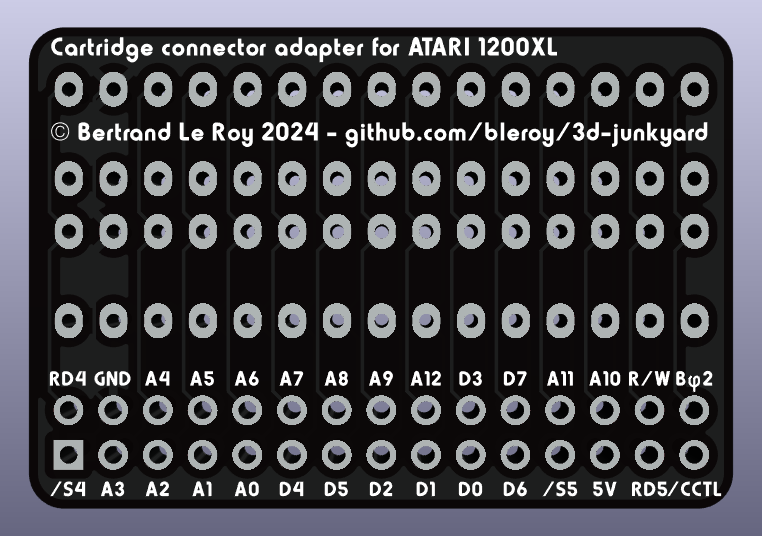

# Replacement cartridge connector for ATARI 1200XL computers

The Atari 1200XL's cartridge port is quite unique: it's basically a tunnel, made of three plastic parts around an angled edge connector that's impossible to source as a new part.

If you need to replace a damaged connector or mount one on a new board, you need something like this board and printed parts.

## Bill of materials

To build a new cartridge port, you'll need:

* 1x [Printed connector holder](../CartridgeConnectorHolder1200XL.stl)
* 1x [Printed cartridge port](../CartridgePort1200XL.stl)
* 1x [Adapter PCB](./production/CartConnectorAdapter1200XL.zip) - Order in 1mm thickness
* 1x [Angled 2x15 edge connector](https://www.aliexpress.us/item/2255800960638500.html)
* 2x [15pin 15mm tall 2.54mm pitch headers](https://www.aliexpress.us/item/3256801327743339.html)
* 2x [15pin 2.54mm pitch header sockets](https://www.aliexpress.us/item/2255801012106911.html)