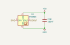

# Decent Retro Keyboard Tester

The Decent Retro Keyboard Tester is an open source board designed around the RP2040 chip
to test vintage computer keyboards.
I built it to test my own modern keyboard replacements for Atari 8-bit computers, but
the architecture is generic enough that drivers for other computers should be very easy
to build.

The tester currently supports the following keyboards:

- Atari 400
- Atari 800
- Atari XE (except XEGS, coming soon)
- Atari 600XL and 800XL
- Atari 1200XL
- USB keyboards

## How to use the tester

Connect the tester to a power source (either the micro-USB at the back or the barrel jack,
center-positive with 5V).

Press the mode button repeatedly until you reach the mode for the keyboard to test.

Connect the keyboard to test.

Start pressing each button on the keyboard. The corresponding LED on the tester should turn
from orange to green. Continue doing that until all the lights are green.

If a light remains orange after the corresponding key has been pressed, there is an issue
with that key. Oftentimes, a whole pattern of keys will fail, not just one.
That usually means that a whole line or column of the keyboard matrix is failing.
Consult a map of the keyboard's matrix and probe the corresponding lines on the PCB or on the
keyboard cable.

## How to build one

### The board

The assembled board can be ordered from JLCPCB or PCBWay using the following files:

- [Gerber](./production/Decent_Retro_Keyboard_Tester_2.zip)
- [BOM](./production/bom.csv)
- [Positions](./production/positions.csv)

You should order the boards assembled, and you'll only have to solder the connectors,
the OLED screen and the barrel jack if you want to power the board without USB.

The connectors are:

- 24P 2.54mm male pin headers on the left of the board
- 15P 2.54mm male pin headers immediately to the right of the 24P connector
- 22P 2.54mm female headers on the top of the board
- 18P 2.54mm male pin headers under the 22P one.
- DB15 at the bottom left of the board
- USB-A connector to the right of the DB25 connector

Don't solder the screen yet, as it's easier to do once the board is in the top half of the enclosure.

### The enclosure

Print the following parts:

- 1x [Enclosure top](./Enclosure/Decent%20Retro%20Keyboard%20Tester%20Enclosure-Top.stl)
- 1x [Enclosure bottom](./Enclosure/Decent%20Retro%20Keyboard%20Tester%20Enclosure-Bottom.stl)
- 3x [Button](./Enclosure/Decent%20Retro%20Keyboard%20Tester%20Enclosure-Button.stl)
- 1x [Full light tunnel](./Enclosure/Decent%20Retro%20Keyboard%20Tester%20Enclosure-Light%20tunnels.stl)
- 1x [Switch slider](./Enclosure/Decent%20Retro%20Keyboard%20Tester%20Enclosure-Slider.stl)

Depending on the keyboards you want to test:

- 1x [Atari XE light tunnel](./Enclosure/Decent%20Retro%20Keyboard%20Tester%20Enclosure-ATARI-XE-Light%20tunnels.stl)
- 1x [Atari XL light tunnel](./Enclosure/Decent%20Retro%20Keyboard%20Tester%20Enclosure-ATARI-XL-Light%20tunnels.stl)

Add 4 threaded inserts to the top of the enclosure.

With the top of the enclosure upside-down on your workbench, add the three buttons, put the OLED
screen in position, then add the main board on top of that.

Make sure everything is properly aligned and level, then solder the screen to the board.

Add the slider to the little switch at the back of the board.

Put the bottom of the enclosure in place, then secure everything with 4 screws corresponding to the
threaded inserts you chose.

### Adapter boards

The tester has some connectors built-in, but the ultimate goal is to support a wide variety of
keyboards with exotic connectors.
For instance, Atari XE and XL computers use a single-sided 2.54mm 24 pin connector that is very
hard to source outside of scavenging it from a vintage motherboard.

To address this, the board presents 24 GPIOs on a standard pin header connector so one can build
adapter boards that translate that into specific connectors.

Have the adapter boards you need fabricated and assemble the required connectors on them.

At this moment, the only adapter board is for Atari XE and XL computers:

- [Gerber](./adapter-ATARI-XE-XL/production/adapter-ATARI-XE-XL.zip)

  It can be assembled by adding a 24P 2.54mm female header on the bottom of the board and to the right
  and an Atari keyboard connector on top to the left with the contacts on the left.

### Overlays

Each keyboard driver will do its own mapping of the physical keys to the array of LEDs on the tester.
To make things a little nicer to look at, there are overlays that are made with a printed light tunnel
and a small PCB with windows in the mask layer that let the light get diffused over each key
footprint.

There are overlays available for the following keyboards:

- Atari XE - [Gerber](./Overlays/XE-overlay/production/XE-overlay.zip) & [light tunnel](./Overlays/XE-overlay/Decent%20Retro%20Keyboard%20Tester%20Enclosure-ATARI-XE-Light%20tunnels.stl)
- Atari XL - [Gerber](./Overlays/XL-overlay/production/XL-overlay.zip) & [light tunnel](./Overlays/XL-overlay/Decent%20Retro%20Keyboard%20Tester%20Enclosure-ATARI-XL-Light%20tunnels.stl)

### Flashing the firmware

The tester can be programmed through its micro-usb port on the back.
Connect that port to a computer and it will appear as a disk drive.

There's a one-time operation which is to install CircuitPython on the device.
Get [the latest version for the Pi Pico](https://circuitpython.org/board/raspberry_pi_pico/) and
copy the uf2 file to the root of the device's file system.
The device will reboot and show a new file system.

If at a later date you need to upgrade your CircuitPython, you can do so by keeping the Boot
button pressed while you connect the device to your computer. You'll then be able to copy a new
uf2 file.

Copy the contents of the [firmware](./Firmware/) directory from this repository to the root of
the device.

The tester will reboot and should display some text on the OLED display.
If it doesn't, then something went wrong with the installation.
Verify you copied everything.
If there's still an issue, you can try to check what happens on the serial port using [the Pi Pico
tooling for VS Code](https://marketplace.visualstudio.com/items?itemName=raspberry-pi.raspberry-pi-pico).

## This is too complicated, can I just buy one from you?

Yes, you can. [Contact me on the AtariAge forums](https://forums.atariage.com/profile/76850-screamingattheradio/).

## Design

The controller part of the board is just a simple implementation of [the RP2040 reference board](https://datasheets.raspberrypi.com/rp2040/hardware-design-with-rp2040.pdf).

GPIO 0 and 1 are the data lines for the USB-A port in front of the board.

GPIO 2 to 25 are connected to the various keyboard ports and can be programmed to scan the
keyboard to test. Each connector has its first pin (GPIO 2) towards the top-left of the board.

GPIO26 is connected to the mode button.

GPIO27 is the data line for the addressable RGB LEDs. Each key module has a SK6805 addressable
LED and a 100nF capacitor:

The data out of each LED goes into the data in of the next.
The final data out is exposed on a small 3-pin connector at the back of the board, enabling
the addition of more LEDs.

GPIO28 and 29 are I2C SDA and SCL, connected to the OLED display and to a qwiic expansion port
at the back of the board.

There's also a debug port on the board that can be used with [the Pi debug probe](https://www.raspberrypi.com/documentation/microcontrollers/debug-probe.html).

## Contributions

A great contribution to this project would be new drivers, adapters and overlays for keyboards
not yet supported.

Bug fixes are also greatly appreciated!
